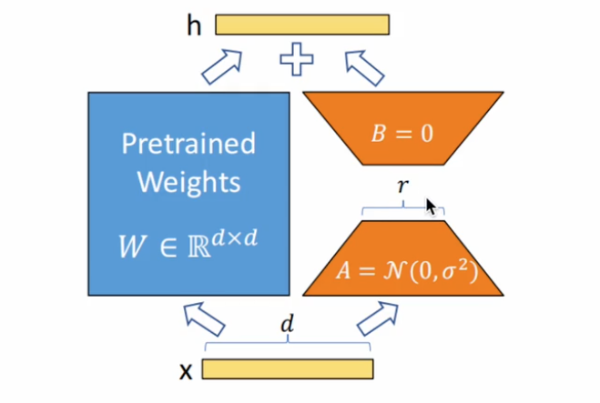
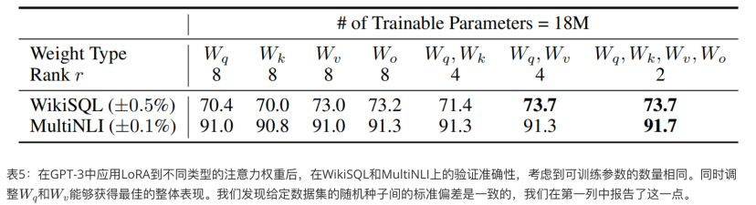

## 1. 什么是LoRA，它解决了什么问题

LoRA（Low-Rank Adaptation）是一种用于微调大型预训练语言模型的高效技术。其核心思想是通过冻结预训练模型的大部分权重，仅训练少量的参数，来实现对特定任务的适配。

LoRA主要解决了如下几个问题

1. 大模型通常包含数亿甚至数百亿个参数，对其进行微调需要大量的计算资源和存储空间，LoRA提供了一种只需要调整及少量参数就能实现模型微调的方法。
2. 在微调过程中，直接修改预训练模型的所有参数可能会破坏模型的原始性能，LoRA提供了一种完全无侵入式，即训练中不改变的模型参数的训练，直到训练结束才将模型参数更新。
3. 存储和部署微调后的大模型需要大量存储空间，尤其是当需要再多个场景中部署不同微调版本时。
4. 许多微调方法会增加推理阶段的计算延迟，影响模型的实时性应用。

## 2. LoRA原理

LoRA额外引入了一个独立于原来参数矩阵$W\in \mathbb{R}^{d\times d}$的微调矩阵$\Delta W$， $\Delta W$由两个矩阵$B\in \mathbb{R}^{d\times r}$和$A \in \mathbb{R}^{r\times d}$相乘而来。

$$
\Delta W = BA
$$

LoRA的核心结构如图所示。其中$A$矩阵需要服从正态分布$A～\mathcal{N}(0,\sigma^2)$，$B$矩阵是一个0矩阵，$B=0$。额外引入支路的$\Delta W$会加入到当前层原来的参数矩阵中。

很明显有$\Delta W\in \mathbb{R}^{d\times d}$，二者是可以直接相加的。

$$
W_{finetuned} = W_{pretrained} + \Delta W
$$



**微调LoRA的计算量从原先的$d\times d$减少到了$d\times r + r\times d$，即矩阵$A,B$各自的大小。因为一般来说$r << d$，“低秩”的概念就从这里得来。**

例如，有原参数矩阵$W\in \mathbb{R}^{4096\times 4096}$，设$r=8$，则如果全量调参，则需要调整的参数有

$$
4096\times 4096 = 16,777,216
$$

如果使用LoRA，则只需要

$$
2\times 8\times 4096 = 262,144
$$

二者相除，后者大概是前者的1.56%，节省了99%以上的参数量



需要注意的是$r$并不是越大越好，在LoRA原论文中对$r$进行了消融实验，如图所示。结果显示应该对Transformer里面的$q, k, v, o$的权重矩阵都进行微调，并且在$r=2$时有最佳效果。

[论文笔记：Attention is all you need](https://emil-jiang.github.io/2023/04/10/%E8%AE%BA%E6%96%87%E7%AC%94%E8%AE%B0-Attention_is_all_you_need/) 6.7节中阐述了$Q,K,V$的本质。而LoRA可以具有良好的效果，就是因为它本身非侵入式训练没有破坏模型原有参数，保留了三个矩阵在注意力机制中的核心作用以及LoRA⽅法在降低参数数量的同时保持或提升模型性能的能⼒。

## 3. LoRA的应用

在微调过程中，LoRA可以运用到各种层当中去，这里举一些例子。

**线性层**

线形层（FC层）的形式为$Wx+b$，显然可以对$W$进行微调。

原因：

- **参数集中：** FC层常常包含了大量参数，在这些层应用可以减少需要微调的参数量。
- **计算密集：** 全连接层计算量较大，通过LoRA可以减少计算复杂度

**注意力层**

在多头注意力（MHA）部分，对$Q,K,V$的权重参数矩阵可以使用LoRA。

原因：

- **关键功能组件：** 自注意力机制是Transformer模型的核心组件，对模型性能影响重大，对这些矩阵进行低秩近似可以显著影响模型的表达能力
- **参数量大：** 这些投影矩阵包含大量参数，使用LoRA可以减少参数数量，降低计算和存储需求

**Embedding层**

在NLP任务重，嵌入层用于将离散的词汇表映射到连续的向量空间

原因：

- **高维稀疏表示：** 嵌入层通常包含的大量高维向量，通过LoRA可以有效降低维度，减少计算量和内存占用
- **提升训练效率：** 低秩分解可以使嵌入层的训练更加高效

## 4. LoRA实训

