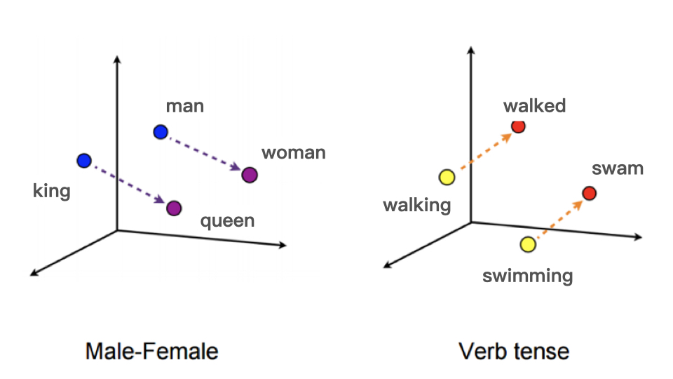
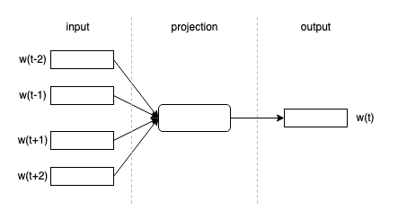
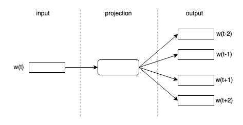
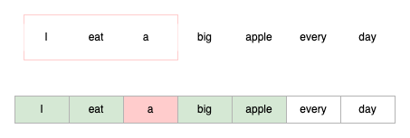
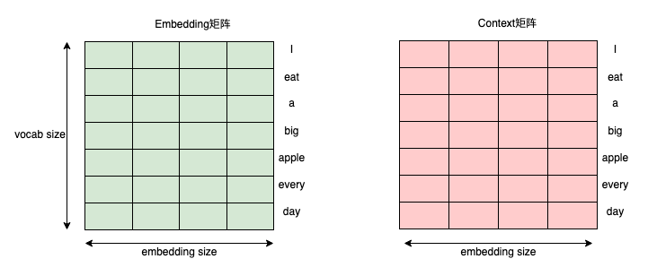
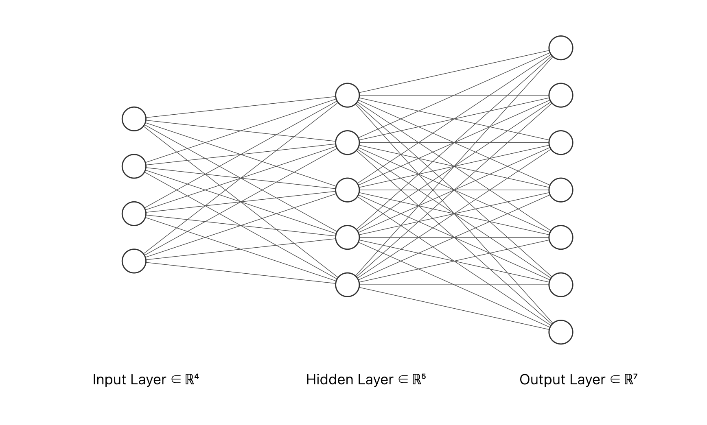
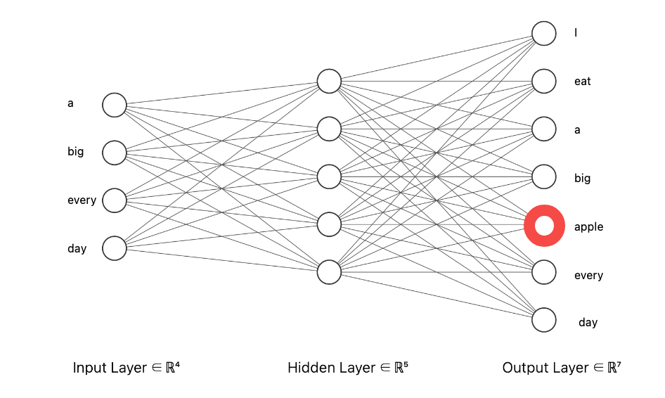

对LLM了解太少了，之前all in CV了，该学点LLM了。

## 1. 什么是Embedding

众所周知，计算机无法读懂自然语言，只能处理数值，但在现实中我们所看到的数据只有两种类型：数值型、类别型，以电影为例来说明，电影的风格、演员、导演、标签、分类等信息，这些无法用数字表示的信息全部都可以看作是类别、ID类数据；能用数字直接表示的数据就是数值型数据，类型包括用户的年龄、收入、视频播放时长、点击量、评论量等。

数字信息可以直接在做一些预处理后直接送入计算机处理，而离散的类别信息常常是以文本的形式存在，将这些文本形式的数据变换为计算机看得懂的数据的过程，就叫Embedding。

## 2. One-Hot编码

One-Hot编码（独热编码）就是将每个单词表示为一个二进制向量，向量的长度等于词汇表大小，且向量中有且仅有一个位置数值为1，其余为0。

这里举一个简单的例子。现在有一句长度为4个词语的句子

```text
I love eating apple
```

那么其独热编码为

| 单词   | Digit 1 | Digit 2  |  Digit 3 | Digit 4  |
|--------|------------------|---|---|---|
| I      | 1                | 0 | 0 | 0 |
| love   | 0                | 1 | 0 | 0 |
| eating | 0                | 0 | 1 | 0 |
| apple  | 0                | 0 | 0 | 1 |

就这么简单。

独热编码的原理和实现都很简单，但其最大的缺陷有两个：

- 在序列过长时编码太稀疏，0占了矩阵大多数，浪费计算资源。
- 独热编码无法捕捉单词间的语义关系，即两个单词即使在语义上很相近，在独热编码中都是相互独立的。

因此我们需要一种更高级的方法，来解决上述两个问题，也就是Embedding。

## 3. 到底怎么做Embedding?


### 3.1 Embedding的目的是什么

**Embedding的本质是一种将离散型变量转化为数值连续的方式。** 单词在经过Embedding后可以通过向量的形式转化为可捕捉上下文关系的一串连续数值。因此，Embedding要做的事情就是建立一个模型，这个模型可以达到以下两个目的：

1. 将离散的单词转化为数值连续的向量
2. 转化的向量存在可以通过捕捉上下文信息的性质

连续的向量非常好理解，例如

```
apple [0.12, 0,45, 0.96]
eating [0.37, 0.66, 0.75]
```

向量中存储的数字都是连续的。


捕捉上下文信息则可以理解为，相近的单词应具有相近的向量表示，即这两个单词的余弦相似度很高。如下图所示，man和woman，king和queen在语义上都有一定相似性，因此映射到向量空间中，它们的距离也不应该很远。

<div align=center></div>


### 3.2 Embedding的生成方法

Embedding的生成方法有很多，例如Word2Vec，Glove，FastText和Bert等。其中Word2Vec开创了一个全新的时代，后续很多工作都是基于这个方式展开，同时也获得了NeuralPS的时间检验奖，因此这里详细介绍Word2Vec方法。

### 3.2.1 什么是Word2Vec

Word2Vec是一种通过训练神经网络来获取单词Embedding的方式，它虽然表面上是无监督学习，但本质上应该可以称为是自监督学习。具体而言，就是通过一句话中自己给自己生成标签来进行训练。

### 3.2.2 Word2Vec的模型有哪些

Word2Vec主要有连续词袋模型（Continuous Bag of Words, CBOW）和skip-gram模型，它们的思想刚好是相反的。

CBOW模型是通过做“完形填空”的方式，通过上下文预测当前位置的单词，如图所示，其中$w(t\pm i)$是单词的Embedding（可以一开始随机初始化Embedding）。

<div align=center></div>

用数学表达即为，其中$f$一般为一个全连接神经网络

$$
w(t) = f(w_{t-N}, w_{t-N+1}, ... w_{t-1}, w_{t+1}, w_{t+2}, .... w_{t+N})
$$

注意到这里用了前$N$个单词和后$N$个单词一起预测当前单词，共$2N$个，我们一般称这个$2N$为窗口长度$L$。

Skip-gram模型与CBOW模型相反，它通过输入一个单词，来预测窗口长度内的其他单词。如图所示

<div align=center></div>

### 3.2.3 CBOW训练流程

CBOW训练可分为以下三步

1. 获取大量文本数据
2. 确定滑动窗口，也就是前面说的$L$
3. 利用这个滑动窗口就能为训练模型生成大量数据，并用这些数据训练神经网络

例如当前文本数据是一句话，窗口长度$L = 4$，即前后各取2个单词。

```text
I eat a big apple every day.
```

例如对于第三个单词`a`，则其前后窗口应该为`I eat`和`big apple`

<div align=center></div>

那么遍历整句话，可以得到一个完整的数据集


| input1 | input2 | input3 | input4 | output |
|:------:|:------:|:------:|:------:|:------:|
|    -   |    -   |   eat  |    a   |    I   |
|    -   |    I   |    a   |   big  |   eat  |
|    I   |   eat  |   big  |  apple |    a   |
|   eat  |    a   |  apple |  every |   big  |
|    a   |   big  |  every |   day  |  apple |
|   big  |  apple |   day  |    -   |  every |
|  apple |  every |    -   |    -   |   day  |


其中`-`代表当前位置没有单词，直接给一个0向量即可。如果是Skip-gram，则全部翻过来，只有一个input，但有多个output。到此为止，已经做完了前两步。


第三步与真实训练息息相关。首先应当确定整个词汇表的大小，即整个数据集中一共有多少单词，例如用上面那句话，有7个**不同的词**，则`vocab_size=7`，记为$n=7$，一般来说词语数量是大于窗口数量的，即存在$0 < L \leq n-1$的关系。

之后建立两个矩阵，分别称为Embedding矩阵和Context矩阵，其中Embedding矩阵是最后的结果，Context矩阵是训练过程中的一个辅助矩阵，这两个矩阵都是随机初始化的，且应该是不同的初始化值。每个单词都对应一个$m$维的向量，因此整个矩阵应该为$n\times m$。这里需要注意的是，一般vocabulary size应该远大于embedding size，即存在关系$n>>m$

<div align=center></div>

好了，现在我们已经构造出一个计算机能看得懂的输入数据了，接下来就是训练它，去得到最终的Embedding矩阵。CBOW的模型非常简单，是一个仅有一个隐藏层的MLP，其输入层神经元个数为滑动窗口的大小$L=4$个，隐藏层神经元个数为$m=5$个，输出层个数应与vocab_size相同，为$n=7$个，则可以绘制神经网络如下

<div align=center></div>

**一个简单的例子**

假设单词表中只有上述7个单词，那么我们可以为每个单词赋予one-hot编码，由于单词量较少，one-hot编码不是很稀疏。

| 单词 | one-hot编码           |
|------|-----------------------|
| I    | [1, 0, 0, 0, 0, 0, 0] |
| eat  | [0, 1, 0, 0, 0, 0, 0] |
| a    | [0, 0, 1, 0, 0, 0, 0] |
| ...  | ...                   |
| day  | [0, 0, 0, 0, 0, 0, 1] |

训练开始时，随机初始化embedding和context矩阵。众所周知，机器学习中可以分为正例和反例，这里正例就是我们想要的结果，反例就是不想要的结果，用一张表即可明确，1就是正例，0就是反例，它们都相当于是标注好的训练数据。

| 期望结果 | 上下文 | target |
|----------|--------|--------|
| apple    | big    | 1      |
| apple    | I      | 0      |
| apple    | eat    | 0      |
| ...      |        |        |


也就是说，如果我想预测`apple`这个单词，那么按照上面$L=4$的窗口长度，输入就应该是`a, big, every, day`。画在图上就应该如下所示，其中红圈代表我们想要额结果

<div align=center></div>

对于每一个词都会输出一个预测概率，经过Sigmoid或者其他激活函数之后，就可以取最大值来当作当前结果，再经过经典的反向传播环节更新权重即可。



注意：训练过程中会同时更新context和embedding矩阵，但最后我们只需要embedding矩阵，context矩阵会被丢弃，因为embedding矩阵中才存放的是每个单词本身的embedding，而context矩阵只是用来辅助训练的。



## 4. 实践

Pytorch直接将Embedding封装为了一个类，调用很方便。其参数如下

| 参数           | 含义            |
|----------------|-----------------|
| n_vocabulary   | 词汇表单词数量  |
| embedding_size | embedding的维数 |


```python

import torch
import torch.nn as nn

# 一个句子，词汇表数量为8，要算上标点符号
# 假如每个单词按照出现顺序编号，例如i=0, eat=1, ... , day=6, 句号=7
# 如果是多个句子，在每个句子最后应该额外加入一个EOS标识符
sentence = "i eat a big apple every day ."
vocab_size = len(sentence)
embed_size = 4 #映射到4维

embedding = nn.Embedding(vocab_size, embed_size)
sentence_index = torch.tensor([0,1,2,3,4,5,6,7,8])
result = embedding(sentence_index)
print(result)

```

输出如下，可以看见每个embedding维度为4

```
tensor([[ 1.2898,  1.3373,  0.2577,  0.4610],
        [-1.6469, -1.1703, -0.4720,  0.7165],
        [-0.1063,  2.5186, -1.4784,  0.6653],
        [ 0.5140, -0.1355, -2.0077,  0.3720],
        [-0.2612, -2.3292, -0.4951,  1.1660],
        [-0.2931,  1.8836, -0.3499,  0.7234],
        [-0.4101,  0.3906, -1.5011, -0.0484],
        [ 0.6284,  0.7961,  0.6538,  0.2233],
        [ 1.2622, -0.8541,  0.9560,  0.6223]], grad_fn=<EmbeddingBackward0>)
```



`torch.nn.embedding`只是初始化了一个embedding矩阵，可以看见`grad_fn`这一项是可以backward的，也就是说embedding可以通过Pytorch提供的`loss.backward()`进行反向传播训练。


