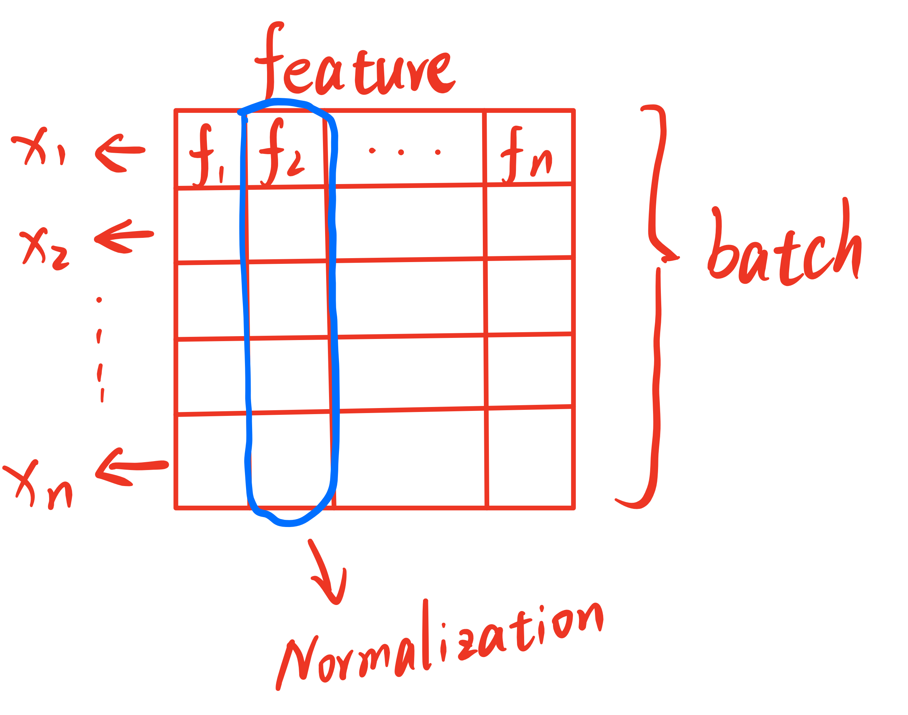
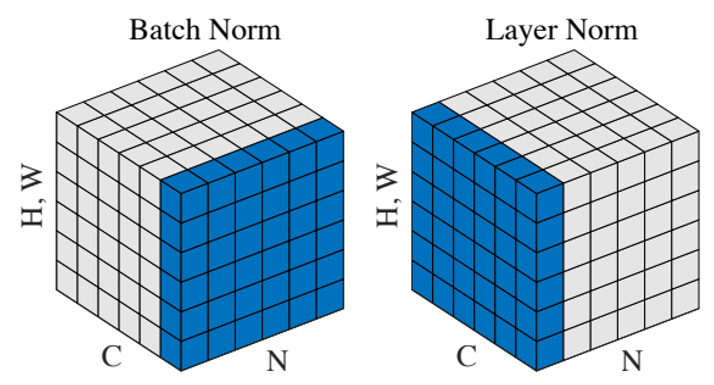

## 1. Batch normalization
Batch normalization，简称BN，是深度学习中常用的的标准化(standardize)方法，其作用是可以使数据分布更加稳定，有助于加快收敛速度与提高泛化能力。BN的原理是对每个batch的数据进行标准化，具体做法是将每个batch中的每一个feature做均值为0，方差为1的归一化处理。

这里结合一张图来说明BN的原理，假设每一个sample输入的维度为一维，经过batch堆叠之后可以形成一个二维矩阵，如图所示，其中每一行代表一个sample，每一列代表一个feature。在进行BN之前，我们需要先计算每一个feature的均值与方差，然后对每一个feature进行标准化处理，最后再乘以一个缩放因子$\gamma$，加上一个偏移量$\beta$，最终得到的结果就是BN的输出。

这幅图中行代表samples的所有feature，列代表不同的samples。而Batch normalization就是对每一个batch中的每一列feature做标准化。用公式表述整个过程如下所示，其中$y_i$是整个BN层的输出。

$$
Input: B=\left\{x_{1 \ldots m}\right\} ; \gamma, \beta (\text{parameters to be learned})\\
Output: \left\{y_i=B N_{\gamma, \beta}\left(x_i\right)\right\}
$$

$$
\begin{aligned}
& \mu_B \leftarrow \frac{1}{m} \sum_{i=1}^m x_i \\
& \sigma_B^2 \leftarrow \frac{1}{m} \sum_{i=1}^m\left(x_i-\mu_B\right)^2 \\
& \tilde{x}_i \leftarrow \frac{x_i-\mu_B}{\sqrt{\sigma_B^2+\epsilon}} \\
& y_i \leftarrow \gamma \tilde{x}_i+\beta
\end{aligned}
$$

## 2. Layer normalization
Layer normalization，简称LN，是另一种常用的标准化方法，其原理与BN类似，只不过LN是对每一个batch中的每一行sample做标准化。同样可以用一张图用公式表述整个过程如下所示。公式表达与BN的区别在于$\mu_B$与$\sigma_B^2$的计算方式不同，LN是对每一行sample做标准化，因此$\mu_B$与$\sigma_B^2$的计算方式也不同。

  

## 3. 三维情况下的BN与LN
三维情况下的BN与LN与二维类似

上图中，N代表batch size，C代表sequence length，H代表height，W代表width。在视觉任务下可以忽略C，即NCHW中的C，因为视觉任务中的输入一般是图片，图片的宽高是固定的，因此C一般是1。在NLP任务下，C代表的是句子中的单词个数。**因此在视觉任务中，可以将BN看作把一个batch中每一张图片对应位置像素做标准化（例如对每张图片(112,112)位置的像素计算均值和方差并标准化），而LN则是对每一幅图像做标准化**。但是在视觉任务中，通常在输入模型之前就会对图片做归一化处理，因此通常不会使用LN。