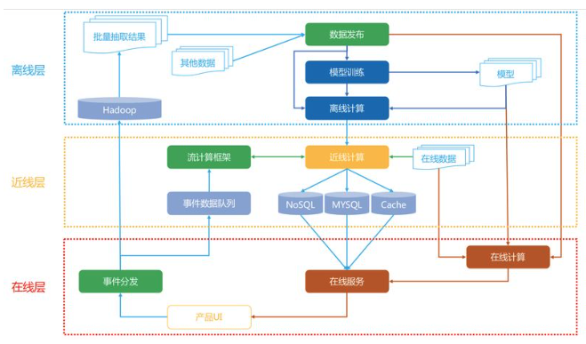
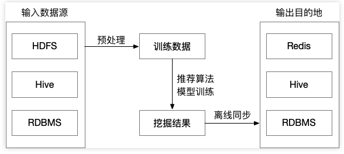
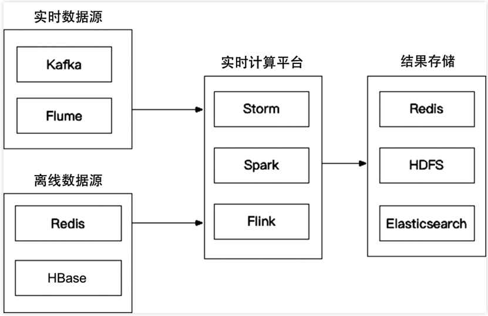
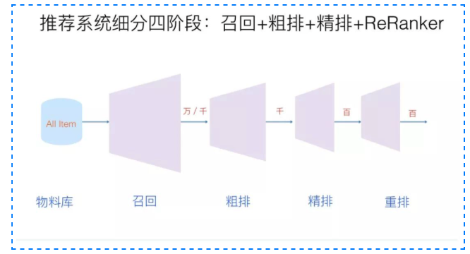

学习搜广推主要根据FunRec的教程，面向有机器学习、深度学习基础的搜广推学习笔记。
地址：https://github.com/datawhalechina/fun-rec/
本博客系列所有笔记都是对其中的重点内容进行总结。
如有侵权，请联系我删除。

## 1. 推荐和搜索的区别

节选自源笔记第一章

搜索和推荐都是解决互联网大数据时代信息过载的手段，但是它们也存在着许多的不同：

- **用户意图：** 搜索时的用户意图是非常明确的，用户通过查询的关键词主动发起搜索请求。对于推荐而言，用户的需求是不明确的，推荐系统在通过对用户历史兴趣的分析给用户推荐他们可能感兴趣的内容。
- **个性化程度：** 对于搜索而言，由于限定的了搜索词，所以展示的内容对于用户来说是有标准答案的，所以搜索的个性化程度较低。而对于推荐来说，推荐的内容本身就是没有标准答案的，每个人都有不同的兴趣，所以每个人展示的内容，个性化程度比较强。
- **优化目标：** 对于搜索系统而言，更希望可以快速地、准确地定位到标准答案，所以希望搜索结果中答案越靠前越好，通常评价指标有：归一化折损累计收益（NDCG）、精确率（Precision）和召回率（Recall）。对于推荐系统而言，因为没有标准的答案，所以优化目标可能会更宽泛。例如用户停留时长、点击、多样性，评分等。不同的优化目标又可以拆解成具体的不同的评价指标。
- **马太效应和长尾理论：** 对于搜索系统来说，用户的点击基本都集中在排列靠前的内容上，对于排列靠后的很少会被关注，这就是马太效应。而对于推荐系统来说，热门物品被用户关注更多，冷门物品不怎么被关注的现象也是存在的，所以也存在马太效应。此外，在推荐系统中，冷门物品的数量远远高于热门物品的数量，所以物品的长尾性非常明显。

## 2. 推荐系统的系统架构

目前主流的推荐系统架构是由Netflix提出的，分为三层：**离线层、近线层和在线层**。它们的作用和特点分别是

- 离线层：不用实时数据，不提供实时响应。主要用于管理离线作业的部分架构，对算法复杂度和处理数据量限制较少，但数据很容易过时。
- 近线层：使用实时数据，不保证实时响应。主要用于结合和管理在线和离线的计算过程，可以执行类似在线计算方法，但不必以实时方式完成，介于离线和在线之间。
- 在线层：使用实时数据，保证实时响应。主要用于及时响应最近的事件和用户交互，对算法复杂性和处理数据量有限制。

如图所示

整体分为三部分：客户端及服务器实时处理数据、流处理平台准实时处理数据和大数据平台离线处理数据。

- 客户端及服务器实时处理数据：这部分一般是后端和客户端完成，又叫埋点和记录点。就是工程师记录用户数据的过程。例如用户交互的内容、使用设备、停留时间、发生时间等。
- 流处理平台准实时处理数据：这部分本质上也是记录数据，但记录的是存在时间误差的实时数据，也叫准实时。在推荐领域中，只有**用户行为数据**类别能被称为准实时数据。例如用户在看当前内容之前还看过哪些内容，和哪些内容有交互。一般通过消息队列+在线缓存的方式做成准实时。
- 大数据平台离线数据处理：离线就是线下处理数据，一般来说这部分才是数据处理的大头，也就是例如增查删改之类的操作，非常耗时，就放到离线层。

### 2.1 离线层

离线层主要负责

1. 数据处理和存储；
2. 特征工程和离线特征计算；
3. 离线模型训练；

离线层不需要实时数据，也不提供实时服务。一个离线层的架构如图所示，可以看出离线层是最接近平常学习的机器学习中处理数据、训练模型这种任务的。

离线层面临的数据量级是最大的，面临主要的问题是海量数据存储、大规模特征工程、多机分布式机器学习模型训练。目前主流的做法是HDFS，收集到我们所有的业务数据，通过HIVE等工具，从全量数据中抽取出我们需要的数据，进行相应的加工，离线阶段主流使用的分布式框架一般是Spark。

### 2.2 近线层

近线层主要负责

1. 特征的事实更新计算：例如统计用户对不同类型的[CTR](https://www.adjust.com/zh/glossary/ctr/)，如果用离线层计算好的特征很容易出现特征分布不一致，因此可以按照用户的实时兴趣来计算。
2. 实时训练数据获取：例如在使用DIN、DSIN这类网络会依赖于用户的实时兴趣变化，用户几分钟前的点击就可以通过近线层获取特征输入模型
3. 模型实时训练：可以对模型进行online训练更新，实时推送到线上。

一个近线层结构如图所示

### 2.3 在线层

在线层主要负责

1. 模型在线服务，包括召回和排序。
2. 在线特征快速处理拼接，即根据传入的用户ID和场景，读取特征和处理特征。
3. AB实验或分流，即根据不同用户采用不一样的模型，比如冷启动用户和正常服务模型。
4. 运筹优化和业务干预：比如要对特殊商家流量扶持、对某些内容限流。

在线层最大的问题就是对实时性要求特别高，一般来说是几十毫秒，这就限制了我们能做的工作，很多任务往往无法及时完成，需要近线层协助我们做。

## 3. 推荐系统的算法架构

推荐系统算法架构主要分为：召回、粗排、精排和重排。

### 3.1 召回

**召回，指从推荐池候选集中选取海量的item送给后续的排序模块**。由于召回模块需要在线输出，因此必须具备轻量和低延迟的特点。召回不需要特别精确，但不能遗漏。

召回的作用就是做候选集筛选，保证精排层的时间效果最大化。另外还可以减少排序阶段拟合多目标的压力，比如召回阶段需要在保证item质量的基础上注重覆盖率的多样性。

目前主要采用多路召回解决范式，分为个性化召回和非个性化召回。个性化召回又有content-based、behavior-based、feature-based等多种方式。

### 3.2 粗排

**粗排的原因是有时候召回的结果还是太多，精排层速度还是跟不上，所以加入粗排**。粗排可以理解为精排前的一轮过滤机制，减轻精排模块的压力。粗排介于召回和精排之间，要同时兼顾精准性和低延迟。目前粗排一般也都模型化了，其训练样本类似于精排，选取曝光点击为正样本，曝光未点击为负样本。但由于粗排一般面向上万的候选集，而精排只有几百上千，其解空间大很多。

### 3.3 精排

精排层，也是我们学习推荐入门最常常接触的层，我们所熟悉的算法很大一部分都来自精排层。这一层的任务是获取粗排模块的结果，对候选集进行打分和排序。精排需要在最大时延允许的情况下，保证打分的精准性，是整个系统中至关重要的一个模块，也是最复杂，研究最多的一个模块。

精排是推荐系统各层级中最纯粹的一层，他的目标比较单一且集中，一门心思的实现目标的调优即可。最开始的时候精排模型的常见目标是CTR,后续逐渐发展了CVR等多类目标。精排和粗排层的基本目标是一致的，都是对商品集合进行排序，但是和粗排不同的是，精排只需要对少量的商品(即粗排输出的商品集合的topN)进行排序即可。因此，精排中可以使用比粗排更多的特征，更复杂的模型和更精细的策略（用户的特征和行为在该层的大量使用和参与也是基于这个原因）。

精排层模型是推荐系统中涵盖的研究方向最多，有非常多的子领域值得研究探索，这也是推荐系统中技术含量最高的部分，毕竟它是直接面对用户，产生的结果对用户影响最大的一层。目前精排层深度学习已经一统天下了，精排阶段采用的方案相对通用，首先一天的样本量是几十亿的级别，我们要解决的是样本规模的问题，尽量多的喂给模型去记忆，另一个方面时效性上，用户的反馈产生的时候，怎么尽快的把新的反馈给到模型里去，学到最新的知识。

### 3.4 重排

常见的有三种优化目标：Point Wise、Pair Wise 和 List Wise。重排序阶段对精排生成的Top-N个物品的序列进行重新排序，生成一个Top-K个物品的序列，作为排序系统最后的结果，直接展现给用户。重排序的原因是因为多个物品之间往往是相互影响的，而精排序是根据PointWise得分，容易造成推荐结果同质化严重，有很多冗余信息。而重排序面对的挑战就是海量状态空间如何求解的问题，一般在精排层我们使用AUC作为指标，但是在重排序更多关注NDCG等指标。

重排序在业务中，获取精排的排序结果，还会根据一些策略、运营规则参与排序，比如强制去重、间隔排序、流量扶持等、运营策略、多样性、context上下文等，重新进行一个微调。重排序更多的是List Wise作为优化目标的，它关注的是列表中商品顺序的问题来优化模型，但是一般List Wise因为状态空间大，存在训练速度慢的问题。

由于精排模型一般比较复杂，基于系统时延考虑，一般采用point-wise方式，并行对每个item进行打分。这就使得打分时缺少了上下文感知能力。用户最终是否会点击购买一个商品，除了和它自身有关外，和它周围其他的item也息息相关。重排一般比较轻量，可以加入上下文感知能力，提升推荐整体算法效率。比如三八节对美妆类目商品提权，类目打散、同图打散、同卖家打散等保证用户体验措施。重排中规则比较多，但目前也有不少基于模型来提升重排效果的方案。