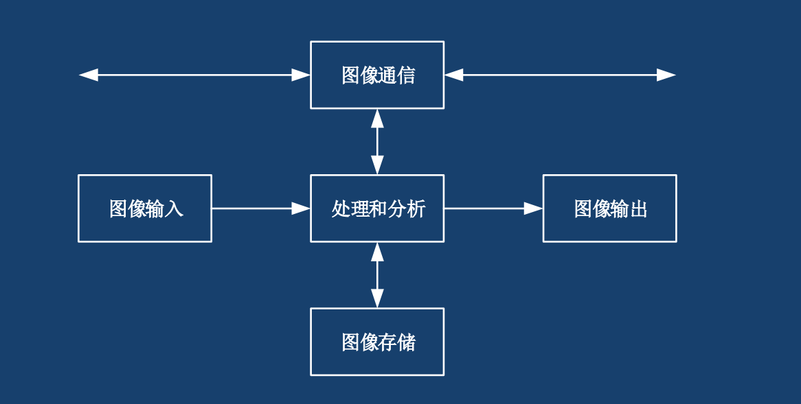

# 1. 图像的概念

图像可分为“图”和“像”分开理解：

- “图” — 物体透射或反射光的分布，是客观存在的
- “像” — 人(的视觉系统)对(接收在大脑中形成的)图的印象或认识，是人的感觉

## 1.1 图像和图像处理的分类

图像可以分为模拟图像和数字图像：
- 模拟图像：空间坐标和幅度都连续变化的图像
- 数字图像：空间坐标和幅度均用离散数字表示的图像

图像处理可以分为：模拟图像处理（光学处理）、数字图像处理和光电结合处理，我们可以用一张表总结他们的优缺点。

|      |          模拟图像处理（光学处理）          |               数字图像处理               |                                                 光电结合处理                                                 |
|------|:----------------------------------------:|:----------------------------------------:|:------------------------------------------------------------------------------------------------------------:|
| **优点** | 实时性强、速度快、处理信息量大、分辨率高 | 精度高、处理内容丰富、方法易变、灵活度高 | 集合了二者的优点，用光学方法完成运算量巨大的处理（如频谱变换），用计算机对光学处理结果（如频谱）进行分析判断 |
| **缺点** | 处理精度低、灵活度差、难有判断功能       | 处理速度慢                               | -                                                                      |

## 1.2 数字图像处理的步骤和方法

### 1.2.1 图像的表达

一幅图像包含的信息首先表现为光的强度（intensity），即一幅图像可看成是空间中坐标点上光强度$I$的集合，其数学表达式为

$$
I = f(x,y,z,\lambda,t)
$$

其中，$(x, y, z)$是空间坐标， $\lambda$ 是波长，$t$ 是时间，$I$是光点位于坐标$(x, y, z)$的强度（幅度）。

在一些特殊情况下，上式括号中的部分参数可以省略，特别的，对于平面上的**静止灰度图像**，其数学表达式可简化为

$$
I = f(x,y)
$$

### 1.2.2 图像的特点

1. 空间有界：一幅图像大小有限
2. 幅度(强度有限)：

$$
0 \leq f(x,y) \leq B_m
$$

$B_m$为有限值。

### 1.2.3 数字图像处理的基本步骤

处理数字图像一般由如下步骤构成：

1. 图像信息的获取
2. 图像信息的存储
3. 图像信息的处理
4. 图像信息的传输
5. 图像信息的输出和显示

**图像数字化：** 将非数字形式的图像信号通过数字化设备转换为数字图像，包括 **采样** 和 **量化**

## 1.3 数字图像处理系统的组成

**重点 需背诵**

