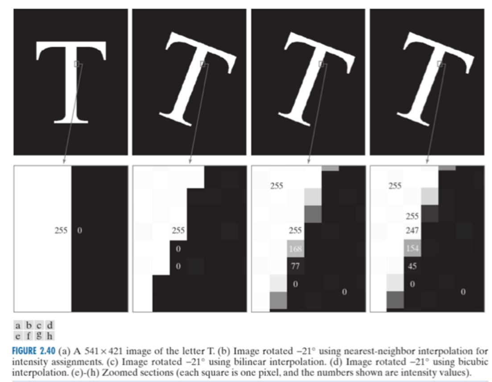
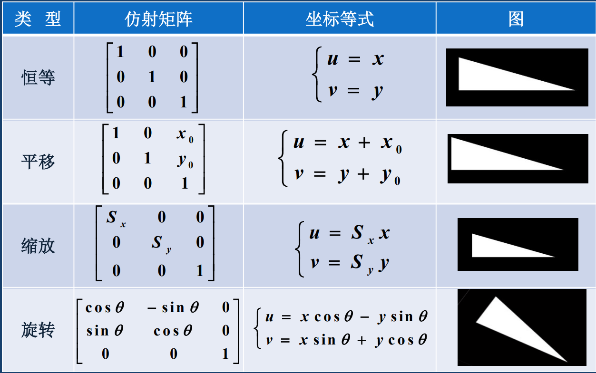
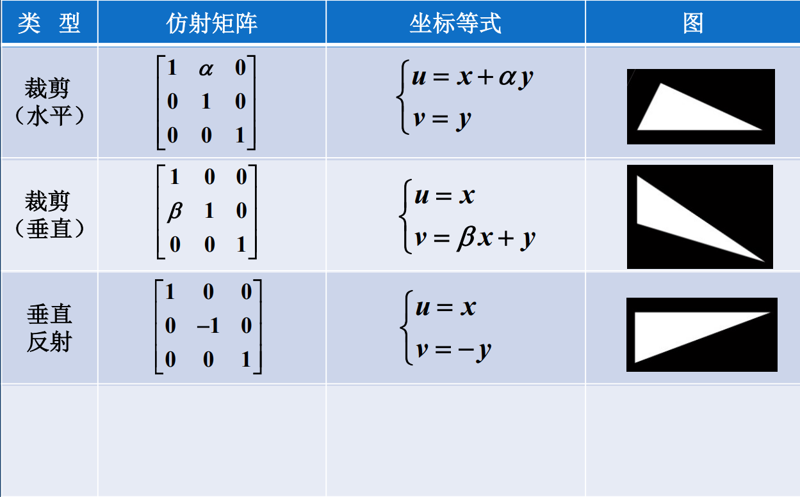
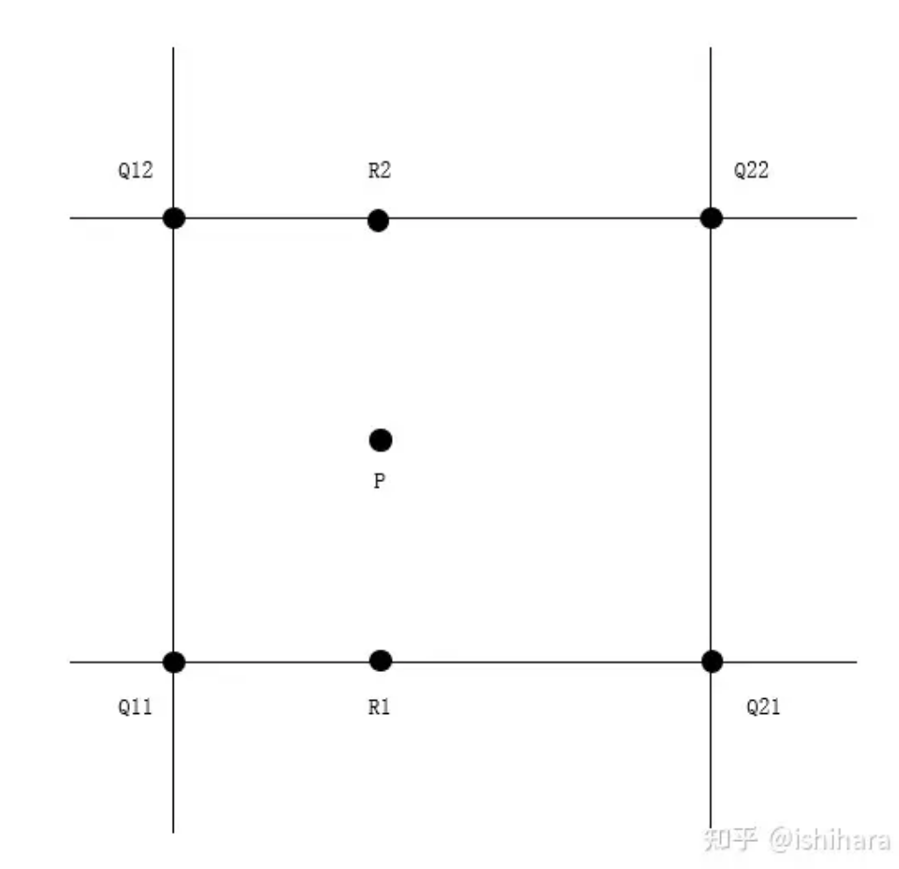

# 3. 图像变换

## 3.1 图像变换的基本概念

线性空间中，如果$x$是一个向量，$U$是一个矩阵，则称

$$
y = Ux
$$

是向量$x$到向量$y$的线性变换。

若$n$阶矩阵$U$满足

$$
U^TU = I
$$

则称$U$位正交矩阵，$y = Ux$称为正交变换。


## 3.2 图像的几何变换

几何变换是最通用的变换之一，例如平移、旋转、裁剪等，这些效果展示目前基本都已经集成到了手机的相片编辑系统中。

### 3.2.1 平移变换

假设平移前坐标为$(x,y)$，后新坐标为$(u,v)$，坐标平移量为$(x_0,y_0)$，则平移变换可以用矩阵表达为

$$
\left[\begin{array}{l}
u \\
v
\end{array}\right]=\left[\begin{array}{ll}
1 & 0 \\
0 & 1
\end{array}\right]\left[\begin{array}{l}
x \\
y
\end{array}\right]+\left[\begin{array}{l}
x_0 \\
y_0
\end{array}\right]
$$

### 3.2.2 比例缩放

设$(S_x, S_y)$为缩放系数，则比例缩放可用矩阵表达为

$$
\left[\begin{array}{l}
u \\
v
\end{array}\right]=\left[\begin{array}{cc}
S_x & 0 \\
0 & S_y
\end{array}\right]\left[\begin{array}{l}
x \\
y
\end{array}\right]
$$


### 3.2.3 旋转变换

将输入图像绕笛卡尔坐标系原点旋转$\theta$角度，用矩阵表示为

$$
\left[\begin{array}{l}
u \\
v
\end{array}\right]=\left[\begin{array}{cc}
\cos\theta & -\sin\theta \\
\sin\theta & \cos\theta
\end{array}\right]\left[\begin{array}{l}
x \\
y
\end{array}\right]
$$

**思考**：旋转变换矩阵的n次方是什么？
从旋转的物理意义出发，每乘以一个旋转矩阵，就相当于将原图像旋转了$\theta$角度，那么乘以n个旋转矩阵，则相当于旋转$n\theta$角度，那么旋转矩阵的n次方就可以写为

$$
\left[\begin{array}{cc}
\cos\theta & -\sin\theta \\
\sin\theta & \cos\theta
\end{array}\right]^n = \left[\begin{array}{cc}
\cos (n\theta) & -\sin (n\theta) \\
\sin (n\theta) & \cos (n\theta)
\end{array}\right]
$$

需要注意的是，对于图像的旋转操作会由于图像空间量化误差而造成信息上的损失，如下图所示

<div align=center></div>

### 3.2.4 仿射变换

仿射变换是前面几种变换一般形式，仿射变换具有：

- 平直性，即变换前后都是直线
- 平行性，即变换前后平行的线仍然平行
  
仿射变换的一般表达式为

$$
\left[\begin{array}{l}
u \\
v
\end{array}\right]=\left[\begin{array}{ll}
a_2 & a_1 \\
b_2 & b_1
\end{array}\right]\left[\begin{array}{l}
x \\
y
\end{array}\right]+\left[\begin{array}{l}
a_0 \\
b_0
\end{array}\right]
$$

通常，仿射变换都会将变换矩阵与坐标增广一个维度，如下所示：

$$
\left[\begin{array}{c}
u \\
v \\
1
\end{array}\right]=\left[\begin{array}{ccc}
a_2 & a_1 & a_0 \\
b_2 & b_1 & b_0 \\
0 & 0 & 1
\end{array}\right]\left[\begin{array}{l}
x \\
y \\
1
\end{array}\right]
$$

这样做的好处是将仿射变换矩阵变为了方阵，**可以进行矩阵的连乘，即多个仿射变换连续进行。**

**仿射变换的性质：**

1. 仿射变换只有**6个自由度**，对应矩阵前两行的6个元素，因此仿射变换可以保证变换前后平行的直线仍然是平行，三角形仍然是三角形，但不能保证四边形以上的多边形映射仍为多边形
2. 仿射变换的乘积和逆变换都是仿射变换

<div align=center></div>

<div align=center></div>

### 3.2.5 透视变换

与仿射变换不同，透视投影按照桶投影中心这一点出发的直线将物体投影到图像平面。透视变换矩阵表达式为

$$
\left[\begin{array}{c}
u^{\prime} \\
v^{\prime} \\
w^{\prime}
\end{array}\right]=\left[\begin{array}{lll}
a_{11} & a_{12} & a_{13} \\
a_{21} & a_{22} & a_{23} \\
a_{31} & a_{32} & a_{33}
\end{array}\right]\left[\begin{array}{l}
x \\
y \\
1
\end{array}\right]
$$

透视变换有9个自由度，因此可以实现平面四边形到四边形的映射。

## 3.3 图像插值

### 3.3.1 最邻近插值

最邻近插值也叫零阶插值，也就是令变换后像素的灰度值等于它最近的输入像素的灰度值。最邻近插值输入输出关系为简单的比例关系，

$$
dst_x = src_x*scale
$$

$$
dst_y = src_y*scale
$$

这里直接给出最邻近插值的Python代码

```python

def nearest(img, scale):
    w, h, _ = img.shape
    n_width = w*scale
    n_height = h*scale
    n_img = np.zeros((n_width, n_height, 3))
    for c in range(3):
        for i in range(n_width):
            for j in range(n_height):
                n_img[i, j, k] = img[round((i-1)/scale), round((j-1)/scale), c]
```

最邻近插值计算简单，但若scale比较大时会出现锯齿边缘的效应，插值效果较差。

### 3.3.2 双线性插值

双线性插值也叫做一阶插值，该方法简而言之就是先沿图像矩阵的行插值，得到结果后再对图像列插值，因此需要至少4个点（行2个，列2个）来进行双线性插值，一张图可以说明这个方法^[https://zhuanlan.zhihu.com/p/141681355]，先通过$Q12,Q22$横向插值得到中间$x$处上方的第一个值$R2$，同理用$Q11,Q21$得到$x$出下方的值$R1$，然后这两个值再做一次插值即可得出最终结果$P$

<div align=center></div>

具体公式如下，总体原理是根据$Q12$到$R2$和$R2$到$Q22$之间的斜率相等列出等式，然后做数学变形计算出$R1$处的值，其余同理。

$$
\begin{aligned}
& f(R 1)=\frac{x 2-x}{x 2-x 1} f(Q 11)+\frac{x-x 1}{x 2-x 1} f(Q 21) \\
& f(R 2)=\frac{x 2-x}{x 2-x 1} f(Q 12)+\frac{x-x 1}{x 2-x 1} f(Q 22) \\
& f(P)=\frac{y 2-y}{y 2-y 1} f(R 1)+\frac{y-y 1}{y 2-y 1} f(R 2)
\end{aligned}
$$

将$f(R1)$，$f(R2)$带入$f(P)$有：

$$
\begin{aligned}
& f(P)=\frac{(x 2-x)(y 2-y)}{(x 2-x 1)(y 2-y 1)} f(Q 11)+\frac{(x-x 1)(y 2-y)}{(x 2-x 1)(y 2-y 1)} f(Q 21)+\frac{(x 2-x)(y-y 1)}{(x 2-x 1)(y 2-y 1)} f(Q 12) \\
& +\frac{(x-x 1)(y-y 1)}{(x 2-x 1)(y 2-y 1)} f(Q 22)
\end{aligned}
$$

同样给出Python代码，实际操作中双线性插值只用相邻4个点（像素位置差1），所以这里分母全为1。

```python

def double_linear(img, scale):
    width, height, channel = img.shape
    n_width = int(width*scale)
    n_height = int(height*scale)
    for c in range(channel):
        for i in range(n_width):
            for j in range(n_height):
                src_x = i / scale
                src_y = j / scale
                src_x_0 = int(np.floor(src_x))
                src_y_0 = int(np.floor(src_y))
                src_x_1 = min(src_x_0 + 1, width - 1) #确保不会选到图像外的点
                src_y_1 = min(src_y_0 + 1, height - 1)
                value0 = (src_x_1 - src_x)*img[src_x_0, src_y_0, c] + (src_x - src_x_0)*img[src_x_1, src_y_0, c]
                value1 = (src_x_1 - src_x)*img[src_x_0, src_y_1, c] + (src_x - src_x_0)*img[src_x_1, src_y_1, c]

                n_img[i, j, c] = int((src_y_1 - src_y))*value0 + (src_y-src_y_0)*value1

                return np.array(n_img)

```

**双线性插值的缺点是边界有模糊，因为这样插值相当于对选取的四个点做了加权平均。**

### 3.3.3 卷积插值法

图像放大时，图像像素的灰度值插值可以通过卷积实现，即将输入图像两行两列中间插入0，然后通过低通模板滤波。

$$
\left[\begin{array}{ll}
x_{11} & x_{12} \\
x_{21} & x_{22}
\end{array}\right] \quad\left[\begin{array}{ccc}
x_{11} & 0 & x_{12} \\
0 & 0 & 0 \\
x_{21} & 0 & x_{22}
\end{array}\right]
$$

## 3.4 图像的傅里叶变换

### 3.4.1 回顾1D-DFT

对于有限长序列，$f(n)(n=0,1,2, ... , N-1)$，其DFT定义为

$$
\left\{\begin{array}{c}
F(u)=\frac{1}{\sqrt{N}} \sum_{n=0}^{N-1} f(n) W_N^{n u}, 0 \leq u \leq N-1 \\
f(n)=\frac{1}{\sqrt{N}} \sum_{n=0}^{N-1} F(u) W_N^{-n u}, 0 \leq n \leq N-1 \\
W_N=e^{-j2\pi/N}
\end{array}\right.
$$

将上述表达式转化为矩阵表达式：

$$
\left[\begin{array}{c}
F(0) \\
F(1) \\
F(2) \\
\cdots \\
F(N-1)
\end{array}\right]=\left[\begin{array}{cccc}
W_N^{00} & W_N^{01} & \cdots & W_N^{0(N-1)} \\
W_N^{10} & W_N^{11} & \cdots & W_N^{1(N-1)} \\
W_N^{20} & W_N^{21} & \cdots & W_N^{2(N-1)} \\
\cdots & \cdots & \cdots & \cdots \\
W_N^{(N-1) 0} & W_N^{(N-1) 1} & \cdots & W_N^{(N-1)(N-1)}
\end{array}\right]\left[\begin{array}{c}
f(0) \\
f(1) \\
f(2) \\
\cdots \\
f(N-1)
\end{array}\right] = Uf
$$

其中，$U$为变换矩阵，且$U$是对称的，即

$$
U = U^T
$$

此外，还可以证明$U$为酉矩阵(unitary matrix)， 即

$$
U(U^*)^T = I 
$$

因此有

$$
U^{-1} = (U^*)^T = U^*
$$

而1D-DFT则为正交变换，正交变换的反变换可用该矩阵表示

$$
f = U^{-1}F = U^*F
$$

### 3.4.2 2D-DFT

2D-DFT是对1D-DFT的扩展，公式如下

$$
\left\{\begin{array}{l}
F(u, v)=\frac{1}{N} \sum_{m=0}^N \sum_{n=0}^{N-1} f(m, n) W_N^{(m u+n v)} \\
f(m, n)=\frac{1}{N} \sum_{u=0}^N \sum_{v=0}^{N-1} F(u, v) W_N^{-(m u+n v)} \\
W_N=e^{-j2\pi / N}
\end{array}\right.
$$

### 3.4.3 2D-DFT的性质

**<font color=red size=3 face="微软雅黑">重点</font>**

**可分离性、移位性、频谱中心化、尺度变换和平均值考试请务必牢记**

| 性质    | 描述                                                                                                       | 数学表达式                                                                                                                                                                                                                                                                                                                                            |
|----------------|------------------------------------------------------------------------------------------------------------|-------------------------------------------------------------------------------------------------------------------------------------------------------------------------------------------------------------------------------------------------------------------------------------------------------------------------------------------------------|
| <span style="display:inline-block;width:100px">变换核可分离性</span> | <span style="display:inline-block;width:300px">2D-DFT相当于先对行（或列）做一维DFT，再对列（或者行）一维DFT</span>                                               | $$\begin{aligned} &   F\left(u,v\right)=\frac1N\sum_{m=0}^{N-1}\sum_{n=0}^{N-1}f\left(m,n\right)W_{N}^{mu+nv}\\  &   =\left.\frac1{\sqrt{N}}\sum_{m=0}^{N-1}\left[\frac1{\sqrt{N}}\sum_{n=0}^{N-1}f\left(m,n\right)W_{N}^{nv}\right]W_{N}^{mu}\right.\\  &   =\frac1{\sqrt{N}}\sum_{m=0}^{N-1}F(m,v)W_{N}^{mu}\\  & =F\left(u,v\right)\end{aligned}$$ |
| 移位性         | 分为空间移位、频域移位，移位前后幅度不变                                                                   | 空间移位：$$f(m-m_0,n-n_0)\leftrightarrow F(u,v)W_N^{(m_0u+n_0v)}$$   时间移位：$$f(m, n) W_N^{-\left(m u_0+n v_0\right)} \leftrightarrow F\left(u-u_0,   v-v_0\right)$$                                                                                                                                                                              |
| 频谱中心化     | 对于$N\times N$大小的图像，将图像$f(m,n)$的频谱从远点搬移到中心$(N/2,N/2)$                                         | $$\left(-1\right)^{m+n}f(m,n)\leftrightarrow F\left(u-u_0,v-v_0\right)$$                                                                                                                                                                                                                                                                              |
| 旋转不变性     | 空域中旋转角度$\theta_0$，频域中也旋转同样的角度$\theta_0$                                                    | $$f\left(r,\theta+\theta_0\right)\Leftrightarrow   F\left(\omega,\varphi+\theta_0\right)$$                                                                                                                                                                                                                                                            |
| 卷积定理       | 空域卷积<=>频域相乘，频域卷积<=>空域相乘，需要注意的是需要先将$f,h$扩展至$M\times N$大小，防止卷积时与前一个周期重合 | $$\begin{cases}f_e(m,n)*h_e(m,n)\Leftrightarrow   F(u,v)H(u,v)\\f_e(m,n)h_e(m,n)\Leftrightarrow F(u,v)*H(u,v)&\end{cases}$$                                                                                                                                                                                                                           |
| 周期性         | 2D-DFT变换前后是周期的                                                                                     | $$\begin{aligned}f\left(m,n\right)&=f\left(m+aN,n+bN\right)\\\\F\left(u,v\right)&=F\left(u+aN,v+bN\right)\end{aligned}$$                                                                                                                                                                                                                              |
| 共轭对称性     | 若图像$f(m,n)$为实函数，则$F(u,v)$具有共轭对称性                                                           | $$F^{*}(u,v)=F(-u,-v)\quad \|F(u,v)\|=\|F(-u,-v)\|$$                                                                                                                                                                                                                                                                                                  |
| 线性           | 傅里叶正反变换都是线性变换                                                                                 | $$\begin{aligned}DFT\begin{bmatrix}af_1(m,n)+bf_2(m,n)\end{bmatrix}=a\cdot   DFT\begin{bmatrix}f_1(m,n)\end{bmatrix}+b\cdot   DFT\begin{bmatrix}f_2(m,n)\end{bmatrix}\\\\IDFT\begin{bmatrix}aF_1(u,v)+bF_2(u,v)\end{bmatrix}=a\cdot   IDFT\begin{bmatrix}F_1(u,v)\end{bmatrix}+b\cdot IDFT\begin{bmatrix}F_2(u,v)\end{bmatrix}\end{aligned}$$                                        |
| 尺度变换       | 空域相乘，频域相除还要除以放缩尺度的乘积                                                                   | $$f\left(am,bn\right)\Leftrightarrow\frac1{\|ab\|}F\left(\frac ua,\frac   vb\right)$$                                                                                                                                                                                                                                                                 |
| 实偶函数DFT    | 仅有余弦实部，奇部求和为0                                                                                  | $$F_e(u,v)=\sum_{m=0}^{N-1}\sum_{n=0}^{N-1}f_e(m,n)\cos\frac{2\pi   mu}N\cos\frac{2\pi nv}N$$                                                                                                                                                                                                                                                         |
| 实奇函数DFT    | 仅有正弦虚部，偶部求和为0                                                                                  | $$F_o(u,v)=-j\sum_{m=0}^{N-1}\sum_{n=0}^{N-1}f_o(m,n)\sin\frac{2\pi   mu}N{\sin\frac{2\pi nv}N}$$                                                                                                                                                                                                                                                     |
| 平均值        | 对整幅图像求平均，相当于$u=v=0$，需要注意空域与频域两种求法                                                | $$\begin{aligned}\overline{f\left(m,n\right)}=\frac1{N^2}\sum_{m=0}^{N-1}\sum_{n=0}^{N-1}f\left(m,n\right)\\\overline{f\left(m,n\right)}=\frac1NF\left(0,0\right)\end{aligned}$$                                                                                                                                                                                                  |
| 相关定理       | 空域互相关<=>频域滤波器变为共轭相乘，反之亦然                                                              | $$\begin{aligned}f_e(m,n)\circ h_e(m,n)\Leftrightarrow   F(u,v)H^*(u,v)\\\\f_e(m,n)h_e(m,n)\Leftrightarrow F(u,v)\circ H^*(u,v)\end{aligned}$$                                                                                                                                                                                                                                      |                                                                                                                                                                                       |                                                                                                                                                                                                                                                                                                                                              |
|                |                                                                                                            |                                                                                                                                                                                                                                                                                                                                                   |


## 3.5 图像变换的一般表示形式

### 3.5.1 图像变换一般表达式

图像的变换多种多样，仿射变换和傅里叶变换只是其中的两个例子，我们可以用一般形式表达图像变换：

$$
\left.\left\{\begin{array}{l}F\left(u,v\right)=\sum_{m=0}^{N-1}\sum_{i=0}^{N-1}f\left(m,n\right)g\left(m,n,u,v\right);\\ \\ 0\leq u,v\leq N-1\\ \\ \\ f\left(m,n\right)=\sum_{n=0}^{N-1}\sum_{i=0}^{N-1}F\left(u,v\right)h\left(m,n,u,v\right);\\ 0\leq m,n\leq N-1\end{array}\right.\right.
$$

其中$g(m,n,u,v)$为正变换核，$h(m,n,u,v)$称为反变换核。在傅里叶变换中，$g = W^{(mu+nv)}_N, h = W^{-(mu+nv)}_N$。

### 3.5.2 正交变换

上述表达式的正变换可以用矩阵形式记为

$$
F = Gf
$$

其中$G$为变换矩阵。

- 若实数方阵$G$满足$GG^T = I$，则$G$为正交矩阵
- 若复数方阵$G$满足$G(G^*)^T = I$，则$G$为酉矩阵

正交矩阵（酉矩阵）性质如下

| 性质     | 描述                                                   |
|----------|--------------------------------------------------------|
| 逆与转置 | $G^{-1}=G^T$ 或者 $G^{-1} = (G^*)^T$                   |
| 正交归一 | 正交矩阵始终有：行模=列模=1，且不同行列向量之间正交    |
| 行列式   | 正交矩阵行列式$\|G\|=\pm 1$                            |
| 反身性   | 若$G$为正交或酉矩阵，则$G^T$和$G^{-1}$也为正交或酉矩阵 |
| 矩阵连乘 | 若$G_1, G_2$为正交或酉矩阵，则$G_1G_2$也为正交或酉矩阵 |

**变换矩阵为正交（或酉）矩阵的变换称为正交变换，如2D-DFT即为正交变换**
二维正交变换同样遵循帕西瓦尔定理(Parseval law)，即空域上图像的平方和等于频域上频谱的平方和

$$
\sum_{n=0}^{N-1}\sum_{n=0}^{N-1}\left|f\left(m,n\right)\right|^2=\sum_{u=0}^{N-1}\sum_{v=0}^{N-1}\left|F\left(u,v\right)\right|^2
$$

### 3.5.3 可分离变换

若变换（或反变换）$g(m,n,u,v)=g_1(m,u)g_2(n,v)$，则称该变换为可分离的，注意不是$g_1(m,n)$和$g_2(u,v)$，**牢记**： $m\rightarrow u, n\rightarrow v$。

如果一个变换核是可分离的，那么一个二维可分离变换可由两个一维变换完成，例如2D-DFT。如果将变换矩阵$G$分离为两个变换矩阵$G_1,G_2$，则可分别乘在原始信号的左右分别表示行变换和列变换

$$
F = G_1^TfG_2
$$

如果$G_1, G_2$存在逆矩阵，则可写出反变换

$$
f = (G^T_1)^{-1}FG_2^{-1}
$$

因为$G$为正交矩阵，有$G^T = G^{-1}$，因此上式又可以写为

$$
f = (G_1^T)^TFG_2^T = G_1FG_2^T
$$

由于DFT是复数运算，运算量大，不便于实时处理，所以通过构造函数使其变为偶函数，偶函数的2D-DFT仅含余弦实部，形成的变换又称为离散余弦变换(Discrete Cosine Transform, DCT)。

## 3.6 离散沃尔什-哈达玛变换

**<font color=red size=3 face="微软雅黑">重点</font>**

沃尔什-哈达玛变换(Walsh-Hadamard Transform)的变换矩阵由+1和-1组成，对应两个数值逻辑状态，计算机更容易实现。**图像数据越是均匀分布，经过沃尔什-哈达玛变换后的数据越集中在矩阵边角，因此沃尔什变换可以集中图像能量，把一个矩阵的非零元素压缩到边角上，可以用于压缩图像信息编码。**

### 3.6.1 哈达玛变换

哈达玛矩阵可分为多阶递推矩阵，其中最低阶矩阵为

$$
H_2=\frac{1}{\sqrt{2}}\begin{bmatrix}1&1\\1&-1\end{bmatrix}
$$

递推矩阵为

$$
H_{2N}=\frac{1}{\sqrt{2}}\begin{bmatrix}H_N&H_N\\H_N&-H_N\end{bmatrix}
$$

**<font color=red size=3 face="微软雅黑">最低阶矩阵及其递推矩阵需记忆</font>**

如二阶哈达玛矩阵

$$
H_4 = \frac{1}{\sqrt{2}}\begin{bmatrix}H_N&H_N\\H_N&-H_N\end{bmatrix} =\frac{1}{2}\begin{bmatrix}1&1&1&1\\1&-1&1&-1\\1&1&-1&-1\\1&-1&-1&1\end{bmatrix}
$$

注意矩阵$H_4$每一行变号次数分别为0,3,1,2，是乱序的。

哈达玛变换核有3条性质：

| 性质     | 描述                                           |
|----------|------------------------------------------------|
| 递推性   | $H_{2N}$可由$H_N$递推得到                          |
| 正交性   | 哈达玛变换矩阵为**实正交对称矩阵**，即$H^TH=I$ |
| 变号次数 | 行列变号次数乱序                               |

根据第二条性质和3.5.3节中的公式，二维哈达玛变换及其反变换可以写为

$$
\left\{
\begin{aligned}
    F = H_NfH_N \\
    f = H_NFH_N
\end{aligned}\right.
$$

### 3.6.2 沃尔什变换

沃尔什变换是由哈达玛变换矩阵经过矩阵的初等变换（行变换）得到的。具体而言，就是将哈达玛变换的行重新排列，使得行的变号次数依次递增。

例如$N=4$时

$$
W_4=\dfrac{1}{2}\begin{bmatrix}1&1&1&1\\1&1&-1&-1\\1&-1&-1&1\\1&-1&1&-1\end{bmatrix}
$$

变号次数依次为0,1,2,3。

沃尔什变换也具有3条性质

| 性质     | 描述                                           |
|----------|------------------------------------------------|
| 递推性   | $W_{N}$可由哈达玛核$H_N$间接递推得到                          |
| 正交性   | 哈达玛变换矩阵为**实正交对称矩阵**，即$W^TW=I$ |
| 变号次数 | 行列变号次数依次递增                               |

同样根据正交性和3.5.3节中的公式，二维沃尔什变换及其反变换可以写为

$$
\left\{
\begin{aligned}
    F = W_NfW_N \\
    f = W_NFW_N
\end{aligned}\right.
$$


图像越平坦，经过沃尔什-哈达玛变换之后能量就越集中



## 3.7 KL变换

KL变换是基于图像统计特性的变换。KL变换能充分去除相关性，把有用的信息集中到数目尽可能少的主分量当中。

### 3.7.1 图像的统计参数

将一个$N\times N$的图像集合中每一个样本$f_i(m,n)$用一个列向量表示:

$$
\boldsymbol{f}_i = \left[\begin{matrix}{f_{i1}}\\{f_{i2}}\\{\vdots}\\\\{f_{iN^2}}\\\end{matrix}\right]
$$

图像的协方差

$$
C_f = E[(f-m_f)(f-m_f)^T]
$$

其中，$m_f$为集合$f$的均值向量（对每个$\boldsymbol{f_i}$的行做平均，放入一个向量中），$m_f\in \mathbb{R}^{N^2\times 1}, C_f\in \mathbb{R}^{N^2\times N^2}$。

在有$L$帧图像样本组成的集合中，可用如下两式近似求得$m_f$和$C_f$

$$
\begin{aligned}
    &m_f = \frac{1}{L}\sum_{i=1}^Lf_i\\
    &C_f = \frac{1}{L}[\sum_{i=1}^Lf_if_i^T]-m_fm_f^T
\end{aligned}
$$

因为协方差矩阵一定是实对称方阵（见随机信号处理第一章笔记），因此$C_f$有$N^2$个特征向量$\lambda_i$和对应的$N^2$个特征向量$\boldsymbol{b_i}$。

### 3.7.2 离散KL变换

KL变换可以分为如下四步

**第一步：计算图像集合的均值向量$m_f$和协方差矩阵$C_f$**

**第二步：计算$C_f$的特征值$\lambda_i$并将其降序排序，计算特征向量$\boldsymbol{b_i}$并归一化特征向量**

**第三步：计算变换矩阵$A$**
对$C_f$的特征向量$\boldsymbol{b_i}$进行归一化，将其按行拼接起来得到KL的变换矩阵$A$。其中$\boldsymbol{b_i}$的归一化过程为

$$
a_{ij} = \frac{b_{ij}}{\sqrt{\sum_{j=0}^{N^2}b_{ij}^2}}
$$

$$
\left.A=\left[\begin{array}{c}a_1^T\\a_2^T\\\vdots\\a_{N^2}^T\end{array}\right.\right]=\left[\begin{array}{cccc}a_{11}&a_{12}&\cdots&a_{1N^2}\\a_{21}&a_{22}&\cdots&a_{2N^2}\\\cdots&\cdots&\cdots&\cdots\\a_{N^21}&a_{N^22}&\cdots&a_{N^2N^2}\end{array}\right]
$$

$A$为$N^2$阶的正交矩阵，因为特征向量$\boldsymbol{b_i}$之间是相互正交的，且有

$$
\left.a_i^Ta_j=\left\{\begin{array}{ll}1,&\text{when }i=j\\0,&\text{when }i\neq j\end{array}\right.\right.
$$

**第四步：计算KL变换**

有了变换矩阵之后，KL变换表达式为

$$
g = A(f-m_f)
$$


变换后图像$g$的自协方差矩阵$C_g$相当于对原图像的自协方差矩阵做对角化，求$C_g$时，直接求$C_f$的特征值即可


**由此可见，KL变换对每个图像都要重新计算变换矩阵，因此KL变换不具备普适性。**

### 3.7.3 KL变换的性质

性质1：因为$A$是正交矩阵，所以离散KL变换时正交变换

性质2：由于二维KL变换核时**不可分离的**，所以KL变换是不可分离变换

### 4.7.4 主成分分析(Principal Components Analysis, PCA)

由于变换矩阵大小$A\in \mathbb{R}^{N^2\times N^2}$，与图像长宽呈平方关系，因此当图像较大时，计算复杂度呈$O(n^2)$上升。

PCA的核心思想是，图像能量主要集中在特征值较大的系数中，因此只用前$k$个分量来近似表示图像$f$，丢掉特征值较小的系数，对图像质量不会有太大影响。取前$k$个特征向量对应的新的变换矩阵为

$$
\left.A_k=\left[\begin{array}{c}a_1^T\\a_2^T\\\vdots\\a_{1k}^T\end{array}\right.\right]_{k\times N^2}
$$

则新的变换为

$$
g_k = A_k(f-m_f)
$$

这个式子的意义为用$k$维向量$g_k$代替原来的$N^2$维的向量$g$，称为主分量表示。