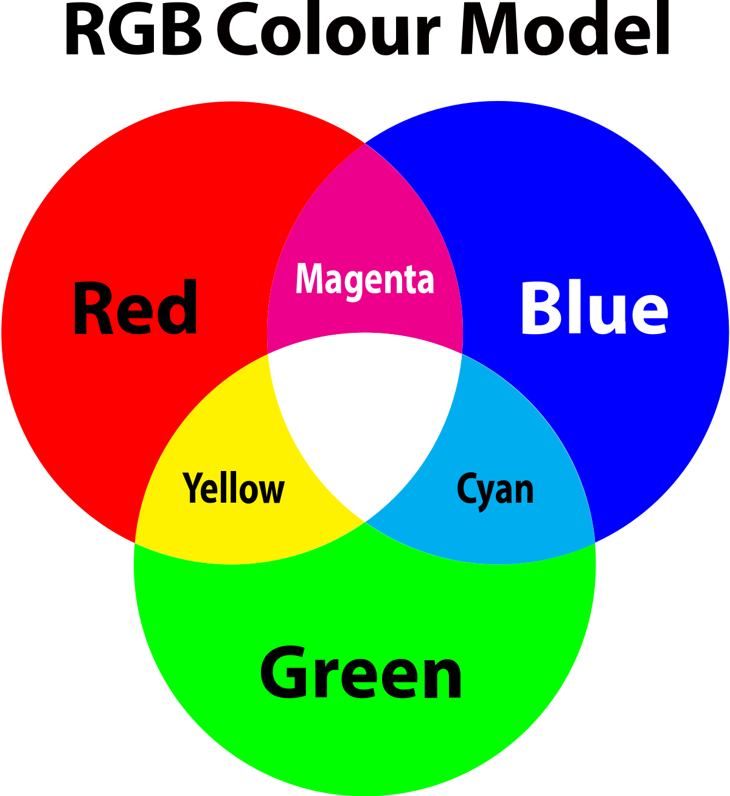
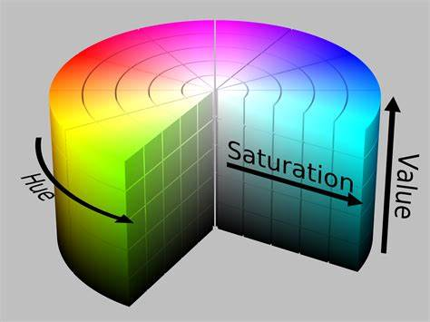
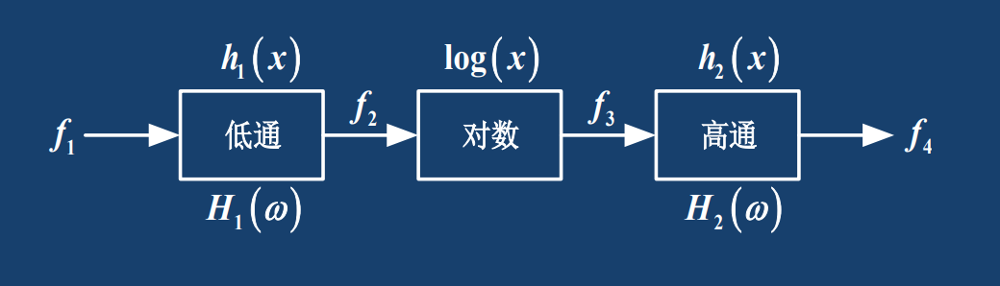

# 2. 数字图像处理基础

## 2.1 色度学基础

光的三基色模型：红（R），绿（G），蓝（B）

**每一张彩色图像都可以用三个矩阵表示，矩阵的每个位置上的元素表示对应空间上图像的像素点的R/G/B值。**

**RGB**模型是**面向硬件**的光学三基色模型，**面向人眼**的颜色模型称为**HSV(HSI)**，即色调(Hue)，饱和度(Saturation)和亮度(Value/Intensity)

## 2.2 人的视觉特性

一幅图像可用$\delta$函数和$f(x,y)$表示，实际上这就是将一维信号的表示扩展到了二维

$$
f(x, y)=\int_{-\infty}^{+\infty} \int_{-\infty}^{+\infty} f(\alpha, \beta) \delta(x-\alpha, y-\beta) d \alpha d \beta
$$

人的视觉模型包括一个低通滤波器，一个对数滤波器和一个高通滤波器，如图所示

人的主观亮度$S$与实际亮度$B$之间是对数关系

$$
S = K\ln B+k_0
$$

## 2.3 图像数字化

**图像数字化：** 将非数字形式的图像信号通过数字化设备转换为数字图像，包括 **采样** 和 **量化**

图像数字化首先应当对其**均匀采样**的，用$\delta$函数即可实现。

$$ 
\begin{aligned}
& f_s(m, n) \leftarrow f_s(x, y)=f(x, y) s(x, y) \\
& =\sum_m \sum_n f(x, y) \delta(x-m \cdot \Delta x, y-n \cdot \Delta y)
\end{aligned}
$$

然后再使用**均匀量化**对图像灰度等间隔离散化

$$
G = INT(\frac{f_{max}-f_{min}}{\Delta f})
$$

实际中，取$G = 2^k (k\geq 1)$，$G$就代表图像的灰度级，即**每一个像素用多少位二进制数来表达**。

## 2.4 数组图像的四大特点

**需背诵**

1. **信息量大**
2. **占用频带宽**
3. **像素间相关性大**
4. **视觉效果的主观性大**