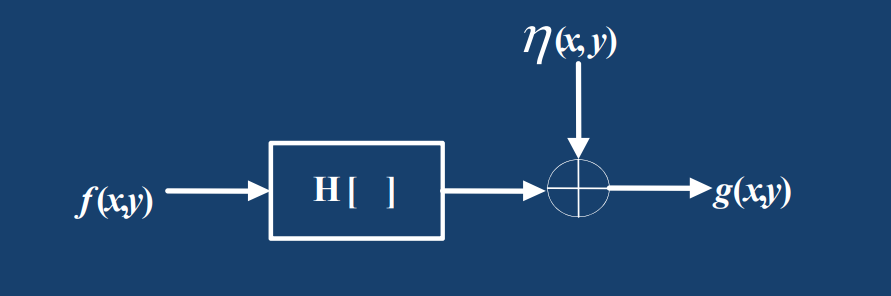

# 5. 图像恢复

## 5.1 退化模型

图像恢复处理的关键在于建立退化模型。建立退化模型是指根据已有的先验知识，对模糊或噪声等退化过程进行数学模型的建立核描述。

其中矩阵$H$为退化模型，也可以用$h(x,y)$表示，$\eta$为噪声。

时域上，退化模型加上噪声可表示为

$$
g(x,y) = Hf(x,y)+\eta(x,y) 
$$

频域上则可表示为

$$
G(u,v) = H(u,v)F(u,v)+N(u,v)
$$


进行FFT之前应先将$f(x,y)$和$h(x,y)$进行周期延拓


退化矩阵$H$是一个循环矩阵（类似于自相关矩阵），**循环矩阵式一定可以被对角化的**，也就是说，存在对角阵$D$和特征向量矩阵$W$，使得

$$
H = WDW^{-1}
$$

那么一幅图像的退化模型则可表示为

$$
g = WDW^{-1}f+\eta
$$


若采用的是FFT，则$W^{-1}$就是FFT的变换矩阵($W_N^{mu+nv}$构成的矩阵)，且对角阵$D$就是$H(u,v)$。


## 5.2 无约束复原-逆滤波法

### 5.2.1 逆滤波的步骤

图像的无约束复原主要指逆滤波（也称反向滤波）法，逆滤波法没有考虑噪声影响。


据说图像算法相关的岗位面试也经常问逆滤波的有关问题


不考虑噪声的情况下，5.1节的退化模型就变为

$$
g = WDW^{-1}f \iff \hat{f} = WD^{-1}W^{-1}g
$$

如果对右侧等式两边同时乘以$W^{-1}$，就成了FFT后的形式

$$
W^{-1}\hat{f}=D^{-1}W^{-1}g
$$

写为频域表达式为

$$
\hat{F}(u,v)=\frac{G(u,v)}{H(u,v)}=P(u,v)G(u,v)
$$

$P(u,v)$即为反向滤波器。

由于这个式子把$H(u,v)$乘到作编去就是正向退化滤波的形式，所以复原的过程称为逆滤波

$$
G(u,v)=H(u,v)F(u,v)
$$

### 5.2.2 逆滤波法的特点

5.2.1中的逆滤波没有考虑噪声，如果将噪声项加入逆滤波，最终恢复的图像具有如下形式

$$
G(u,v)=H(u,v)F(u,v)+N(u,v)\iff \hat{F}(u,v) = F(u,v)+\frac{N(u,v)}{H(u,v)}
$$

显然可以看出，右边等式当$H(u,v)$的值比较小的时候，噪声项的影响会很大，使得图像淹没在噪声中。

因此，使用逆滤波有三点注意事项

1. 在$H(u,v)=0$处不做计算（防止除数为0）

$$
P(u,v)=\begin{cases}\dfrac{1}{H(u,v)};&|H(u,v)|\neq0\\[2ex]1;&|H(u,v)|=0\end{cases}
$$

2. 当$H(u,v)$很小时，噪声项起主导作用，而实际上$|H(u,v)|$离开原点后衰减的很快，**所以复原应当局限于离原点不太远的有限区域进行，可以理解为将$P(u,v)$过一个理想低通滤波器**

3. 为了避免振铃效应，可以对逆滤波进行加门限的处理

