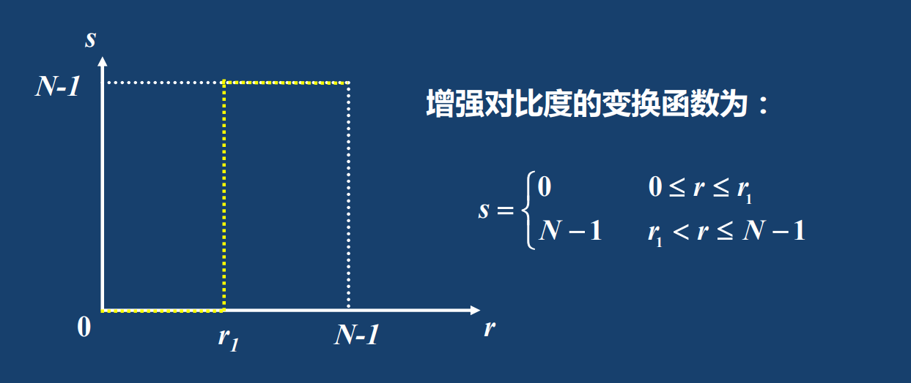
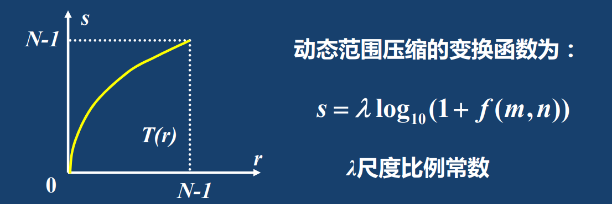
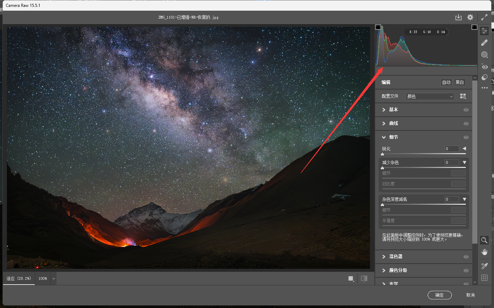
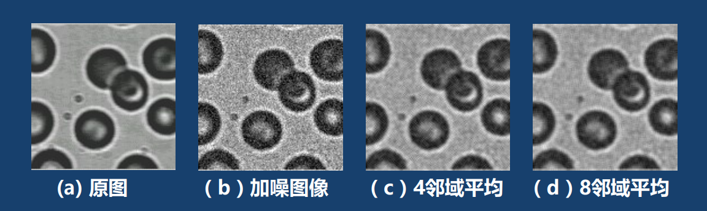
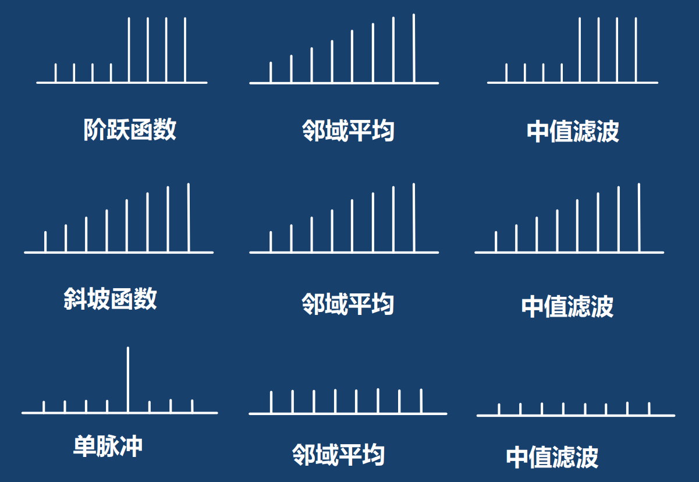
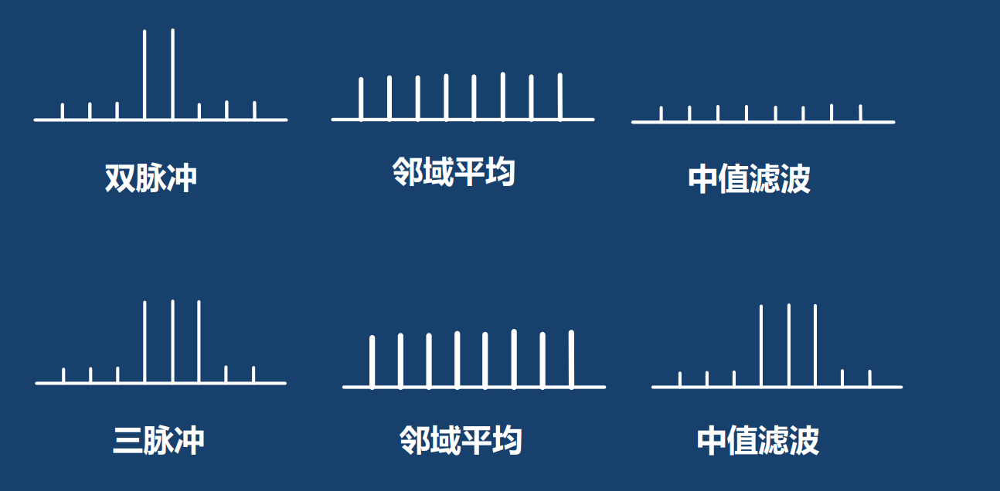
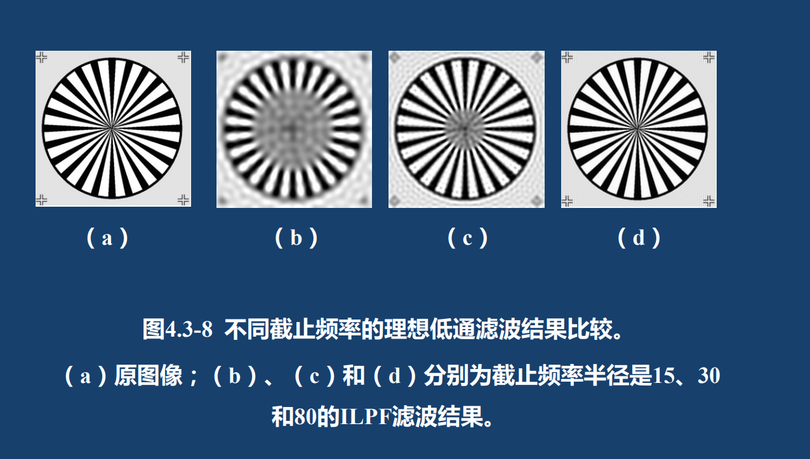
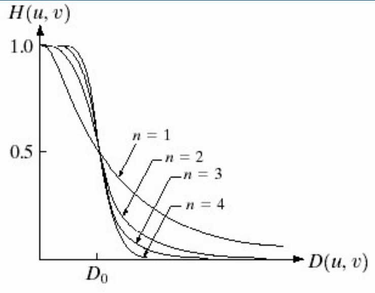
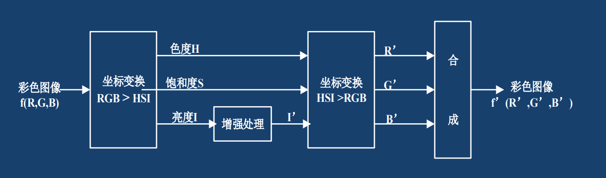
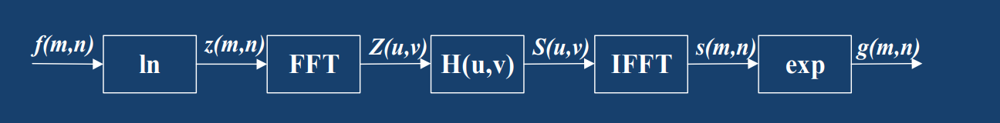

# 4. 图像增强

需要图像增强的原因：由于光照度不够会造成图像灰度过于集中，图像在传输或者处理过程中会引入噪声等等。因此需要图像增强

**在图像增强的过程中，没有新信息的增加，只是通过压制一部分信息从而突出另一部分信息。**

## 4.1 灰度变换

直接定义原像素的灰度$r$与增强后的像素灰度$s$的变换函数为$s = T(r)$，则该变换函数称为灰度变换。

常用灰度变换有直接灰度变换与直方图处理。

### 4.1.1 直接灰度变换

直接灰度变换是指对图像中每个像素都使用变换函数映射到新的灰度值，例如线性变换和非线性变换。利用Photoshop中的曲线工具可以直观的感受这种变换方式的效果。

直接灰度变换较为简单，这里只记录一个线性变换和两个非线性变换。

**1. 线性变换：图像二值化**

图像二值化是指设定一个阈值，将高于阈值的像素全部取1（归一化之后的结果），低于阈值的像素全部取0。如图所示

**该方法增强后的图像只有黑白二值，对比度最大，但细节信息全部丢失。**

**2. 非线性变换：对数变换（动态范围压缩）**

由于人眼所可以分辨的灰度变化范围有限，所以当动态范围太大时，很高的亮度值把暗区的信号都覆盖了。动态压缩常用取对数的方法，如图所示

**3. 非线性变换：指数变换（Gamma变换）**

与对数变换的效果相反，指数变换使得高灰度范围得到扩展，压缩了低灰度范围，其表达式为

$$
g(m,n) = \lambda(f(m,n)+\epsilon)^\gamma
$$

其中$\lambda$和$\gamma$为常数。$\gamma$值的选择对于变换函数的特性有很大影响，当 $\gamma<1$时会将原图像的灰度向高亮度部分映射，当 $\gamma>1$时向低亮度部分映射，而当$\gamma=1$时相当于正比变换。

**简而言之，根据指数函数图像的特点，$\gamma$ 越大，图像越暗，$\gamma$越小，图像越亮。**

## 4.2 直方图处理

**重点**

### 4.2.1 图像的直方图

反应图像中灰度级与出现这种灰度级的概率之间的关系的图形称为直方图

$$
p(s_k) = \frac{n_k}{n}
$$

其中$s_k$是图像中第$k$个灰度级，$n_k$是具有灰度$s_k$的像素个数。

直方图有以下3条性质：

1. 直方图的位置缺失性，即直方图会丢失图像位置信息
2. 直方图与图像的一对多特性，即一个直方图可对应多个图像
3. 直方图的可叠加性，即可以同时堆叠多个直方图

在Photoshop中打开一张图片，依次点击"滤镜$\rightarrow$Camera raw滤镜"，右上角即可看见该图像的直方图（以包络线的形式展示）。

### 4.2.2 直方图均衡化

将原始图像的直方图变换为均匀分布称为直方图均衡化。直方图均衡化的增强函数应满足：

- $T(s)$在$0\leq s\leq L-1$的范围内是单值的单增函数
- 对$0\leq s\leq L-1$有$0\leq T(s)\leq L-1$

具体过程如下表所示，考试请务必记住操作步骤和画表。$\text{int}$表示向下取整，$L$表示灰度级的个数，下表中灰度级$L = 8$

| 序号 | 运算 | 步骤与结果 |   |  |  |  |  |  |  |
|---|---|---|---|---|---|---|---|---|---|
| 1 | 列出原始图像灰度级$s_k$  | 0 | 1 | 2 | 3 | 4 | 5 | 6 | 7 |
| 2 | 统计原始图像各灰度级像素 $n_k$ | 790 | 1023 | 850 | 656 | 329 | 245 | 122 | 81 |
| 3 | 计算原始直方图$p_k$ | 0.19 | 0.25 | 0.21 | 0.16 | 0.08 | 0.06 | 0.03 | 0.02 |
| 4 | 计算累积直方图$c_k$ | 0.19 | 0.44 | 0.65 | 0.81 | 0.89 | 0.95 | 0.98 | 1.00 |
| 5 | 新灰度值 $$t_k=\text{int}[(L-1)\times c_k+0.5]$$ | 1 | 3 | 5 | 6 | 6 | 7 | 7 | 7 |
| 6 | 确定映射对应关系 $s_k\rightarrow t_k$  | $0\rightarrow1$  | $1\rightarrow3$  | $2\rightarrow5$ | $3,4\rightarrow6$ |  | $5,6,7\rightarrow7$  |  |  |
| 7 | 统计新图像各灰度级缘素 $n_k'$ |  | 790 |  | 1023 |  | 850 | 985 | 448 |
| 8 | 计算新的直方图 |  | 0.19 |  | 0.25 |  | 0.21 | 0.24 | 0.11 |

直方图均衡的优点：自动增加图像对比度

直方图均衡的缺点：不能用于交互方式的图像增强应用

解决方案：直方图规定化

### 4.2.3 直方图规定化

直方图规定化是指将直方图变换到指定要求的形式

直接看例题

原始直方图如下表

| 原始图像灰度级$j$ | 0 | 1 | 2 | 3 | 4 | 5 | 6 | 7 |
| :---: | :---: | :---: | :---: | :---: | :---: | :---: | :---: | :---: |
| 原始直方图 | 0.19 | 0.25 | 0.21 | 0.16 | 0.08 | 0.06 | 0.03 | 0.02 |

现在要将该直方图转换为规定直方图

| 规定图像灰度级$j$ | 0 | 1 | 2 | 3 | 4 | 5 | 6 | 7 |
| :---: | :---: | :---: | :---: | :---: | :---: | :---: | :---: | :---: |
| 规定直方图 | 0 | 0 | 0 | 0 | 0.2 | 0.3 | 0.3 | 0.2 |

则具有以下转换过程

| 步骤 | 计算方法 | 计算结果 |  |  |  |  |  |  |  |
|---|---|---|---|---|---|---|---|---|---|
| 1 | 列出图像灰度级$i,j$ | 0 | 1 | 2 | 3 | 4 | 5 | 6 | 7 |
| 2 | 计算原始直方图$P_r(i)$ | 0.19 | 0.25 | 0.21 | 0.16 | 0.08 | 0.06 | 0.03 | 0.02 |
| 3 | 列出规定直方图$P_z(j)$ | 0 | 0 | 0 | 0 | 0.2 | 0.3 | 0.3 | 0.2 |
| 4 | 计算原始累计直方图$P_i$ | 0.19 | 0.44 | 0.65 | 0.81 | 0.89 | 0.95 | 0.98 | 1 |
| 5 | 计算规定累计直方图$P_j$ | 0 | 0 | 0 | 0 | 0.2 | 0.5 | 0.8 | 1 |
| 6 | 从$P_j$反向找回对应的最近$P_i$ | 4 | 5 | 6 | 6 | 7 | 7 | 7 | 7 |
| 7 | 确定变换关系 | $0\rightarrow 4$ | $1\rightarrow 5$ |  | $2,3\rightarrow 6$ |  |  |  | $4,5,6,7\rightarrow 7$ |
| 8 | 求变换后的累计匹配直方图 | 0 | 0 | 0 | 0 | 0.19 | 0.25 | 0.37 | 0.19 |

表中最关键的步骤为第5步到第6步，我们需要从第5步中的结果反向查找第4步中的结果，寻找最近的匹配灰度级，例如$0.2\rightarrow 0.19$，$0.5\rightarrow 0.44$，$0.8\rightarrow 0.81$等等。如果两个匹配结果之间有未匹配灰度级，例如灰度级2的原始直方图为$0.65$，按照就近原则，与$0.5$和$0.8$都可以匹配，但由于前一个灰度级$0.5$已经分配给了$0.44$，因此$0.65$将并入下一个直方图为$0.8$的灰度级中。

这种方法也被称为组映射(Group Mapping Law, GML)，简而言之，就是先从规定累计直方图反向查找原始累计直方图中最近的灰度级概率，两个匹配概率之间的灰度级将归并到下一个灰度级中。

## 4.3 图像平滑

图像平滑的目的：去除或衰减图像中噪声和假轮廓

邻域：

- 4邻域：以指定像素为圆心，单位长度的整数倍为半径画圆为4邻域。
- 8邻域：以指定像素为圆心，$\sqrt{2}$倍单位长度画圆为8邻域。

### 4.3.1 空域平滑法

**1. 邻域平均法**

直接用指定像素周围邻域的灰度值的平均值代替该点的灰度值。假定讨论像素为$F(m,n)$，邻域像素点集为$A$，集内像素个数为$L$，则新像素灰度值为

$$
G(m,n) = \frac{1}{L}\sum_{(m,n)\in A}F(m,n)
$$

假设一幅$N\times N$的图像$f_s$被加性白噪声$\eta$污染，其中白噪声$\mu = 0, \sigma^2 = \sigma_w^2$，则含噪图像可表示为$f = f_s+\eta$，平滑（求平均）后的图像可以表示为

$$
g(m,n)=\frac1N\sum_{(i,j)\in S}f_s(i,j)+\frac1N\sum_{(i,j)\in S}\eta(i,j)
$$

显然，上式第二项方差为$\frac{1}{N}\sigma_w^2$，因此减少了噪声。

**直接做邻域平均带来的问题是使目标轮廓或边缘变模糊**

**2. 阈值平均法与加权阈值平均法**

阈值平均法是指加入门限的方法来减少模糊，公式如下。具体含义为只有当原始图像的灰度值与计算的平均灰度值的差异大于某个阈值$T$时才会替换像素。

$$
g(m,n)=\begin{cases}&f_{avg};&\mid f(m,n)-f_{avg}\mid>T\\&f(m,n);&else&\end{cases}
$$

加权平均法则是指用邻域灰度值和本身的灰度值的加权和来代替该点灰度值，公式如下，其中$f(m,n)$为该点本身的灰度值，它的权值为$\frac{M}{M+N}$

$$
g(m,n)=f_{avg}=\frac{1}{M+N}\Bigg[\sum_{(i,j)\in\mathcal{S}}f(i,j)+Mf(m,n)\Bigg]
$$

同理，加权阈值平均法也可以带门限。

**3. 模板平滑法**

2中的邻域平均法大多数时候是用模板卷积来实现的，可以根据需要设计具有不同特性的平滑模板，平滑模板与原图像做滑动卷积操作，例如

$$
W=\frac{1}{9}\begin{bmatrix}1&1&1\\1&1&1\\1&1&1\end{bmatrix}
$$



**重点 ** **平滑模板的特点：**  

- 模板内系数全为正，所乘的小于1的系数表示取平均
- 模板系数之和为1，这一点保证了处理前后平均亮度不变



**4. 中值滤波法**

中值滤波器使一个含有奇数个像素的滑动窗口，在处理之后，位于窗口正中像素的灰度值用窗口内各像素灰度值的中值替代。

例如窗口长度为5，其中像素灰度分别为

$$
\{20,10,30,15,25\}
$$

从小到大排序后得到

$$
\{10,15,20,25,30\}
$$

则滤波器输出为

$$
\hat{F}_3 = 20
$$

中值滤波有两个结论：

- 结论1：与均值滤波相比，中值滤波可以更好的保护图像边缘，但当噪声超过滤波窗口长度大小一半时，中值滤波就失效了，如下图所示
- 结论2：中值滤波对点状噪声（如椒盐噪声）的抑制作用较强。

**5. 中值滤波与邻域平均法比较**

| 比较 | 邻域平均 | 中值滤波 |
|---|---|---|
| 滤波类型 | 线性滤波 | 非线性滤波 |
| 噪声类型 | 加性白噪声 | 椒盐噪声 |
| 滤波效果 | 抑制噪声，同时模糊图像边缘 | 抑制噪声，同时保护图像边缘 |
| 消噪依据 | 降低噪声方差 | 窗口中噪声点数量小于信号点 |

**6. 高斯平均算子**

高斯平均算子核具有如下形式（**考试不要求记公式，但特点需要记住**）。

$$
g(m,n,\sigma) = \frac{1}{2\pi\sigma^2}e^{-\frac{m^2+n^2}{2\sigma^2}}
$$

$m,n$为邻域与中心的距离，$g$为权值

$m,n$离中心像素越近，权值就越大，$\sigma^2$决定了分布中心峰值和分布离散程度的大小。


高斯平滑的特点：

1. 旋转对称
2. 距离中心峰值单调递减
3. 平滑程度有$\sigma^2$决定，**$\sigma^2$越小**，中心权值越大，周围权值越小，**越保留边缘**，但**抑制噪声效果越差**。



### 4.3.2 频域平滑法

频域图像平滑本质上是让图像通过了一个低通滤波器，以模板平滑中的模板$W$为例。若将行列索引都标记为$[-1,0,1]$，则平滑过程可表示为

$$
g(m,n) = \frac{1}{9}\sum_{i=-1}^1\sum_{j=-1}^1f(m-i,n-j)
$$

回顾第三章中2D-DFT的时域移位特性，等式两边做$z$变换有

$$
\begin{aligned}
G(Z_{n},Z_{n})& =\frac{1}{9}\sum_{i=-1}^{1}\sum_{j=-1}^{1}F(Z_{m},Z_{n})Z_{m}^{i}Z_{n}^{j}  \\
&=\frac{1}{9}F(Z_{m},Z_{n})\biggl(\sum_{i=-1}^{1}Z_{m}^{i}\biggr)\biggl(\sum_{j=-1}^{1}Z_{n}^{j}\biggr)
\end{aligned}
$$

则可得频率响应

$$
H(Z_m,Z_n)=\frac{G(Z_m,Z_n)}{F(Z_m,Z_n)}=\frac19(1+Z_n+Z_n^{-1})(1+Z_n+Z_n^{-1})
$$

令$Z_m = e^{jw_m},Z_n = e^{jw_n}$有

$$
H(w_{n},w_{n})=\frac{1}{9}(1+2\cos w_{n})(1+2\cos w_{n})
$$

**本质上就是一个简单的滤波器求解问题，需要注意的是二维卷积的数学表达式$g(m,n)$和2D-DFT的时域移位性质。**

**1. 理想低通滤波器**

二维理想低通滤波器在频域上是一个圆柱的样子（想象一个矩形绕轴旋转）。理想低通滤波器最大的问题是会产生**振铃效应**。这是由于理想低通滤波器在空域中的sinc函数形式会产生旁瓣，卷积出来会有振荡的现象。

**2. Butterworth理想低通滤波器**

理想低通滤波器在截止频率处是不平滑的，这样会导致空域分辨率下降，因此使用一些方法来使截止频率处变平滑，巴特沃斯滤波器就是其中一种。（公式不要求硬背，但要掌握延缓下降的概念）

$$
H\left(u,v\right)=\frac{1}{1+(\sqrt{2}-1)\left[\frac{D\left(u,v\right)}{D_{0}}\right]^{2n}}
$$

其中$D_0$为截止频率，$n$为阶数，可延缓截止频率处的下降速度

其他的诸如指数低通滤波器，梯形滤波器等原理也都相同，这里就不列出具体公式了。

## 4.4 图像锐化

图像锐化的目的：加重目标物轮廓，使模糊图像变清晰。

图像模糊的原因：成像系统聚焦不好或信道过窄，或使用了平均/积分运算。

### 4.4.1 空域微（差）分法

模糊图像的本质是受到平均或积分运算，故对其进行逆运算微分即可使得图像清晰。

离散差分一、二阶导数分别定义为

$$
\begin{aligned}
    &f_n'=f(n+1)-f(n)\\
    &f_n'' = f(n+1)+f(n-1)-2f(n)
\end{aligned}
$$

导数相当于提取的边缘信息，将边缘信息叠加到原图像上即可得到强化边缘的图像。以一维信号为例设$g(n)$增强后的信号，$f(n)$为原信号，则有

$$
g(n) = f(n)+[-f''(n)]
$$


 这里存在两个问题：
 
 1. 为什么使用的是二阶导数而不是一阶导数？
 
 2. 为什么是减去二阶导数而不是加上二阶导数？

 对于问题1，二阶导数对边缘信息更加敏感，因为二阶导数的零点处反映了图像边缘，而一阶导数的极大值和极小值才反应了图像边缘。
 
 对于问题2，首先需要明晰一个概念：进入边缘是指灰度从大到小的过程，离开边缘是指灰度从小到大的过程。因此，进入边缘时一阶导数递减，二阶导数为负，离开边缘时一阶导数递增，二阶导数为正。当进入边缘时，如果对原信号加上二阶导数，会导致减弱边缘（因为本来灰度就变小了，再减去一个正数就更小了），反之离开边缘时若选择加上二阶导会导致灰度过大，也弱化了边缘。因此减去二阶导是为了强化边缘而不是减弱边缘。


**1. 拉普拉斯锐化法**

拉普拉斯算子为分别对$x,y$方向求二阶导的加和

$$
\nabla^2f = \frac{\partial^2f}{\partial x^2}+\frac{\partial^2f}{\partial y^2}
$$

锐化公式为

$$
g(m,n) = f(m,n)+\alpha[-\nabla^2f(m,n)]
$$

实际计算拉普拉斯算子则是用模板卷积运算

4邻域拉普拉斯算子模板

$$
W_1=\begin{bmatrix}0&-\alpha&0\\-\alpha&1+4\alpha&-\alpha\\0&-\alpha&0\end{bmatrix}
$$

8邻域拉普拉斯算子模板

$$
W_4=\begin{bmatrix}-\alpha&-\alpha&-\alpha\\-\alpha&1+8\alpha&-\alpha\\-\alpha&-\alpha&-\alpha\end{bmatrix}
$$

**注：拉普拉斯锐化方法属于线性滤波**


**拉普拉斯算子的特点：**

1. 对噪声敏感
2. 算子幅值会产生双边缘
3. 无边缘方向




**重点 ** **锐化模板的特点：**

- 模板内系数有正有负，表示差分运算
- 模板内系数之和为1，处理前后图像亮度不变



**2. 其他锐化模板**

这里再额外列举一些其他的锐化算子，方便今后查询。**注意这些模板都是非线性的，非线性滤波都包含$x,y$两个方向的梯度，最后用距离的形式合并梯度。**

水平$x$梯度对垂直线条敏感，垂直$y$梯度对水平线条敏感。

**Prewitt算子**

Prewitt算子水平方向梯度模板为

$$
W_{h}=\frac{1}{3}\begin{bmatrix}-1&0&1\\-1&0&1\\-1&0&1\end{bmatrix}
$$

Prewitt算子垂直方向梯度模板为

$$
W_{v}=\frac{1}{3}\begin{bmatrix}-1&-1&-1\\0&0&0\\1&1&1\end{bmatrix}
$$

**Sobel算子**

Sobel算子水平方向梯度为

$$
W_h=\dfrac{1}{4}\begin{bmatrix}-1&0&1\\-2&0&2\\-1&0&1\end{bmatrix}
$$

Sobel算子垂直方向梯度为

$$
W_{v}=\frac{1}{4}\begin{bmatrix}-1&-2&-1\\0&0&0\\1&2&1\end{bmatrix}
$$

Sobel算子和Prewitt算子由于都是先平均后差分，平均时会丢失一些细节信息，使边缘有一定的模糊。但由于Sobel算子的加权作用，其使边缘的模糊程度要稍低于Prewitt算子。

这些算子在第七章还会用到。

### 4.4.2 频域锐化法

提取边缘在频域上体现为高通滤波。具体频率响应求取方法与4.3.2节中平滑的方式相同，这里就不再赘述了。

理想高通滤波同样存在截止频率处跳跃的问题，因此跟低通滤波一样采取同样的方法对截止频率处的变化做平滑处理。

## 4.5 彩色图像增强

**彩色图像增强（例如直方图均衡、匹配）一定是在HSV空间下进行的。**

## 4.6 同态滤波

一幅图像是由光源的照度分量（照度场）$r(m,n)$和目标场的反射分量$i(m,n)$的乘积组成，即

$$
f(m,n) = i(m,n)r(m,n)
$$

其中$r(m,n)$是缓变的，$i(m,n)$是快变的，只要从$f(m,n)$中把这二者分开，斌分别采取压缩低频，提升高频的方法，就可以达到减弱照度分量、增强反射分量，使图像清晰的目的。第一步取对数是将乘法变为加法，最后再取指数变回去。

