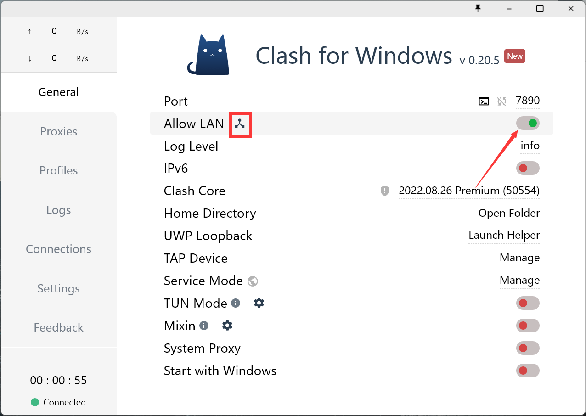

# 1. Clash for Windows
想要用自己的电脑做代理将服务器接到外网，需要将自己电脑的IP地址作为代理服务地址配置在Linux服务器上，然后在服务器上配置代理。用Clash这个软件可以很方便查看自己电脑的IP和端口。当然IP地址也可以用powershell中的`ipconfig`命令查看，但用命令行查看当前网络端口有些麻烦，所以推荐用Clash。
[Clash下载链接点这里](https://www.bing.com/ck/a?!&&p=23bfa545fa8b33caJmltdHM9MTY3Nzg4ODAwMCZpZ3VpZD0yMWNlMzMxMy0yMjEyLTY4ODYtMjJmMC0yMWQ0MjNjMDY5YzMmaW5zaWQ9NTE3MA&ptn=3&hsh=3&fclid=21ce3313-2212-6886-22f0-21d423c069c3&psq=clash+for+windows&u=a1aHR0cHM6Ly9naXRodWIuY29tL0ZuZHJvaWQvY2xhc2hfZm9yX3dpbmRvd3NfcGtnL3JlbGVhc2Vz&ntb=1)

下载好后代开软件，点开Allow LAN选项，然后点击旁边的三角按钮查看当前网络的IP地址，端口号在第一行Port标出。保存好IP地址和端口号。


# 2. Linux服务器配置代理
在服务器root目录下用vim打开`.bashrc`文件，
```
vim ~/.bashrc
```

添加如下内容：
```
export_http_proxy=http://<IP地址>:<端口号>
export_https_proxy=http://<IP地址>:<端口号>
```
之后用`:wq`命令保存退出，然后执行`source ~/.bashrc`命令使配置生效。之后就可以用pip或者conda命令直接在服务器上安装包啦！