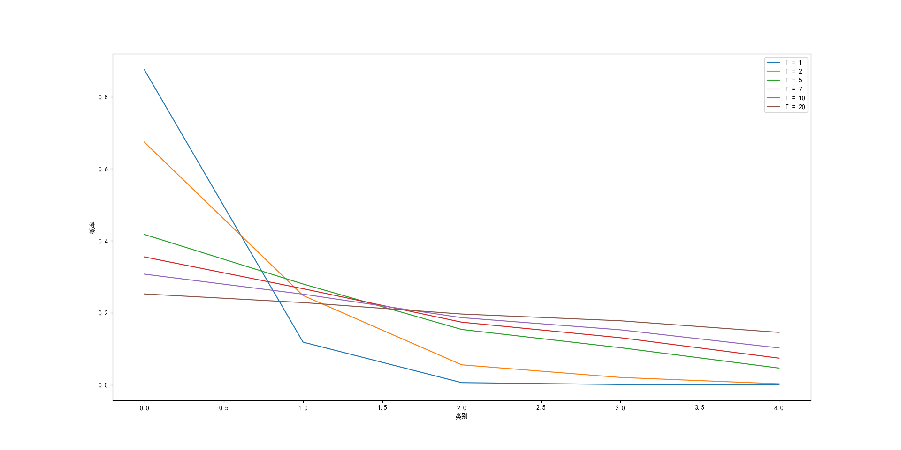

当前的深度学习从模型体量的角度分类可以分为两个方向：第一是利用庞大的数据集、算力、时间和金钱成本来训练一个复杂模型(Cumbersome model)，一般来说只有大型科技公司才有能力开发这类模型，例如OpenAI的GPT-3、Google的Switch Transformer和清华大学的悟道2.0等；第二则是轻量化模型开发，因为庞大而精密的模型在实际应用过程当中的部署与应用极为困难，例如在嵌入式设备的模型部署、本地无网络连接的模型部署等场景下几乎无法应用上述模型解决问题，所以开发轻量化模型也是深度学习领域的一个重要方向，目前主要的方法有模型压缩（知识蒸馏、模型量化、模型剪枝等）、直接训练小规模模型（MobileNet，ShuffleNet等）、加速卷积运算等等。本篇文章着重阐述知识蒸馏（Knowledge Distillation, KD），开山之作是Geoffrey Hinton大神在2014年NIPS上发表的[Distilling the Knowledge in a Neural Network](https://arxiv.org/pdf/1503.02531.pdf)
<!--more-->

# 1. 背景

在大规模学习中，尽管不同场景下的任务不尽相同，我们仍然采用相似的训练方法：从海量的数据中提取特征来训练参数。因为这种方法不需要实施运作，所以它们可以耗费大量的时间和计算资源，结果则是训练出的模型体量较大。而在一些要求低时延和计算资源有限的情况下，则需要小模型来完成一些特定任务，例如语音识别。

当前的问题是，以往的研究过于注重从已知模型的参数中提取知识，该方法最大的缺点就是**无法在改变了模型结构的情况下仍然保留原有知识**。这里的知识可以理解为学习到的从输入向量到输出向量的一组映射（Mapping）。这就导致了很难创建一个更小的模型来汲取复杂模型的知识。因此Hinton打破了这个传统思维的禁锢，提出了知识蒸馏（Knowledge Distllation, KD）。

# 2. 知识蒸馏的理论基础

实际上，知识蒸馏的重要理论依据就是教师-学生网络（Teacher-student network）。复杂模型就是老师，新建的轻量化待训练网络就是学生。一般的教师-学生网络的训练过程，就是将同时将同一组向量输入到教师和学生网络，然后将教师网络的输出作为学生网络的标签（或标签之一）进行训练。但由于教师网络也可能会出错，所以还需要学生网络自己从数据集中学习。这就是知识蒸馏最原始的想法。

# 3. 知识蒸馏核心算法

知识蒸馏实质上是在对教师-学生网络改良的基础上，用更改过的softmax作为激活函数来训练网络。这里先复习一下softmax的公式，其中$z_i$为网络输出评分。

$$
    softmax(z_i) = \frac{e^{z_i}}{\sum_{j=1}^ne^{z_j}}
$$

## 3.1 Softmax函数与蒸馏温度

传统的神经网络训练中softmax函数的作用就是将网络输出的logits（或者叫评分）转换为对应类比的概率，之后根据设定的阈值来确定分类的结果。网络输出的logits一旦经过了softmax函数，不同类别之间概率的“贫富差距”会被放大，也就是概率大的更大，小的更小。例如某个网络对如下图像进行判别的结果是

| 类别       | 网络评分 |
|------------|----------|
| 唐可可     | 7        |
| 南小鸟     | 5        |
| 岚千砂都   | 2        |
| 西木野真姬 | 0        |
| 绚濑绘里   | -4       |

经过softmax函数后各项概率为
$$
p(唐可可) = \frac{e^{7}}{e^7+e^5+e^2+e^0+e^{-4}} = 0.875
$$
$$
p(南小鸟) = \frac{e^5}{e^7+e^5+e^2+e^0+e^{-4}} = 0.118
$$
$$
\vdots
$$
$$
p(绚濑绘里) = \frac{e^{-4}}{e^7+e^5+e^2+e^0+e^{-4}} = 1.46\times 10^{-5}
$$
各项数据如下表

| 类别       | 分类概率 |
|------------|----------|
| 唐可可     | $0.875$    |
| 南小鸟     | $0.118$    |
| 岚千砂都   | $0.006$    |
| 西木野真姬 | $0.001$    |
| 绚濑绘里   | $1.46\times 10^{-5}$  |

从概率表可以看出在经过softmax函数后，各个分类之间的概率差距被放大。这对于训练学生网络是不利的，因为学生网络在这种情况下学到的“知识”仍然近似于原数据集，但又由于学生网络的结构比教师网络简单，最终的结果将受到影响。最重要的是，因为判定阈值的存在，**低于阈值的概率都被舍弃了，在计算损失函数的时候没有被纳入计算，这直接导致了信息的损失**，因为在其他类别中也存在相应的概率。通俗的来说，老师在教学生的时候不仅仅会教他说某样东西是什么，而且会把这样东西与其他的区别与联系也教给学生。例如，老师会给孩子说这是一辆小汽车而不是一辆自行车，也不是一辆货车，因为小汽车有四个轮子而且尾部没有挂载。不仅仅像百科全书上说这就是小汽车，那就是货车，而诸如小汽车与自行车都没有尾部挂载，小汽车与一些货车都有四个轮子之类的信息却在书中找不到。用一句话总结就是：网络从原始数据集中只能学会这是什么，而学不会这一类与另一类的是否相似或者有相似程度是多少。

为了解决信息损失的问题，知识蒸馏引入了一个新的参数，温度$T$来改良softmax函数，改良后的softmax函数（称其为$q_i$）为
$$
q_i = \frac{e^{z_i/T}}{\sum_{j=1}^ne^{z_j/T}}
$$

公式很简单，作用也很明显，加入温度$T$后可以减少softmax函数输出概率的差异性，这一点用数学计算可以很简单地验证。假设温度$T=5$，则各个$q_i$的值为
$$
p(唐可可) = \frac{e^{\frac{7}{5}}}{e^{\frac{7}{5}}+e^{\frac{5}{5}}+e^{\frac{2}{5}}+e^{\frac{0}{5}}+e^{-\frac{4}{5}}} = 0.417
$$
$$
p(南小鸟) = \frac{e^{\frac{5}{5}}}{e^{\frac{7}{5}}+e^{\frac{5}{5}}+e^{\frac{2}{5}}+e^{\frac{0}{5}}+e^{-\frac{4}{5}}} = 0.280
$$
$$
\vdots
$$
$$
p(绚濑绘里) = \frac{e^{-\frac{4}{5}}}{e^{\frac{7}{5}}+e^{\frac{5}{5}}+e^{\frac{2}{5}}+e^{\frac{0}{5}}+e^{-\frac{4}{5}}} = 0.046
$$

完整数据如下表

| 类别       | $q_i$值 |
|------------|---------|
| 唐可可     | 0.417   |
| 南小鸟     | 0.280   |
| 岚千砂都   | 0.154   |
| 西木野真姬 | 0.103   |
| 绚濑绘里   | 0.046   |

对比之前的概率表，很明显可以发现各个类别之间概率的差别缩小了，我们也可以在不同的温度$T$下观察不同的概率值，如下图所示。可以发现，温度越高，各个类别之间的概率差距越小，但温度过高时会导致教师网络输出的不同类别的概率趋近于相同，这也不利于学生网络的训练。因此，选择合适的温度$T$是能否得到优秀的模型的关键因素之一。

看到这里也许有人会问：得到各类别相近的概率有什么用呢？这个问题在下一节会得到解答。
