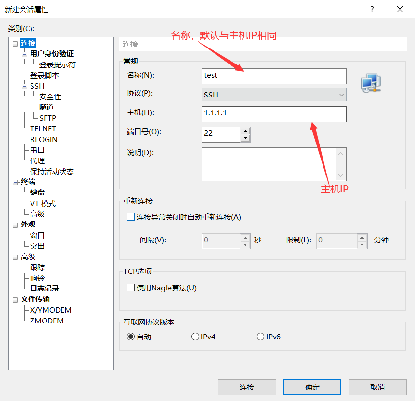
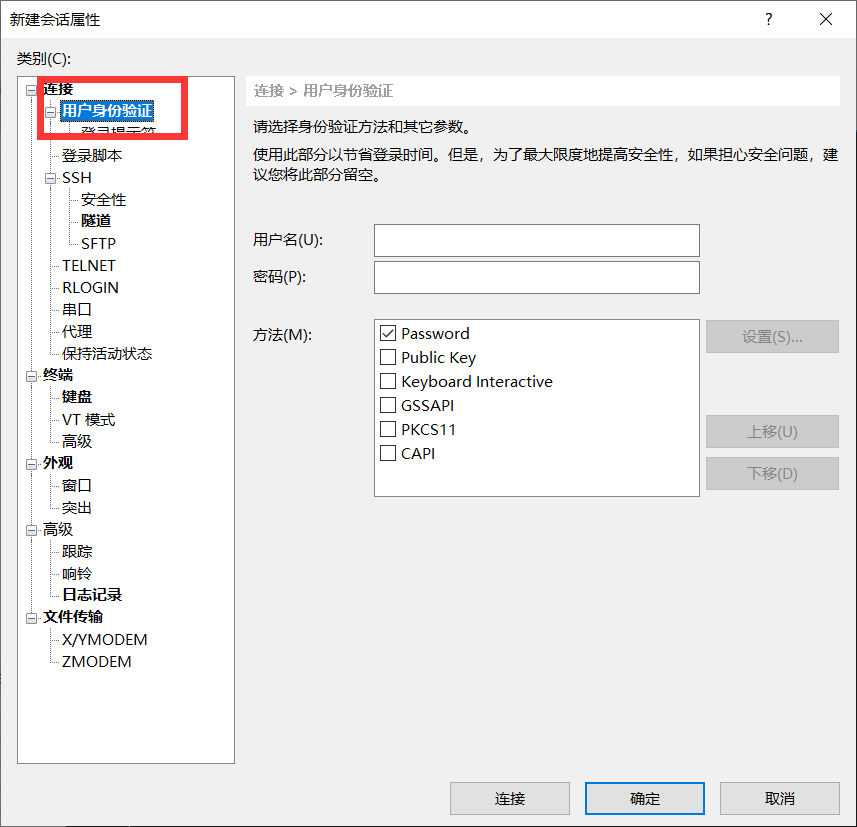
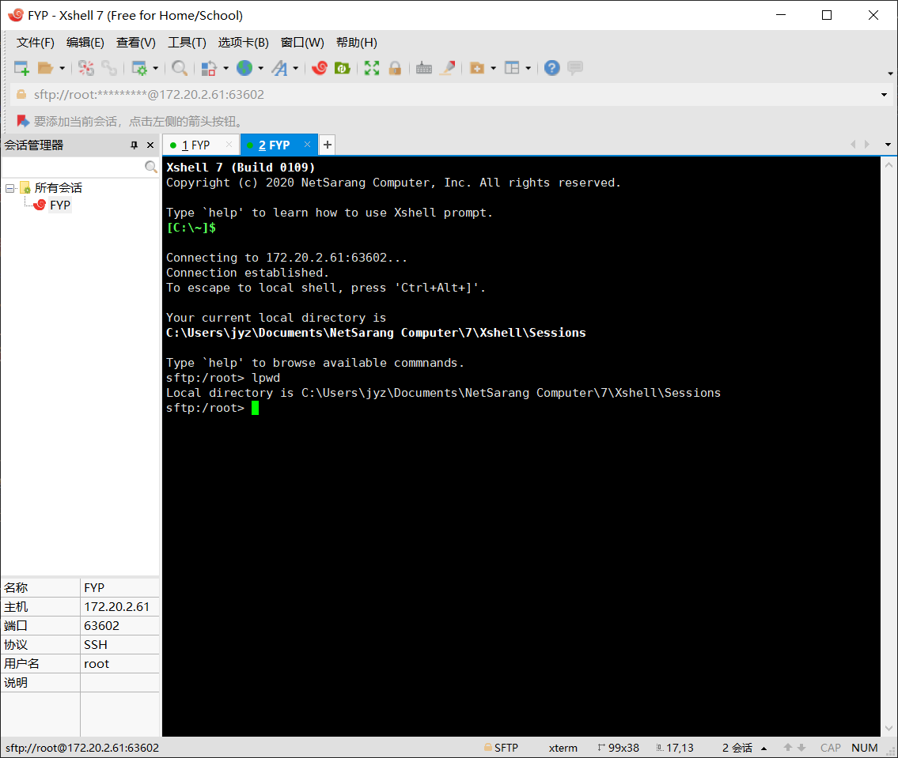
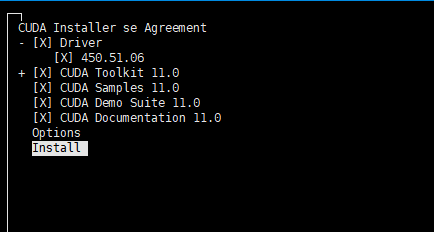
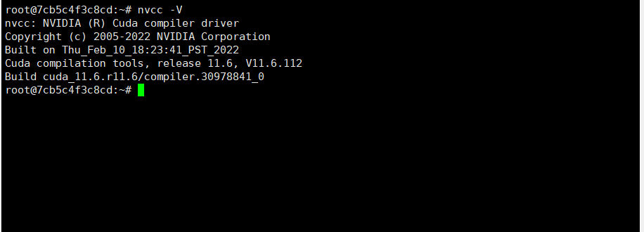
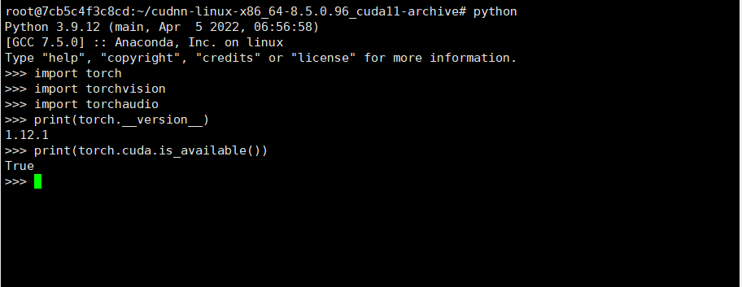

**<font color=Red>请在安装前登录xshell并尝试`conda -V`和`pip -V`指令，若可以正常显示版本号则无需安装，若无法显示版本号则需要安装。本文只是提供一个安装思路，不同的电脑环境会遇到不同的问题。</font>**

# 1. Xshell
## 1.1 安装
Xshell是一款远程连接工具，可以在Windows系统下连接Linux服务器，安装过程很简单，直接下载安装即可。这里给出下载链接（需要科学上网）：[Xshell](https://www.netsarang.com/zh/xshell/)

## 1.2 连接
连接方法有两种，首先介绍直接在命令行里连接，直接在shell中运行如下指令：
```
ssh username@ip
```
其中username是服务器的用户名，ip是服务器的ip地址，连接成功后会提示输入密码，输入密码后就可以进入服务器了。另一种方法是在Xshell中配置好服务器的信息，然后直接点击连接即可。

第二种是在Xshell中配置好服务器的信息，详细步骤如下：
1. 点击Xshell左上角的“文件”->“新建会话”
2. 弹出窗口中输入主机名称，主机号，端口等信息，如图所示：<div align=center></div>
3. 配置用户名和密码，该方法此后记住用户名和密码后无需再次输入，如图所示：<div align=center></div>
4. 双击刚刚新建的会话，即可连接服务器。

# 2. Anaconda
## 2.1 安装
因为目前所使用的服务器无法使用外网，所以需要从本地下载好Anaconda，然后通过Xshell上传到服务器上。Anaconda的下载链接为：[Anaconda](https://www.anaconda.com/products/individual)，这个链接需要科学上网才能高速下载，嫌慢的也可以下清华源的：[清华源](https://mirrors.tuna.tsinghua.edu.cn/anaconda/archive/)。

下载好后，通过Xshell上传到服务器上，单击“窗口”->“传输新建文件”，此时会提示需要XFTP，不理他，直接点取消。此时会弹出新的shell窗口，输入指令`lpwd`查看当前共享文件所需保存的的路径，如图所示：<div align=center></div>

把下载的文件复制到该文件夹下，然后在Xshell中输入指令
```
put Anaconda3-2022.05-Linux-x86_64.sh
```
put后的参数就是下载的Anaconda文件。上传完成后在shell中输入
```
bash Anaconda3-2022.05-Linux-x86_64.sh
```
一直回车然后输入yes即可安装完成。

## 2.2 配置环境变量
安装完成后，需要配置环境变量，否则无法使用conda命令。在shell中用vim打开.bashrc文件
```
vim ~/.bashrc
```
按键盘上的i键进入编辑模式，在文件末尾添加如下内容：
```
export PATH="/root/anaconda3/bin:$PATH"
```
按Esc键退出编辑模式，输入`:wq`保存并退出。然后输入
```
source ~/.bashrc
```
使配置生效。

**注意：目前我还没有找到一次性全部生效的方法，所以每次在启动服务器时都需要输入source指令使环境变量生效。**

完成后输入`conda -V`或者`pip -V`查看版本，再输入`python`查看Python版本。

# 3. CUDA

## 3.1 安装
首先查看服务器的显卡型号，输入
```
nvidia-smi
```
查看显卡型号，得知当前服务器显卡最高支持CUDA11.6，所以到官网下载对应版本，下载链接为： [CUDA11.6](https://developer.nvidia.com/cuda-11-6-1-download-archive?target_os=Linux&target_arch=x86_64&Distribution=Ubuntu&target_version=20.04&target_type=runfile_local)。但由于服务器无法连接外网,`wget`指令无法解析DNS地址，CUDA现在又未提供直接下载包的链接，所以只能在自己的Linux虚拟机中下载包后共享到自己的主机上。如果没有虚拟机和Linux的使用经验我这里也提供了一份安装包
```
链接：https://pan.baidu.com/s/1OjPdX8T7mp5CXfph6U77JA 
提取码：1234 
```
下载好后上传至服务器，然后在shell中输入
```
sh cuda_11.6.1_450.51.06_linux.run
```
在这个界面时将Driver一项按回车取消勾选，因为驱动已经安装好了
<div align=center></div>
之后输入accpet后等待安装完成。

## 3.2 配置环境变量
同样用vim打开.bashrc文件
```
vim ~/.bashrc
```
在文件末尾添加如下内容：
```
export PATH=/usr/local/cuda-11.6/bin:$PATH
export LD_LIBRARY_PATH=/usr/local/cuda-11.6/lib64:$LD_LIBRARY_PATH
```
输入`:wq`保存并退出。然后在shell输入如下代码使配置生效
```
source ~/.bashrc
```

## 3.3 验证安装
在shell中输入
```
nvcc -V
```
出现如图所示则说明安装成功
<div align=center></div>


# 4. cuDNN

## 4.1 下载与安装
cuDNN是NVIDIA提供的深度学习加速库，需要在官网注册账号后才能下载，下载链接为： [cuDNN8.5.0](https://developer.nvidia.com/rdp/cudnn-archive)。下载好后上传至服务器。

## 4.2 解压
我下载的是tar.xz格式的压缩包，所以用如下命令解压
```
tar -xvf cudnn-11.6-linux-x64-v8.5.0.53.tgz
```
解压出来是一个文件夹，`cd`到这个文件夹下。在shell中输入如下命令将文件夹中的文件复制到CUDA的目录下。
```
cp lib/* /usr/local/cuda-11.6/lib64/   
cp include/* /usr/local/cuda-11.6/include/
```
验证cuDNN太麻烦了所以没做

# 5. PyTorch

## 5.1 安装
还是那个问题，服务器不能连外网，不能直接用pip或者conda装，所以只能在自己的Linux虚拟机中下载包后共享到自己的主机上。这里提供conda和pip两个本地安装包链接，conda是.tar.bz2文件，pip是.whl文件。下载的时候记得除了Pytorch还要下载对应的torchvision和torchaudio，因为Pytorch是一个框架，不包含这两个包。
```
conda(清华源): https://mirrors.tuna.tsinghua.edu.cn/anaconda/cloud/pytorch/linux-64/
pip(Pytorch官网): https://download.pytorch.org/whl/cu116
```
下载好后上传至服务器，然后在shell中输入，注意cp39是Python版本，安装的时候要看清楚自己的Python版本。
```
conda install --use-local cudnn-linux-x86_64-8.5.0.96_cuda11-archive.tar.xz
conda install --use-local torchaudio-0.12.1-py39_cu116.tar.bz2
conda install --use-local torchvision-0.13.1-py39_cu116.tar.bz2
```
或者用pip安装，这里就不贴文件名了。
```
pip install 对应.whl文件
```

## 5.2 验证安装
在shell中输入，`python`打开Python解释器，逐行输入以下代码
```
import torch
import torchvision
import torchaudio
print(torch.__version__)
print(torch.cuda.is_available())
```
若没有报错且输出如下则说明安装成功
<div align=center></div>

# 6. 后续
后续应该会更新在VSCode中配置连接远端服务器的教程，看心情。