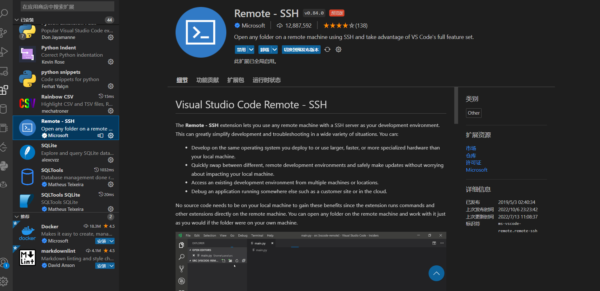
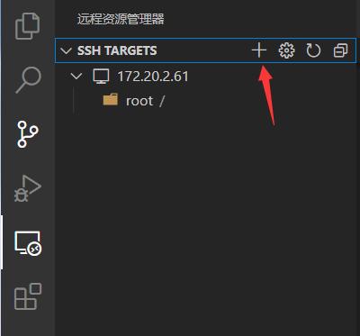
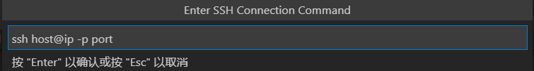
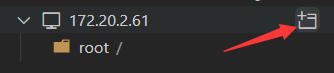
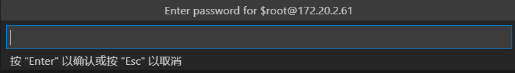
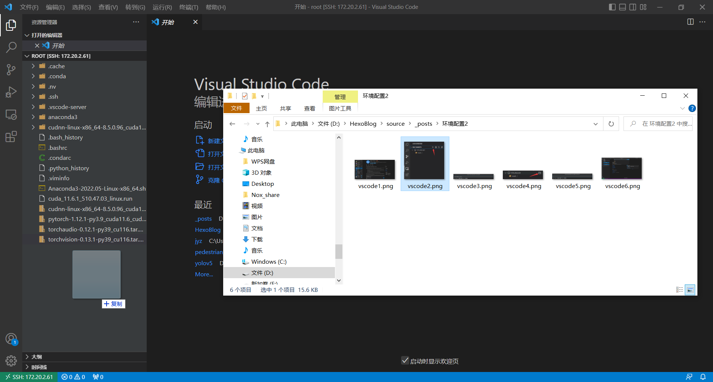

VSCode现已支持客户端内连接远程服务器，用户可以在本地编辑远程服务器上的文件，而无需使用FTP等工具，而且可以对文件夹进行可视化管理，非常方便。本文主要介绍了在VSCode中配置远程连接服务器的方法。

# 1. 安装Remote-SSH插件
在VSCode中"应用"搜索Remote-SSH插件，如图所示，安装完后重启VSCode。
<div align=center></div>

# 2. 连接服务器
## 2.1 添加服务器
Remote-SHH安装完成后左侧会出现一个"远程资源管理器"，点击"远程资源管理器"后点击"SSH TARGET"中的加号添加。
<div align=center></div>
之后在弹出的输入框内按如图所示格式输入服务器的IP地址和端口号，若端口号为默认的22则可以省略，如图所示
<div align=center></div>

## 2.2 修改setting.json文件(重要)
因为服务器不能连外网，只能在局域网内使用，我们使用的是校园网，所以需要在setting.json文件中添加如下代码：
```
"remote.SSH.useLocalServer": true,
```

## 2.3 连接服务器
点击"SSH TARGET"中的服务器名称，如图所示，即可连接服务器。
<div align=center></div>
连接时会提示输入密码，直接输入即可。
<div align=center></div>
连接上之后会自动打开一个新的窗口，如图所示，这个窗口就是连接到服务器的窗口，可以在这个窗口中进行文件的编辑和管理。这个窗口很方便，可以直接从本地其他文件夹上传文件到服务器，也可以直接从服务器下载文件到本地，不需要再像xshell一样那样使用FTP工具了。
<div align=center></div>