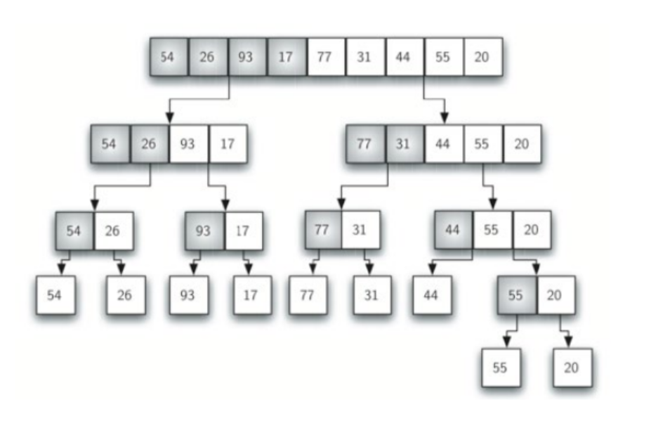

## 1. 二分搜索

二分搜索的核心思想是把一个**有序数组**分为两部分，然后判断值在哪一部分，然后再在那一部分中进行二分搜索，直到找到目标值。


代码：循环版

```cpp
#include<iostream>

using namespace std;

int binary_search(int arr[], int x, int n);

int main(void){
    int arr[9] = {1,2,3,4,5,6,7,8,9};
    int x = 5;
    int n = 9;
    int pos = binary_search(arr, x, n);
    cout << pos << endl;
}

int binary_search(int arr[], int x, int n){
    // arr: 数组
    // x: 目标值
    // n: 数组长度
    // return: 目标值的位置索引
    int left = 0;
    int right = n-1;
    int mid = 0;
    while(left < right){
        mid = (int)((left-right)/2)
        if (arr[mid] == x) return mid; //找到并返回
        if (arr[mid] > x){
            right = mid+1;
        } // x在arr的左边
        if (arr[mid] < x){
            left = mid-1;
        } //x在arr右边
    }
    return -1; //未找到目标值
}

```

代码：递归版

```cpp 
#include<iostream>

using namespace std;

int recursive_binary_search(int arr[], int left, int right, int x);

int main(void){
    int arr[9] = {1,2,3,4,5,6,7,8,9};
    int x = 5;
    int n = 9;
    int pos = binary_search(arr, x, n);
    cout << pos << endl;
}

int recursive_binary_search(int arr[], int left, int right, int x){
    // arr: 数组
    // left: 数组（子数组）开始索引
    // right: 数组（子数组）结束索引
    // x: 目标值
    // return: 目标值在原数组中的索引
    int mid = (int)((left-right)/2);
    if (left > right) return -1; //参数错误
    if (arr[mid] == x) return mid; //找到并返回
    if (arr[mid] > x){ // 左边
        recursive_binary_search(arr, left, mid-1, x);
    }
    if (arr[mid] < x){ // 右边
        recursive_binary_search(arr, right, mid+1, x);
    }
}

```

## 2. 排序/时间复杂度

### 2.1 合并排序

合并排序的步骤有：

1. 分解(Divide)：将原数组通过二分法分为最小的单位数组；
2. 解决(Conquer)：用合并排序法对两个子序列递归地求解排序；
3. 合并(Combine)：合并两个已排序的子序列以得到排序结果。

分解过程
<div align=center></div>

合并过程
<div align=center></div>

说这么多不如直接看代码

```cpp
#include <iostream>

using namespace std;

void Merge_sort(int arr[], int left, int right);
void Merge(int arr[], int left, int mid, int right);

int main(void){
    int arr[12] = {3,4,1,6,1,3,5,8,12,5,5,12};
    for(int i = 0; i < 12; i++){
        cout << arr[i] << " ";
    }
    cout << endl;
    Merge_sort(arr, 0, 11);
    for (int i = 0; i < 12; i++){
        cout << arr[i] << " " ;
    }
}

void Merge_sort(int arr[], int left, int right){
    // arr: 数组
    // left: 数组（子数组）开始索引
    // right: 数组（子数组）结束索引
    if (left < right){
        int mid;
        mid = (int)((left+right)/2);
        Merge_sort(arr, left, mid); //往左边二分
        Merge_sort(arr, mid+1, right); //往右边二分
        Merge(arr, left, mid, right);
    }

}

void Merge(int arr[], int left, int mid, int right){
    int* B = new int[right - left + 1]; //创建一个辅助数组
    int i = left;
    int j = mid + 1;
    int k = 0;

    //比较操作
    while(i <=  mid && j <= right){
        if (arr[i] <= arr[j]){
            B[k++] = arr[i++];
        }
        else{
            B[k++] = arr[j++];
        }
    }

    //处理剩余元素
    while (i <= mid){
        B[k++] = arr[i++];
    }
    while (j <= right){
        B[k++] = arr[j++];
    }

    //把排好序的数组赋值给arr
    for (i = left, k = 0; i <= right; i++){
        arr[i] = B[k++];
    }

    delete[] B;
}

```

### 2.2 时间复杂度

简而言之，计算时间复杂度就是计算代码执行次数的最高次项。考试要求的是给出伪代码计算时间复杂度。

以合并排序为例

```
MERGE(A,p,q,r)
    n1=q-p+1;
    n2=r-q;
    create new arrays L[n1+1] and R[n2+1]
    for i=0 to n1-1
        L[i]=A[p+i]
    for j=0 to n2-1
        R[j]=A[q+1+j]
    L[n1]=99999 //无穷大
    R[n2]=99999
    i=j=0
    for k=p to r
        if(L[i]<=R[j])
            A[k]=L[i]
            i=i+1
        else
            A[k]=R[j]
            j=j+1

MERGE_SORT(A,p,r)
    if p<r
        q=floor((p+r)/2)
        MERGE_SORT(A,p,q)
        MERGE_SORT(A,q+1,r)
        MERGE(A,p,q,r)
```

函数MERGE的时间复杂度是$O(n)$，因为函数体内部除了三个单层for循环之外没有其他循环了。函数MERGE_SORT的时间复杂度是$O(n\log n)$，$\log n$的来源是二分法的结果。假如数组长度为$n$，每次分割为长度$\frac{n}{2}$的数组，一共就要分$\log_2^n$次，每一次调用MERGE_SORT都有一次MERGE的操作，左右一共$\frac{n}{2}+\frac{n}{2}=n$次，因此最后为$n\log n$

再比如插入排序的伪代码，因为for循环中套了一个while循环，复杂度上限为$O(n^2)$，下限为$O(n)$，当数组为逆序时达到上限，顺序时达到下限。

```
for j=2 to A.length
    key=A[j]
    i=j-1;
    while i>0 and A[i]>key
        A[i+1]=A[i]
        i=i-1
    A[i+1]=key
```

考试复杂度多半从各大排序算法中出题，背一背这张表应该会有用。一个准则就是，一看就很简单能快速算出来的，多半是$O(n^2)$或者$O(n)$（但排序很少有$O(n)$的），想了半天没想出来的，猜一个$O(n\log n)$概率会比较大。

<div align=center></div>

## 3. 动态规划

### 3.1 概念

动态规划（Dynamic Programming, DP）的基本思想是将待求问题分解为若干子问题，**每个子问题不是相互独立的**，用分治法求解时有些子问题会被重复计算很多次。DP则采用一个数组的形式储存已经计算过的子问题，在接下来再次遇到该问题时直接查表解决。

考试伪代码多半从排序算法里出，背一背这张表应该比较有用


**DP与分治法的异同**

| 相同点                                                                           | 不同点                                                                       |
|----------------------------------------------------------------------------------|------------------------------------------------------------------------------|
| DP与分治法都是将目标问题分解为若干子问题，先求解子问题，然后从子问题中求解原问题 | DP分解出来的子问题往往不是独立的，如果用分治法求解，则很多子问题会被重复计算 |

### 3.2 矩阵连乘加括号问题

直接看例子

6个矩阵连乘$A_0A_1,...,A_5$，首先应将每个矩阵维度$p_i$表示出来，由于每个矩阵相乘的时候，左边矩阵的列与右边矩阵的行“抵消掉了”，但第一个矩阵的行列维度都需要保存，所以6个矩阵用7个值$p_0,p_1,...,p_6$就能表示出来。


| $A_1$           | $A_2$         | $A_3$        | $A_4$        | $A_5$         | $A_6$         |
|-----------------|---------------|--------------|--------------|---------------|---------------|
| $30\times 35$   | $35\times 15$ | $15\times 5$ | $5\times 10$ | $10\times 20$ | $20\times 15$ |
| $p_0=30,p_1=35$ | $p_2=15$      | $p_3=5$      | $p_4 = 10$   | $p_5=20$      | $p_6=25$      |

**考试请牢记**，第$i,j$两个矩阵之间的计算量公式为

$$
m[i,j]=\left\{\begin{aligned}
&0&i=j\\
&\min_{i\leq k \leq j}\{m[i,k]+m[k+1,j]+p_{i-1}p_kp_j\}&i<j
\end{aligned}\right.
$$

其中$k$的位置有$j-i$种可能。有了这个公式，就可以计算出乘法代价表。

如图所示，从矩阵主对角线开始计算，主对角线元素全为0，因为只有一个矩阵，没有乘法。次对角线为相邻两个矩阵相乘的代价，直接计算即可。其余的对角线则需要按照上面提到的公式计算。例如$m[1,3]$

$$
m[1,3]=\min \left\{\begin{aligned}
&m[1,1]+m[2,3]+p_0p_1p_3=0+2625+30\times 35\times 5 = 7875\\
&m[1,2]+m[3,3]+p_{0}p_2p_3=15750+0+30\times 15\times 5 = 18100&i<j
\end{aligned}\right.
$$

显然$m[1,3]=7875$，其余计算同理。图中$s[i,j]$表示的是最优加括号的位置，比如$m[1,3]$取的是值7875，所以括号位置应该在第1个矩阵后面，也就是$A_1(A_2A_3)$。

如何从$s[i,j]$表中得到最后6个矩阵加括号的结果呢？

从$s[i,j]$开始，第一个**右括号**应该加在$A_3$的后面，所以应该是$(A_1A_2A_3)(A_4A_5A_6)$。此时连乘被分为了前三个和后三个矩阵连乘两个部分，对于前三个矩阵上面已经说明过应该是$A_1(A_2A_3)$，对于后三个矩阵，只需要查询$s[i,j]$表中$s[4,6]$的值，这里$s[4,6]=5$，所以括号应该加载第五个矩阵后面，也就是$A_4A_5(A_6)$。因此这个矩阵连乘代价最小的括号加法应该为

$(A_1(A_2A_3))(A_4A_5(A_6))$

为了美观，整理一下就有

$(A_1(A_2A_3))((A_4A_5)A_6)$


## 4. 遗传算法

**遗传算法只考概念和流程**

遗传算法是一种基于自然群体遗传进化机制的自适应全局优化概率搜索算法。

遗传算法有三个**关键步骤**：

- 选择
  
- 交叉
  
- 变异

遗传算法的基本机理：**适应度函数**。

适应度函数决定了染色体的优劣程度，对于优化问题，适应度函数就是目标函数。

### 4.1 选择 

选择也称赋值操作，根据个体的适应度函数值度量决定该解是否可以遗传到下一代。

**主要思想：适应度值交大的染色体有交大的选择（复制）机会**

$$
P_s = \frac{f(x_i)}{\sum f(x_i)}
$$

$f(x_i)$为第$i$个染色体的适应度值。
$\sum f(x_i)$为种群中所有染色体适应度值之和。

P.S. 个人感觉这里用softmax感觉会更合理

### 4.2 交叉

将被选择出来的两个个体作为父母个体，将二者部分码值进行交换，这个交换要求产生一个随机数$c$，确定交叉位置。

<div align=center></div>

### 4.3 变异

随即改变数码串上某个位置的数字

<div align=center></div>


## 5. 粒子群算法

### 5.1 PSO的基本思想

<div align=center></div>

每个寻优的问题解称为“粒子”。所有粒子都在一个D维空间进行搜索。所有的粒子都由一个fitness function 确定适应值以判断目前的位置好坏。每一个粒子必须赋予记忆功能，能记住所搜寻到的最佳位置。每一个粒子还有一个速度以决定飞行的距离和方向。这个速度根据它本身的飞行经验以及同伴的飞行经验进行动态调整。

### 5.2 PSO公式

假设D维空间中有N个粒子，每个粒子有如下参数

- 粒子位置：$\boldsymbol{x}_i = (x_{i1}, x_{i2},...,x_{iD})$，将$x_i$带入适应度函数$f(x_i)$求适应值；
  
- 例子速度：$\boldsymbol{v}_i = (v_{i1},v_{i2},...,v_{iD})$；
  
- 粒子个体经历过的最好位置：$\boldsymbol{pbest} = (p_{i1},p_{i2},...,p_{iD})$
  
- 种群经历过的最好位置：$\boldsymbol{gbest} = (g_1,g_2,...,g_D)$

通常，位置和速度都有他们自己的变化范围$[X_{min},X_{max}],[V_{min},V_{max}]$，若超出了边界值，则该维的速度或位置会被限制维该维最大速度或边界位置。

**PSO的核心公式**：粒子$i$的第$d$维速度更新公式，实际上是一个递推公式（要求背）

$$
v_{id}^k = wv_{id}^{k-1}+c_1r_1(pbest_{id}-x_{id}^{k-1})+c_2r_2(gbest_d-x_{id}^{k-1})
$$

参数解释：

| 参数       | 含义                                          |
|------------|-----------------------------------------------|
| $v_{id}^k$ | 第$k$次迭代粒子$i$飞行速度矢量的第$d$维分量   |
| $x_{id}^k$ | 第$k$次迭代粒子$i$飞行位置矢量的第$d$维分量   |
| $c_1,c_2$  | 加速度常数，调节学习最大步长                  |
| $r_1,r_2$  | 两个随即常数，取值范围$[0,1]$，增加搜索随机性 |
| $w$        | 惯性权重，非负数，即对前一个状态的依赖程度    |

理解记忆：PSO速度更新公式有三部分

1. 递推部分：粒子上一个状态的速度加权
   
2. 认知部分：当前粒子自身的思考，可理解为粒子$i$当前位置与自己最好位置之间的距离
   
3. 社会部分：可理解为粒子$i$当前位置与群体最好位置之间的距离。

### 5.3 PSO的参数影响

| 参数    | 影响                                                                                     |
|---------|------------------------------------------------------------------------------------------|
| $w=0$   | 失去对粒子本身速度的记忆                                                                 |
| $c_1=0$ | “只有社会，没有自己”，所有位置更新取决于群体位置，**容易陷入局部最优无法跳出**           |
| $c_2=0$ | “只有自己，没有社会”，所有位置更新取决于自己位置，**没有信息共享，导致算法收敛速度变慢** |

### 5.4 全局PSO与局部PSO

全局PSO是指每次更新都使用一个群体内所有粒子的位置信息，局部PSO是指只将群体中的部分个体作为粒子的邻域。类似于Batch SGD和mini-Batch SGD的关系。

二者优缺点：

全局收敛快，但容易陷入局部最优

局部收敛慢，但很难陷入局部最优

### 5.5 粒子群算法流程

1. 在初始化范围内，对粒子群进行随机初始化，包括随机位置和速度
   
2. 计算每个粒子的适应值
   
3. 更新粒子个体的历史最优位置
   
4. 更新粒子群体的离职最有位置
   
5. 更新粒子的速度和位置，公式如5.2所示

6.  若未达到终止条件，则跳转第二步


## 6. 决策树

详情见我写的[另一篇笔记](https://blog.csdn.net/weixin_45772839/article/details/113144784)，这里只针对考点做总结。


### 6.1 信息增益

要算信息增益需要先算条件熵

$$
H(Y|X) = H(X,Y)-H(X) = -\sum\limits_{x,y}p(x,y)\log p(y|x)
$$

把$p(x,y)$用贝叶斯公式展开就有

$$
H(Y|X)=-\sum\limits_{x,y}p(x)[p(y|x)\log p(y|x)]
$$

信息增益计算为信息熵减去条件熵。

$$
I(X,Y) = H(X)+H(Y)-H(X,Y) = H(X)-H(X|Y)
$$


直接看例子

下图是西瓜数据集，考试也从这个里面出题

<div align=center></div>

最终目的是要区分好瓜坏瓜，所以随即变量$X=[好瓜,坏瓜]$，正例有8个反例有9个，则根节点信息熵就可以计算了，注意这里$\log$底数为2

$$
H(X) = -(\frac{8}{17}\log\frac{8}{17}+\frac{9}{17}\log\frac{9}{17}) = 0.998
$$


要计算信息增益则还需要计算每个属性的条件熵，以色泽为例，色泽为青绿的瓜有6个，其中好瓜3个，则令色泽青绿为$D_1$

$$
H(D_1) = -(\frac{3}{6}\log\frac{3}{6}+\frac{3}{6}\log\frac{3}{6}) = 1
$$

这里$H(D_1)$是条件熵的原因是分母6并不是整体数据集的数量17，而是指定了“色泽”条件下的数量。

同理可得色泽乌黑($D_2$)，色泽浅白($D_3$)的信息熵为
$$
\begin{aligned}
H(D_2) = 0.918\\
H(D_3) = 0.722
\end{aligned}
$$

根据信息增益定义式有
$$\begin{aligned}
    I(X,D) = H(X)-H(X|D) = 0.998-(\frac{6}{17}\times1+\frac{6}{17}\times0.918+\frac{5}{17}\times0.722) = 0.109
\end{aligned}
$$

### 6.2 预剪枝与后剪枝

剪枝(pruning)的目的是为了避免决策树模型过拟合。

1. 预剪枝：指在构造决策树的过程中，先对每个节点在划分前进行估计，若当前的节点划分不能带来决策树模型的泛化能力提升，则不对当前节点进行划分并且将当前节点标记为叶节点。

2. 后剪枝：指先把决策树构造完毕，然后自底向上地对非叶节点进行考察，若将该节点对应的子树换位叶节点能带来泛化性能地提升，则把该子树替换为叶节点。

## 7. 聚类

聚类只考K-means聚类

K-means聚类的度量指标是L2距离

K-means聚类的基本步骤为：

1. 随机选择$k$个样本作为初始均值向量${\mu_1,\mu_2,...,\mu_k}$

2. 计算每个样本$x_i$与均值向量的L2距离
   
3. 根据距离将$x_i$划分给距离均值向量最近的簇

4. 划分好之后对每个簇内求平均，重新计算新的均值向量

直接看例子

<div align=center></div>

假定聚类数$k=3$，则有簇$C_1,C_2,C_3$。开始随机选取三个样本$x_6,x_{12},x_{27}$做为初始均值向量，则

$$
\mu_1=(0.403,0.237),\mu_2=(0.343,0.099),\mu_3=(0.532,0.472)
$$

考察样本$x_1 = (0.697, 0.460)$，$x_1$与三个均值向量的L2距离分别为$0.369,0.506,0.166$，因此$x_1$被分到$C_3$。同理对其他样本也进行求距离-划分的操作。

$$
\begin{aligned}
&C_{1} =\{\boldsymbol{x}_5,\boldsymbol{x}_6,\boldsymbol{x}_7,\boldsymbol{x}_8,\boldsymbol{x}_9,\boldsymbol{x}_{10},\boldsymbol{x}_{13},\boldsymbol{x}_{14},\boldsymbol{x}_{15},\boldsymbol{x}_{17},\boldsymbol{x}_{18},\boldsymbol{x}_{19},\boldsymbol{x}_{20},\boldsymbol{x}_{23}\}  \\
&C_2=\{\boldsymbol{x}_{11},\boldsymbol{x}_{12},\boldsymbol{x}_{16}\} \\
&\text{C_3} =\{\boldsymbol{x}_1,\boldsymbol{x}_2,\boldsymbol{x}_3,\boldsymbol{x}_4,\boldsymbol{x}_{21},\boldsymbol{x}_{22},\boldsymbol{x}_{24},\boldsymbol{x}_{25},\boldsymbol{x}_{26},\boldsymbol{x}_{27},\boldsymbol{x}_{28},\boldsymbol{x}_{29},\boldsymbol{x}_{30}\} 
\end{aligned}
$$

然后对$C_1,C_2,C_3$的所有向量分别求均值（对每个维度都要求），得到更新哈偶的均值向量（聚类中心）

$$\boldsymbol{\mu}_1=(0.473,0.214),\boldsymbol{\mu}_2=(0.394,0.066),\boldsymbol{\mu}_3=(0.623,0.388)$$

如此循环往复，直到终止条件。
