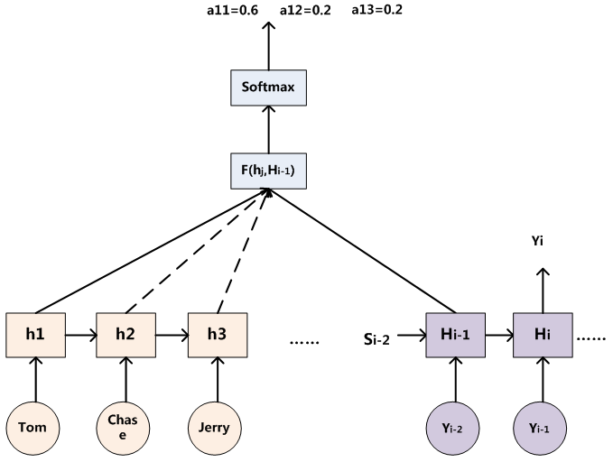
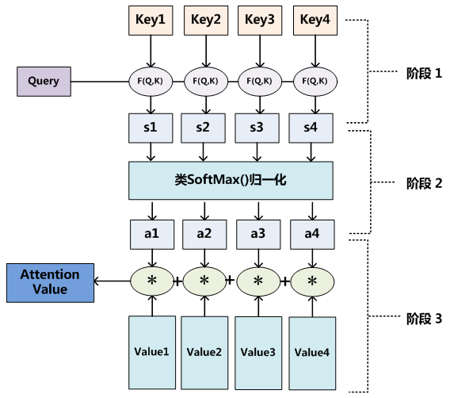
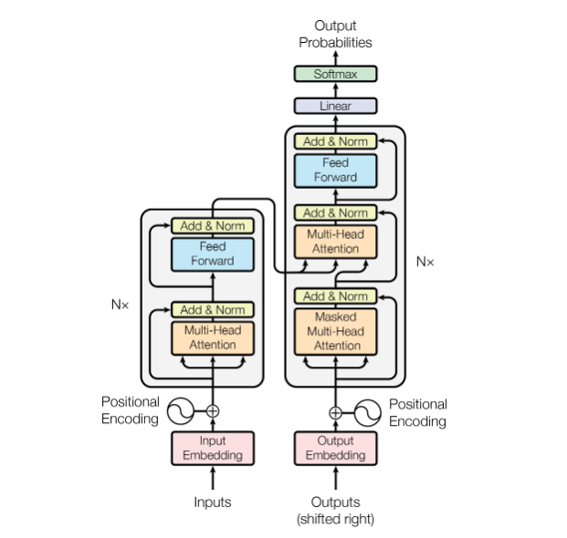
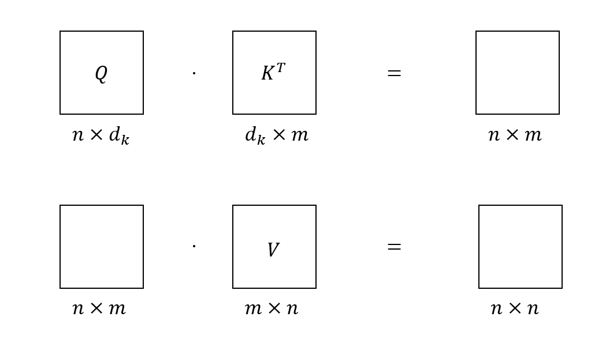
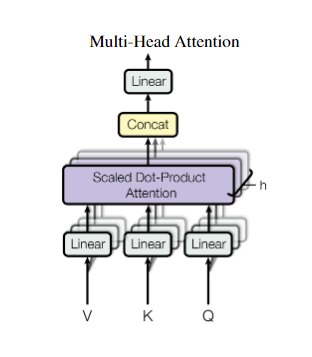

论文链接：https://arxiv.org/abs/1706.03762

## 1. 摘要
Transformer结构出来之前对于序列转换(sequence transduction)主要依赖于带有encoder-decoder结构的RNN和CNN，当然也有一些模型也使用了attention机制来来连接编解码器。但是这些模型都有一个共同的问题，就是它们的计算复杂度随着序列长度的增加而呈指数级增长，这使得它们在处理长序列时变得非常困难。Transformer模型是第一个完全使用attention机制来进行编码和解码的模型，它的计算复杂度与序列长度成线性关系，因此可以很好地处理长序列。

## 2. 结论
Transformer是首个只是用attention机制的序列转换模型，主要使用了multi-headed self-attention模块。作者预测将来Transformer将会被运用除了文本以外更多领域(而事实也确实如此)。

## 3. 导论
RNN的特点是在计算时间步$h_t$的时候必须依赖于当前输入和上一个时间步状态$h_{t-1}$，而这种对迁移状态的依赖导致了RNN的并行计算效率很差，并且当时间步过大时会产生梯度消失或者爆炸问题。同时，RNN的编码器始终将输入编码为定长的向量$c$，这是不合理的，因为变长的输入编码到定长的向量时很可能产生信息损失。

Attention机制的特点是可以使模型纵观全局输入而不依赖于时间步的关系，因此attention可以忽略输入序列之间不同词语的距离，这也为并计算提供了可能。

Transformer只依赖于attention机制，去除了循环结构，并行度高，在较短时间内获得了很好的结果（8 P100 GPUs，12小时训练）

## 4. 背景（相关工作）
CNN也可以用来减少sequential computation。但由于CNN的感受野（窗口）大小是有限的，通常为$3\times 3$到$7\times 7$，因此若两个像素像个较远，则需要通过多个卷积层才能学习到二者的关系，也就是说CNN无法处理好long distance的问题。

本文提出了self-attention机制，它是一种将一个序列中不同位置关联起来，从而达到表达这个序列的机制。

## 5. Attention机制
Attention机制可以表达输入序列不同词语之间的关系，实际上就是一组向量的加权求和。Attention机制的核心计算是基于三个矩阵：$Query$, $Key$和$Value(Q,K,V)$。一句话概括计算步骤则是：通过计算$Q$矩阵和$K$矩阵之间的相似度，经过softmax之后得到相应权重再与V矩阵加权求和得到attention的值。这样描述也许有些模糊，可以先从物理意义上来理解这句话，假设`<key, value>`可以组成一个source（可以理解为一个键值对），现在来了一个查询请求query，那么就应该将query与每一个key做对比，也就是计算相似度，然后再与value做加权求和，这样就可以得出这一个query与source中的哪一个键值对最相似，然后再赋予该值最大的权重即可，需要注意的是key和value的值可以是相同的，也可以是不同的，在机器翻译下的self-attention中，key和value的值是相同的。下图可以表示attention权重的计算过程。

这里单词Tom可表示query，在encoder中，它可以与decoder中的所有隐藏状态$H_{i-1}$计算相似度，后经过softmax函数，就可以得到隐藏状态$H_{i-1}$与单词Tom的权重，再与隐藏状态做加权求和即可（图上未表示出来），单词chase和Jerry同理。当然这里是采用了RNN架构的attention，不采用RNN的attention结构如下图。

用公式描述则为
$$
Attention=\sum_{i=1}^{L}Similarity(Q,K)\cdot V
$$

上式中$L$为序列长度，$Similarity(\cdot)$可以有很多形式，本论文中用的是Scaled dot-product来计算的相似度。

## 6. 模型架构

### 6.1 概述

假设有一组输入$(x_1,x_2,...,x_n)$可以被encoder编码为向量$\boldsymbol{z} = (z_1,z_2,...,z_n)$，而decoder输出为序列$(y_1,y_2,...,y_n)$。在机器翻译任务中，翻译结果是一个词一个词输出的，所以在生成$y_t$时也可以依赖于$y_{t-1}$和当前输入（类似于RNN），因此每一步实际上是一个自回归(auto-regressive)。

### 6.2 Encoder-Decoder架构
论文中的图清晰的给出了一个Encoder-Decoder架构的图，这里首先对这张图做整体描述，再详细解释每一个模块。该图中的左侧为encoder，输入首先经过一个embedding层，加入位置掩码(Positional encoding)后输入encoder，encoder中包含了一个多头注意力模块(Multi-head attention)，并且做了残差连接，之后送入一个前馈的MLP并也进行残差连接后完成编码。右侧的decoder下方输出也先经过一个embedding层，这里shifted right指的是decoder会将之前的输出作为这一时刻的输入。同样，decoder中也加入了位置掩码，并将输出向量送入一个带有mask的multi-head attention模块中，该模块经残差连接以及layernorm后的输出则作为下一个multi-head attention输入中的$Query$矩阵，而$Key$和$Value$矩阵则来自于encoder的输出。最后通过一个前馈的MLP，再经过线性层和softmax层即可得到输出概率。

### 6.3 Positional encoding 
位置编码(Positional encoding)的作用是用来引入时序信息。因为Transformer在处理机器翻译任务时，attention机制可以感知模型内部所有的信息，也就是说，模型在输出$y_{t}$的时候是可以看见$y_{t+1,t+2,...,t+n}$的信息。在实际中具体体现为将一个句子打乱之后模型仍然可以学到词语之间的关系，这显然是不合理的，因为词语的顺序是一个成句的重要组成部分。**为了保证系统是因果的**，可以将时间步$t$以后的信息做成掩码。一种简单的做法是将$t$时刻以后的$Q$和$K$值替换为一个很大的负数，这样在softmax中它们就会趋近于0，从而达到引入位置编码的效果。但本文的作者提出了一种巧妙但很简单的的位置编码方法，他们将奇数维与偶数维的位置掩码分别表示用不同频率的$\sin$和$\cos$函数表示，具体公式如下

$$
\begin{aligned}
P E_{(p o s, 2 i)} & =\sin \left(p o s / 10000^{2 i / d_{\text {model }}}\right) \\
P E_{(p o s, 2 i+1)} & =\cos \left(p o s / 10000^{2 i / d_{\text {model }}}\right)
\end{aligned}
$$

公式中$\frac{1}{10000^{2i/d_{model}}}$即为频率，用$\omega_i$表示，则位置编码可用如下公式，因为$i$在指数上，随着$i$的增加，只有在$pos$较大的时候，后面的位置向量才不为0。最后将位置向量直接与embedding之后的词向量相加即可得到输入向量。
$$
\overrightarrow{p_t}=\left[\begin{array}{c}
\sin \left(\omega_1 \cdot t\right) \\
\cos \left(\omega_1 \cdot t\right) \\
\sin \left(\omega_2 \cdot t\right) \\
\cos \left(\omega_2 \cdot t\right) \\
\vdots \\
\sin \left(\omega_{d / 2} \cdot t\right) \\
\cos \left(\omega_{d / 2} \cdot t\right)
\end{array}\right]
$$

### 6.4 Attention
本文中的attention机制原理与第五节相同，其独特的地方在于使用了scaled dot-product。具体公式如下，$d_k$为编码后的向量维度，论文中$d_k=512$。可以看出作者巧妙地将计算余弦相似度的过程转换为了两个矩阵相乘。

$$
\text{Attention}(Q,K,V) = \text{softmax}(\frac{QK^T}{\sqrt{d_k}})V
$$

这里首先阐述每个矩阵的维度问题。因为$d_k=512$，所以不妨假设有query矩阵$Q_{n\times d_k}$，key矩阵$K_{m\times d_k}$和value矩阵$V_{n\times m}$，注意矩阵$Q$和$V$必须具有一个相同的维度$n$，其实很好理解，有多少“请求”就必须有多少“响应值”。如图所示

当$Q,K,V$矩阵很大的时候，做点积就可能产生很大的值，这些值在softmax中当成负指数时就会趋近于0，而最大值会趋近于1，值就会往(0,1)两端分散，同时梯度也会趋近于0，因此除以$\sqrt{d_k}$可以有效的限制矩阵内值的大小，保证信息的有效性。

在Transformer的编码器中使用的是self-attention模块，即$K=V$，自己与自己做attention操作，这种做法可以提取句子内部词语的关联性。而解码器中使用的则是输出与编码向量的attention操作，这种操作可以有效地提取encoder的输出，即翻译的目标语言与源语言的关系。

### 6.5 Multi-head attention
多头注意力机制(Multi-head attention)是模仿CNN的多输出通道的模式，将高维的模型输入特征通过线性映射到低维中去，通过很多个低维的attention模块学习到不同的映射模式。在我看来这类似于用ensemble的方式将多个弱分类器集合为一个强分类器。下图表示了multi-head attention模块架构

用公式表示则为
$$
\begin{aligned}
\text{MultiHead}(Q,K,V)=\text{Concat}(\text{head}_1, \text{head}_2,...,\text{head}_h)W^{O} \\
\text{where head}_i = \text{Attention}(QW_i^Q, KW_i^K,VW_i^K)
\end{aligned}
$$

$W_i^Q, W_i^K,W_i^V$分别表示将$Q,K,V$矩阵映射到低维空间的转移矩阵，每个低维空间的维度为$d_h=\frac{d_k}{h}$，本文中$d_k=512,h=8$，则有$d_h=64$，$W^O$则是用来将拼接后的结果投影回原来维度的空间。多头注意力机制相当于给了模型$h$次机会来学习映射模式，并且增加了模型可学习的参数，类似于CNN的多输出通道的形式，可以使得模型拟合能力更强。

### 6.6 Point-wise feed-forward networks
每一个encoder和decoder模块的最后都引入了一个FFN，该FFN的作用是将attention的结果映射到更高维的特征空间中去，类似于SVM的核函数，可以在高维特征空间中学到更为线性分类器。

FFN的本质上就是一个做了残差连接的MLP，用公式表示为

$$
\text{FFN}(x) = \text{ReLU}(W_1x+b_1)W_2+b_2
$$

本文中首先通过$W_1$投影到$d_{ff}=2048$的空间中，学习之后再通过$W_2$投影$d_k=512$的空间中。

## 7. 评论
这篇文章的确开创了一个新的时代，它摒弃了传统的RNN和CNN架构，只使用了attention机制，在当时证明了除了循环结构和卷积结构外还有其他表现优秀的结构。后来的大型语言模型(Large language model, LLM)，如GPT，也普遍采用了Transformer架构，可见其影响力。

但是由于Transformer架构对模型的假设很少，所以需要更大的模型体量和更多的数据训练才能获得理想结果，这对于小作坊来说是非常困难的。这时候就是Money is all you need了。