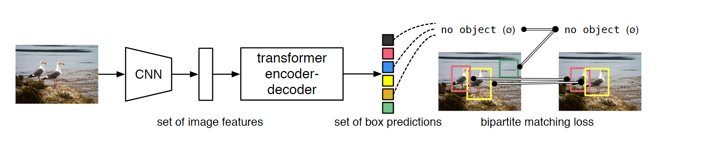
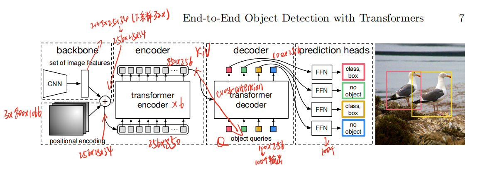
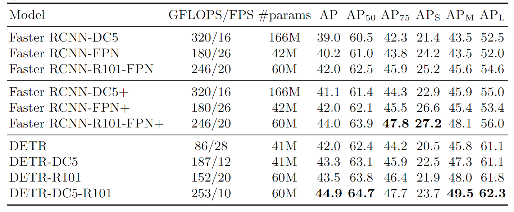
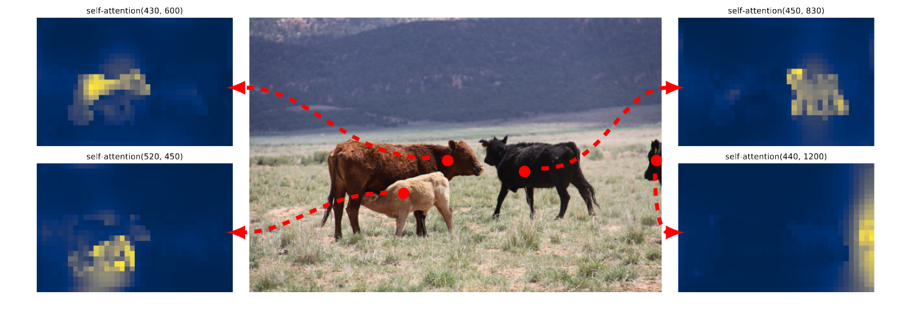
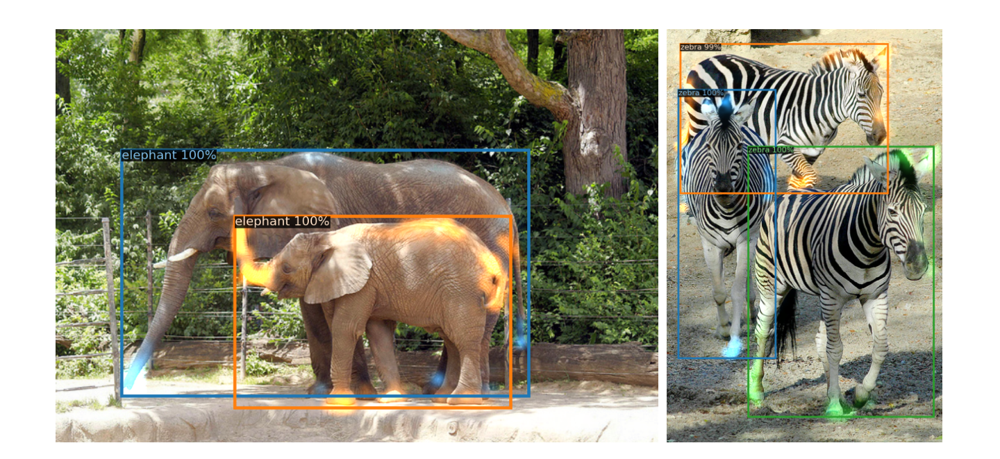

论文链接：https://arxiv.org/abs/2005.12872


## 1. 前言

目标检测一直以来都是CV领域的重要分支，在DETR出现之前，不论是anchor based方法、proposal based方法，还是anchor free方法，都至少需要非极大值抑制（Non-maximum suppression, NMS）来去除最后生成的很多anchor，而含NMS的方法调参和部署都比较困难，因此当时的方法仍然不足够“端到端（end-to-end）”。**De**tection **Tr**ansformer的目的就是使用Transformer的全局建模能力，为端到端目标检测提供一个开端。


## 2. 摘要

DETR将目标检测看作一个集合预测问题，因此不需要NMS来处理预设的anchors，极大减少了对先验知识的依赖。DETR运用了基于集合的全局损失，并通过二分图匹配强制模型对每个物体只输出一个预测，并且使用了Transformer encoder-decoder的结构。此外DETR通过在解码器端设置可学习的object queries，结合图像的全局信息来直接**并行地**输出最后的预测框。DETR最大的优点就是简单，虽然没有拿下当年的SOTA，但在COCO数据集上也可以和Faster RCNN打成平手。这种端到端的形式也引起了研究者们极大的兴趣。后来拿下COCO test-dev数据集SOTA的DINO，Group DETR等都是基于DETR的改进方案，可见DETR在目标检测领域的潜力。

## 3. 引言

现有的检测器，比如proposal based的Faster RCNN，Mask RCNN和Cascade RCNN，再比如anchor based的YOLO，Focal loss等方法最后都会生成一系列的预测框，再通过NMS操作去掉多余的框，也就是说这些检测器至少是two-stage的，因为NMS这一步属于post processing steps。DETR提出了一个简单的端到端结构，大幅度简化了前向过程，但由于Transformer这一结构本身比较庞大，还处在雏形的DETR并不能在速度上超越基于卷积网络的RCNN系列。但正如作者所说，DETR最大的优点就是简单，可拓展性强。

引言中给出了DETR的简化版结构，输入图像首先经过一个CNN得到特征图（原文中用了Res50和Res101），然后输入一个标准的ViT编解码器，输出就是边框预测和类别，具体而言就是用线性层做维度投影，一个是类别投影，输出维度为类别数，另一个是边框投影，输出维度始终为4，代表边框的中心点和宽高$（x,y,h,w）$信息。最后使用二分图匹配的方法去掉多余的框，在匹配上的框里计算Loss。DETR虽然也要去掉多余的框，但原文中只输出了100个框，比Faster RCNN的2000个框做筛选少多了，并且RCNN系列是通过预先定义边框来输出anchor，相当于人为增加了先验知识，而DETR不需要。简化版中省去了这篇文章的关键贡献之一object queries，在方法中会详细介绍。

<div align=center></div>

## 4. 方法

### 4.1 Object detection set prediction loss

集合预测损失是DETR最重要的两大贡献之一。DETR会输出固定大小的预测集合，这个集合中的子集元素就是分类结果和预测框，注意这里的集合大小$N$应该远大于数据集中一幅图像中的类别数量，原文中取$N=100$，这个大小对于COCO数据集来说是足够大的。有了$N$个预测框后，DETR通过使用**二分图匹配**的方式将输出框与ground truth做匹配，筛选出跟GT最近的框。原文中使用的二分图匹配是使用**匈牙利算法**，Scipy中的`linear_sum_assignment`函数能直接输出最优方案，`scipy.optimize.linear_sum_assignment`的输入为代价矩阵（cost matrix）。对于目标检测而言，代价矩阵中的cost元素就对应的损失值，每一个cost的计算方式如下，其中$\sigma$代表匈牙利算法中最优匹配策略，$-1$和$1$分别代表当$c_i\neq \emptyset$时，分别取系数$-1$和$1$。

$$
\mathcal{L}_{match}(y_i,\hat{y}_{\sigma(i)})=-\mathbb{1}_{\left\{c_i \neq \varnothing\right\}} \hat{p}_{\sigma(i)}\left(c_i\right)+\mathbb{1}_{\left\{c_i \neq \varnothing\right\}} \mathcal{L}_{\mathrm{box}}\left(b_i, \hat{b}_{\sigma(i)}\right)
$$

实际上这个损失函数与传统目标检测函数相同，第一项是分类损失，第二项是边框损失。有了每一项的损失，就可以计算出总体损失，只需要简单的对所有预测集合求和即可。实际上作者在实现的的过程中去掉了第一项的$\log$函数，目的是为了保证第一项与第二项在同一取值空间中（值的大小在同一数量级）。第二项边框损失不仅使用了L1 loss，还是用了generalized IoU loss。

$$
\mathcal{L}_{Hungarian}(y_i,\hat{y}_{\sigma(i)})=\sum_{i=1}^N\left[-\log\hat{p}_{\sigma(i)}\left(c_i\right)+\mathbb{1}_{\left\{c_i \neq \varnothing\right\}} \mathcal{L}_{\mathrm{box}}\left(b_i, \hat{b}_{\sigma(i)}\right)\right]
$$

得到最佳匹配之后就知道生成的100个框中与GT最匹配的框了，然后就可以与GT做进一步的损失计算做反向传播。原文对这种方法也做了进一步解释，实际上这种寻找最有匹配的方法思想上与利用先验知识匹配proposal和anchors的方法相同，但这里约束性更强，强制模型输出一对一的匹配关系，去掉了后续的NMS操作。

### 4.2 DETR模型架构

方法中给出的模型架构比较详细，为了方便描述，我们假设输入维度为$3\times 800\times 1066$，这也是原文中使用的维度。输入首先通过CNN网络提取特征，特征维度为$2048\times 25\times 34$，25和34分别是800和1066下采样32倍后的结果。特征还需要通过$1\times 1$的卷积映射到256维，方便与位置掩码相加。相加后将第2，3维展平，得到$256\times 850$的向量，输入到ViT编码器中。而解码器端加入了可学习的object queries来表示positional embedding。Object queries在decoder中将与encoder的输出做cross attention操作，这也是为什么DETR可以学到图像的全局信息。最后deocoder的输出被送入FFN中得到6个输出：前景概率、背景概率和预测框的$(x, y, h, w)$信息。

Object queries实际上表示的是目标类别的位置编码，在预测时，每个object query与encoder的输出特征进行匹配，以此确object query与特征图中哪个位置相对应。

<div align=center></div>

### 4.3 DETR代码实现

原文中直接给出了DETR的Pytorch代码实现，非常的简洁优雅。

```python
import torch 
import torch.nn as nn
from torchvision.models import resnet50 

class DETR(nn.Module):
    def __init__(self, num_classes, hidden_dim, nheads, num_encoder_layers, num_decoder_layers) -> None:
        super().__init__()
        self.backbone = nn.Sequential(*list(resnet50(pretrained=True).children())[:-2])
        self.conv = nn.Conv2d(2048, hidden_dim, 1)
        self.transformer = torch.nn.Transformer(hidden_dim, nheads, num_encoder_layers, num_decoder_layers)
        self.linear_class = nn.Linear(hidden_dim, num_classes+1)
        self.linear_bbox = nn.Linear(hidden_dim, 4)
        self.query_pos = nn.Parameter(torch.rand(100, hidden_dim))
        self.row_embed = nn.Parameter(torch.rand(50, hidden_dim//2))
        self.col_embed = nn.Parameter(torch.rand(50, hidden_dim//2)) #positional encoding
        
    def forward(self, inputs):
        x = self.backbone(inputs)
        h = self.conv(x)
        H, W = h.shape[-2:]
        pos = torch.cat([
            self.col_embed[:W].unsqueeze(0).repeat(H, 1, 1),
            self.row_embed[:H].unsqueeze(1).repeat(1, W, 1)
        ], dim=-1).flatten(0,1).unsqueeze(1) 
        print(pos.shape, h.shape)
        h = self.transformer(pos+h.flatten(2).permute(2,0,1), self.query_pos.unsqueeze(1))
        return self.linear_class(h), self.linear_bbox(h).sigmoid()
detr = DETR(num_classes=91, hidden_dim=256, nheads=8, num_encoder_layers=6, num_decoder_layers=6)
detr.eval()
inputs = torch.randn(1, 3, 800, 1200)
logits, bboxes = detr(inputs)
```

## 5. DETR的优缺点

DETR的优点在于简单，端到端的学习也提供了其他的可拓展性。此外DETR对大物体的检测非常准确，这可能是DETR没有限制anchor尺寸，并且Transformer的全局建模能力较强。但是DETR的推理速度远跟Faster RCNN系列还是有差距，同等模型参数量大小下的推理速度约为Faster RCNN的一半，而且DETR初版的训练时间非常长，作者一共训练了500个epoch，而平常只需要几十个epoch就差不多了。

<div align=center></div>

从作者的可视化结果中可以看出，DETR的encoder主要学习了全局特征，让主要物体尽可能分开，但细节轮廓则需要decoder去学习。从结果中可以看出encoder和decoder对遮挡问题都处理得很好。

<center class="half">


</center>

## 6. 总结

DETR作为当年新的结构，能在COCO数据集上与Faster RCNN基线打成平手，并且在大物体检测和分割任务上取得了更好的效果，缺点就是训练太慢，推理时间太长，小物体检测性能也较差。但DETR在当年作为最具潜力之一的ECCV论文，引起了极大的热度。后续的诸如Deformable DETR，DINO，Group DETR等基于它的工作层出不穷，足以见其在目标检测领域的影响力。
