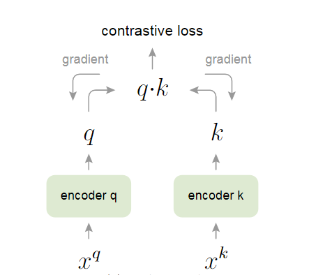

论文链接：https://arxiv.org/abs/1911.05722


## 1. 前言

对比学习作为从19年开始一直到现在，视觉领域乃至整个机器学习领域最炙手可热的方向之一，它简单、好用、强大，以一己之力盘活了从2017年开始就卷的非常厉害的机器视觉领域，涌现了一大批优秀的工作，MoCo就是其中之一。MoCo作为一个无监督的表征学习的工作，不仅在分类任务上逼近了有监督的基线模型，而且在很多主流的视觉任务（比如检测、分割、人体关键点检测）上，都超越了有监督预训练的模型，也就是ImageNet上预训练的模型，在有的数据集上甚至是大幅度超越。

## 2. 摘要

MoCo作为学习视觉表征（或者作为特征提取器）的一种无监督学习方式，它将对比学习看成是一个字典查找任务。本文通过队列这一数据结构构造了一个动态的字典，同时使用了一个滑动平均的编码器。这两个操作可以构建一个庞大且具有高度一致性的字典，有利于对比学习的训练。

MoCo作为一个无监督的预训练模型，能够在7个下游任务（分割、检测等）上，而且比如说在VOC、COCO这些数据集上超越之前的有监督的预训练模型，有时候甚至是大幅度超越。

## 3. 结论

MoCo的结论再一次强调了它在实验上的结果，但是结论中提到，当数据规模从ImageNet-1M（百万级数据集）提高到Instagram-1B（亿级数据集）时性能提升并不明显，也就是说可能存在饱和现象。另外作者在当年就已经有将MoCo与masked auto-encoding结合起来的想法了，也就有了后来的MAE。

## 4. 引言

无监督学习已经在NLP领域有了广泛的应用，例如GPT，BERT等模型，但在CV领域，有监督学习仍然占主导地位。原因可能在于文本信号与图像信号本质上的区别，文本信号通常是离散的，很容易构建tokenized dictionary来做无监督学习（tokenized指将一个词抽取为某一特征），而图像信号是连续、高维的，这里的连续并不是指像素值的连续，而是指一幅图像必须至少从连续若干个像素来提取特征。举例来说，一个单词具有单独的语义信息，我们可以理解一个单词，也可以理解一个句子或者一段话，但我们无法理解单一的或者极少量的像素值。

前人的工作可以被归纳为构造动态字典（dynamic dictionaries）。字典的key是从数据中采样获得，而本文呢将无监督学习看作字典查询的思想，就是将找到与query尽可能相似的key，并与其它不相似的key区分开来，这一过程是通过最小化对比损失（contrastive loss）来达成的。这也符合对比学习的基本思想：**将相似的特征（token）之间的距离尽可能拉近，并在指定范围内将不相似的特征尽可能拉远**。注意在对比学习中，一般应指定特征之间的最远距离，否则模型将会难以收敛。这种做法乍一看与聚类或许有部分相似，但二者有实际意义上的区别。首先聚类通常是在整个数据集上操作，但对比学习是在一个batch中每两个样本比较。另外在对比学习中，我们通常会以一个或几个样本作为锚点（anchor），然后计算一个batch中其他所有样本与锚点之间的距离，这种方法不仅可以帮助我们找到最相似的样本，同时也可以帮助我们在不同的任务中使用相同的锚点。

<div align=center></div>

对比学习除了指定anchor，还应当指定至少一个正样本（positive）和若干负样本（negative），这些正负样本组合起来就是文中所说的动态字典。一个好的动态字典应当具备两个性质：

- 丰富性（large），即一个字典应当有足够多的样本；
- 一致性（consistency），即一个字典中的元素应当来自相同或相似的编码器。

首先，大字典可以更好的采样连续和高维的特征，字典中key越多，能表示的视觉信息越丰富，更容易找到具有区分性的本质特征，若词典过小，模型可能学到的是shortcut，泛化能力差，容易过拟合。其次，一致性可以保证query和key做对比是所有的key保证语义的一致性，若字典不一致，模型可能将anchor与其它编码器生成的key的距离拉近，而不是实际拥有语义近似的key。用简单的话来说，假如要找出一个班当中最优秀的一批人（正样本），那就应该从同一个老师（编码器）教的人当中找，而不是和另外的老师教出来的学生做对比，这样才能保证筛选的公平性。

MoCo用队列（queue）的方式来储存这个字典，队列是一种常用的数据结构，具有先进先出（FIFO）的特点。在MoCo中，当前mini-batch中新的编码特征被加入到队列中（enqueue），队列中最旧的编码特征被移除（dequeue）。使用队列数据结构可以将batch size与dictionary size完全分离，也就是说即使batch size很小，我们也能构建一个很大的字典，这就解决了大字典的需求。另外，MoCo采用了一个缓慢更新的编码器，也就是动量编码器（momentum encoder），由于更新速度慢，我们就可以保证每个字典队列中的一致性，具体如何更新将在方法章节中介绍。

对比学习常常会指定一个代理任务（pretext task）作为学习目标。这些代理任务通常不是我们关心的诸如分类、检测等目标，而是针对最终目标创建正负样本对的任务，MoCo选用了instance discrimination作为其代理任务。Instance discrimination是最简单的代理任务之一，以论文中的模型结构图为例，首先将$x_0^{key},x_1^{key},...,x_n^{key}$经过动量编码器编码为特征向量$k_0,k_1,...,k_n$，这其中还可以加入一系列数据增广操作，之后指定$k_0$为正样本$k_+$，其余所有$k_i$为负样本，注意，正负样本应使用同一编码器。得到正负样本后再与query向量计算相似度和对比损失即可。

<div align=center></div>


## 5. 方法

### 5.1 Contrastive learning as dictionary look-up

对比学习可以看作是训练一个字典查找的编码器。具体做法跟引言最后一段的Instance discrimination相同，关键是字典$\{k_0,k_1,k_2,...\}$的构建。接下来是对比损失的设计，设计对比损失应该遵循两个原则：、

- $q$和正样本$k_+$越相似时，contrastive loss应该越小
- $q$和其他所有负样本$k_-$都不相似时，contrastive loss应该较小

根据上述两个原则，本文设计了名为InfoNCE loss的损失函数，实际上它就是交叉熵函数的变体，公式如下

$$
L_q = -\log \frac{\exp(q\cdot k_+/\tau)}{\sum_{i=0}^{K}\exp(q\cdot k_i/\tau)}
$$

这个公式的分子就是正样本的logits，分母则是所有负样本的logits之和，$\tau$为温度，代表关心负样本的程度。直观上来讲，这个公式就是训练一个共有$(K+1)$类的分类器，这个分类器的目标是将$q$识别为$k_+$。**注意这里K既代表负样本数量也代表类别数，因为在Instance discrimination中，每一个负样本就代表一个类别**。

这里再补充一下NCE loss。在交叉熵函数中，分母的$K$代表总类别数量，但在对比学习中，人为制造正负样本的方法常常会产生大量类别，例如在Instance discrimination中，除了正样本之外其余每一个样本都被视作一个类别，在大型数据集上分母的$K$就会过大，计算变得十分缓慢。为了解决这个问题，NCE loss将多分类问题转化为二分类问题，即只将样本看作数据类别与噪声类别，数据类别来自正样本和输入样本，噪声类别来自于从负样本采样。从公式的角度更容易理解

$$
L_{\text {nce }}=-\log \frac{\exp \left(\mathbf{v}_o^T \mathbf{u}\right)}{\sum_{i=1}^K \exp \left(\mathbf{v}_i^T \mathbf{u}\right)+\exp \left(\mathbf{v}_{o^{\prime}}^T \mathbf{u}\right)}
$$

这里，$\boldsymbol{v}_o$表示正样本的向量表示，$\boldsymbol{v}_o'$表示负样本的向量表示，$\boldsymbol{u}$为输入样本的向量表示，**$K$为负样本的数量**。我们再来对比一下softmax函数

$$
Softmax = \frac{\exp (z_i)}{\sum_{i=1}^K\exp(z_i)}
$$

为了方便，logits统一用$z_i$表示。**这里softmax函数分母的求和上限$K$代表的是类别总数而不是负样本数量**，因此NCE loss从数学公式上就是修改了$K$的意义。

### 5.2 Momentum contrast


动量对比，顾名思义就是引入动量来更新参数，其实从信号与系统的角度来理解，动量编码器可以简单类比成一个时序系统，也就是这一时刻的输入依赖于上一个时刻的输出（注意这里的输入输出指的是编码器本身的参数而不是编码器的输入输出）。用公式表示如下

$$
\boldsymbol{\theta_k} = m\boldsymbol{\theta_{k-1}}+(1-m)\boldsymbol{\theta_q}
$$

$\boldsymbol{\theta_k}$表示当前动量编码器参数，$\boldsymbol{\theta_{k-1}}$表示上一轮动量编码器参数，$\boldsymbol{\theta_q}$表示query的编码器。

为什么要使用动量编码器呢？我们从两个极端情况来解释，如果动量编码器完全跟query编码器同步，也就是$m=0$，这样会导致编码器更新速度过快，进而导致每一轮的编码向量更新过快，进入字典队列的向量一致性遭到破坏。另一种极端，如果编码器完全不动，那参数就无法更新，模型学不到东西，进入字典队列的向量完全保持一致，这样会损失模型的鲁棒性。所以采用了动量更新这一种折中的方案，同时采取自己上一轮和query编码器的参数来更新。实际过程中，$m$应该取得大一些，避免动量编码器更新过快，MoCo中设定的$m=0.999$效果最佳，即每一次更新动量编码器$0.1\%$的参数。

原文中还提到了其他方法，例如端到端学习和memory bank，但这两个方法都会至少受限于两个构造好字典要素的其中一个。端到端学习（end-to-end）受限于丰富性这一条件，这种方法的$q$和$k$来自于同一个batch，这样就可以保证一致性，但采用的是两个不同的编码器，每个编码器单独做反向传播更新参数。虽然看起来很合理，但实际上这种方法将batch size和字典大小绑定到一起了，虽然Google的SimCLR就是采用的这种方式，但别人是财大气粗，有TPU这种玩意的，batch size可以拉的很高，字典大小也足够了。

<div align=center></div>

Memory bank方法是牺牲了一部分一致性来保证字典的丰富性。具体而言，memory bank将数据集中所有的样本特征都放在一个字典里，对于ImageNet-1M而言，如果把图像做成128维特征，那就有128万个key，最后需要约600M左右的空间存储。每一次计算loss更新完编码器参数后，memory bank就将这一个batch中的样本重新计算特征，再将其放回原来的大字典做替换。这样虽然保证了字典的丰富性，但每一次更新的特征都来自于不同的编码器，比如batch 1更新了$k_1,k_2,k_3$的特征，batch 2更新了$k_4,k_5,k_6$的特征，这两个batch明显经过的编码器是不相同的，这样就破坏了字典的一致性。

<div align=center></div>

### 5.3 Pseudocode of MoCo

到这里MoCo的主要知识点已经讲完了，但对于不熟悉对比学习的朋友来说可能还是不明白MoCo到底是怎样做forward过程的，好在Kaiming大神直接写了伪代码，而且这份伪代码质量相当高，真实的Pytorch代码与这份伪代码相差无几。

<div align=center></div>

首先将query encoder和momentum encoder做初始化，二者初始化参数是相同的，然后做数据增广操作，query和key经过各自的编码器后计算query和正样本$k_+$和其他样本$k_-$的相似度，用矩阵乘法就可以实现（与attention计算原理类似）。Logtis来自正负样本相似度的堆叠，label是一组零向量作为CrossEntropyLoss的索引，CrossEntropyLoss索引输入法请参考另一篇博客：[Pytorch中Cross Entropy的用法]((https://emil-jiang.github.io/2023/06/01/%E6%8A%80%E6%9C%AF%E6%9D%82%E9%A1%B9-Pytorch%E4%B8%ADcross_entropy%E7%9A%84%E7%94%A8%E6%B3%95/))。得到loss之后就可以进行常规反向传播操作了。


## 6. 总结

总结下来MoCo一共有两大贡献
1. 如何把字典看成队列
2. 如何用动量更新编码器

MoCo论文里有一句非常重要的话：

```
A main goal of unsupervised learning is to learn features that are transferrable.
```

无监督学习的主要目的是学习到可迁移的特征。因此作者也在原文中做了许多下游视觉任务，都取得了良好的效果。