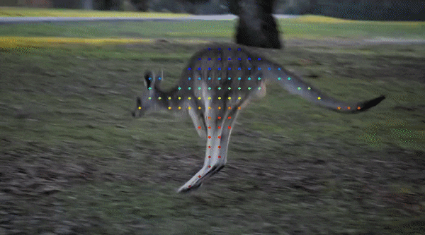
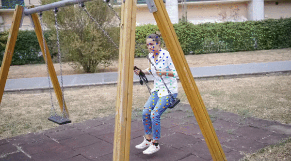
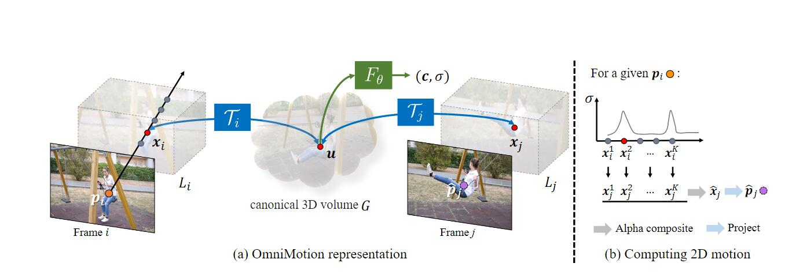
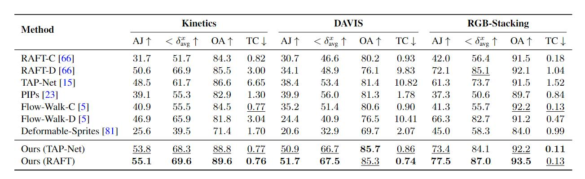
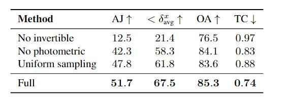

论文笔记-Track Everything Everywhere All at Once

<figure class="half">

</figure>

<!--more-->

论文链接：<https://export.arxiv.org/pdf/2306.05422v2.pdf>

## 写在前面

Track Everything Everywhere All at Once是ICCV 2023最佳学生论文，作者来自康奈尔大学和Google research。一作作者曾经有过很多有趣的实验，大多数也发表在了顶会顶刊上，附上作者的个人主页链接: <https://qianqianwang68.github.io/。>
光是看题目会觉得这篇文章有哗众取宠的嫌疑，毕竟今年拿了ICCV最佳论文提名的Segment Anything之前也是大红大紫，但实际上这篇文章的idea确实巧妙，而且文章本身写的非常简单易懂，即使没有前置知识也可以暂时把文章内部提到的一些结构当作黑盒，并不会妨碍读文章的顺畅度。

## 1. 摘要

摘要部分首先提出了一个可以从视频序列中估计密集型（dense）的长范围运动（long-range motion）。之前的光流法或者粒子视频追踪法都苦于有遮挡的跟踪和保持全局的一致性，这里的全局一致性指的是所有像素点的运动轨迹都基于同一个全局的运动表示得到，这种全局一致性可以在运动估计在过程中避免产生不一致的情况，从而能更准确地估计视频中所有像素点的运动轨迹。因此，本文提出了一个全局一致的运动表达，称为Omnimotion，它可以追踪视频中每一个像素点的全长运动轨迹估计。

Omnimotion是一种伪3D的规范体积（quasi-3D canonical volume）来作为视频的表达（respresentation），并通过局部空间和规范空间的双射（bijection）来执行像素级别的跟踪。最后卖结果部分，在TAP-Vid这个benchmark下达到了新的SOTA。

## 2. 引言

运动估计通常遵循两种主流防范：稀疏特征追踪和密集光流。使用稀疏特征可以在长视频中追踪，但无法对每一个像素点追踪，光流法则相反，它只能在一个固定的短时间窗里才能有效追踪，这也是光流法本身的物理特性所决定的。另外，二者对于有遮挡的目标追踪效果都欠佳。因此，在密集型长范围追踪领域内主要面临三个挑战：

1. 保持准确的长视频序列跟踪
2. 对有遮挡的点跟踪
3. 保证时间与空间的连贯性

引言剩下的部分是对摘要的扩充，作者将Omnimotion的贡献概括为三个方面

1. 为整个视频中的所有像素点生成全局一致的全长运动轨迹
2. 解决了有遮挡目标跟踪的问题
3. 可以解决相机和场景运动带来的问题（就是相机可以是移动的）

## 3. 相关工作

相关工作前几部分主要讲述了前人工作在引言中的三个挑战的限制，这里不作过多赘述。相关工作最后一个部分提到了神经视频表达（Neural video representations），这一部分主要讲了**本文是用基于坐标的MLP去建模一个视频**，参考文献给的NeRF，SIREN和傅里叶高频特征，这三个方法主要作用于三维重建或者视频分解，而本文的主要任务是做长序列的密集预测。最后还提到，这些方法局限于用有限的层数与固定的顺序来表达视频，因此也限制了它们对一个复杂的真实世界视频建模。

## 4. Omnimotion

### 4.1 概览

文中建立的整个系统的输入是一些列的视频帧和与其配对的噪声运动估计（pairwise noisy motion estimates）作为输入，例如光流场，然后用这些输入来建模一个具备全局一致性（global consistency）的方法来表示一个视频。作者把经过编码后的隐藏表达称之为Omnimotion。

### 4.2 Omnimotion representation

解决带遮挡的跟踪目标需要一种能表示全局运动的编码，也就是一种可以将场景中所有点的轨迹编码出来的数据结构。但显然，只局限于2D平面是无法完全解决遮挡问题，因为我们只能从一个角度观察视频。另一种极端的方法是使用三维重建技术将还原一个3D场景，但这个方法的弊端就是不适定（ill-posed）。


Well-posed and ill-posed:

well-posed问题是指一个问题满足：

1)解是存在的;

2)解是惟一的;

3)解能根据初始条件连续变化，不会发生跳变，即解必须稳定。

不满足任一条件即为ill-posed问题。



因此作者发问：是否在真实世界中不用动态3D重建来追踪运动轨迹？（这个写法很像Kaiming He啊）

接下来作者正式提出了Omnimotion，如图所示

我们先对图(a)的组件进行解释，在4.5节中将对整个流程进行详细介绍

这里共有两个关键的“体积”：第一个是本地体积（local volume），可以理解为对视频的采样空间，第二个是规范3D体积（canonical 3D volume），用$G$表示，可以理解为作者提出的一种新的视频特征表示方法。这两个体积之间通过本地-规范双射来（local-canonical bijection）进行转换，这个双射本质上是一个可逆神经网络（Invertible Neural Network, INN），它可以同时捕捉场景运动和相机运动，这种方式也可以看作将视频序列一个固定的静态相机渲染生成的local volume。

实际上，通过local-canonical bijection投射到的空间并不是真正物理意义上的3D空间，作者将它称之为**quasi-3D**表达。用这种方法有两个好处：

1. 保留了全局循环一致性（global cycle-consistentcy），也就是说视频中所有像素点的运动轨迹都是全局一致的，即所有像素点的运动轨迹都是基于同一个全局的运动表示得到的；
2. 保留了投影到每个像素上的所有场景点的信息，以及它们的相对深度顺序（relative depth ordering）。相对深度顺序指的是一幅图中物体之间应该有的前后顺序，例如在一个图像中有一只猫和一个桌子，猫在前，桌子在后，那么我们可以确定猫的深度比桌子浅，因为猫被投影到图像中的像素点的深度比桌子的深度更浅。

### 4.3 Canonical 3D Volume

Canonical 3D Volume是全文最关键的贡献之一，空间中的元素用$\boldsymbol{u} \in G$表示。此外，还通过基于坐标的网络（coordinate-based network）$F_\theta$计算元素$\boldsymbol{u}$的**颜色分量$\boldsymbol{c}$与密度分量$\sigma$**，其中密度分量可以用来计算物体表面在这个3D空间中的位置，而颜色分量可以用来计算光流损失（photometric loss）

### 4.4 3D Bijections

前面提到，3D双射本质上是一个INN，它的作用是将local volume中的采样点$\boldsymbol{x_i}$映射到canonical 3D volume中，用公式表示如下，其中$i$表示的视频中的第$i$帧，$\mathcal{T_i}$是3D双射，且存在$\mathcal{T_i}^{-1}$。

$$
\boldsymbol{u} = \mathcal{T}_i(\boldsymbol{x_i})
$$

通过canonical 3D volume作为媒介，就可以计算在第$i$帧中在local volume中的采样点在第$j$帧中的对应位置$\boldsymbol{x_j}$

$$
\boldsymbol{x_j} =   \mathcal{T}_j^{-1}\circ\mathcal{T}_i(\boldsymbol{x_i})
$$

在作者的实验中$\mathcal{T_i}$使用的是Real-NVP网络作为3D双射的映射网络，用$M_\theta$表示，但对其进行了修改。对每一帧都添加了一个潜变量编码$\psi_i$，$\psi_i$的作用是对local volume进行编码，例如，如果视频有100帧，那么就会有100个对应的潜变量码，每个潜变量码用于表示该帧在local volume中的坐标。这样，当需要查询某个像素在某一帧的运动轨迹时，就可以使用该帧对应的潜变量码来计算。

加入了$\psi_i$后的$\mathcal{T_i}$可表示为

$$
\mathcal{T_i} = M_\theta(\cdot;\psi_i)
$$

### 4.5 计算帧间运动

了解了Omnimotion每个结构的组成和功能后，让我们回到Omnimotion的模型结构图来了解它的工作流程。

整个工作流程可以描述为：用一条射线将采样点“提升”到3D空间，再通过3D双射$\mathcal{T_i}$和$\mathcal{T_j}$将第$i$帧和第$j$帧中的采样点$\boldsymbol{x_i},\boldsymbol{x_j}$对应起来，然后使用射线采集到的不同的样本点通过alpha composition“渲染”这些点，最后投射回2D平面得到最终对应关系。

直接理解起来有些困难，射线是什么？alpha composition又是什么？我们一条一条来解析。

首先，射线指的是帧中从$\boldsymbol{p_i}$投射出去的那个箭头。这里已经假设相机的**移动已经包含在了$\mathcal{T_i}$中**，因此直接将相机建模为了一个**固定的正交相机**。固定很好理解，正交则是指在建模的相机中，物体没有近大远小的特征。这一点很重要，因为没有了近大远小的视角限制，一个2D像素点无论深度如何，它的RGB值一直都是一样的^[https://blog.csdn.net/wjpwjpwjp0831/article/details/132512530]。 从$\boldsymbol{p_i}$出发的射线就可以定义为：

$$
\boldsymbol{r_i}(z) = \boldsymbol{o_i}+z\boldsymbol{d}
$$

$\boldsymbol{p_i} \in \mathbb{R}^2$，为像素坐标，则$\boldsymbol{o_i} = [\boldsymbol{p_i}, 0] \in \mathbb{R}^3, \quad \boldsymbol{d} = [0,0,1]$，这个式子实际上相当于给原来的像素坐标额外添加一维，这个维度上的值由放缩因子$z$决定。有了射线后就在这条线上采样$K$个样本，组成向量$\{\boldsymbol{x}_i^k\}$，对应的也有$K$个$z$，$\{z_i^k\}$。

有了local volume内采样的样本后就可以将这个样本投射到canonical 3D volume中，并用$F_\theta$计算它的密度和颜色

$$
(\boldsymbol{\sigma}_k, c_k) = F_\theta(M_\theta(x_i^k;\psi_i))
$$

同样的方法也可以在第$j$帧中再实现一遍。

Alpha composition则是指通过估计第$j$帧中对应点$\hat{x}_j$，其中用到的alpha值为$\alpha_k = 1-e^{-\sigma_k}$，而alpha composition可以用一个公式表达

$$
\hat{\boldsymbol{x}}_j=\sum_{k=1}^KT_k\alpha_k\boldsymbol{x}_j^k,\text{ where }T_k=\prod_{l=1}^{k-1}(1-\alpha_l)
$$

要阐述这个公式，首先要理解$\alpha_k$，$\alpha_k$可以理解为第$k$个采样点的透明度或者3D空间中该位置存在物体的可能性，密度$\sigma_k$越大表示物体越不透明（想象一下用PS处理照片的时候用的调整透明度选项）。$T_k$则表示前面所有样本的联合可信度，意思就是前面如果已经有一个较大的$\alpha$值了，那当前$k$值上的采样点就可以少采纳。

## 5. 训练

### 5.1 Loss函数

Loss函数分为三个部分，位置误差，颜色误差和为了保证前后一致性的惩罚项。

位置误差是预测流与RAFT生成的原始光流之间的L1距离

$$
\mathcal{L}_\mathrm{flo}=\sum_{\boldsymbol{f}_{i\to j}\in\Omega_f}||\hat{f}_{i\to j}-f_{i\to j}||_1
$$

其中$\hat{f}_{i\rightarrow j} = \boldsymbol{\hat{p}_j}-\boldsymbol{p}_i$，$f_{i\rightarrow j}$是输入的监督流。

颜色误差指的是预测的颜色$\hat{\boldsymbol{C_i}}$和观测的颜色$\boldsymbol{C_i}$的MSE

$$
\mathcal{L}_{pho}=\sum_{i,p}||\hat{C}_i\left(p\right)-C_i\left(p\right)||_2^2
$$

惩罚项是为了保证两帧之间的一致性而加入的损失

$$
\mathcal{L}_{\mathrm{reg}}=\sum_{(i,\boldsymbol{x})\in\Omega_x}\|x_{i+1}+x_{i-1}-2x_i\|_1
$$

总loss是三个loss项的加权

$$
\mathcal{L}=\mathcal{L}_\mathrm{flo}+\lambda_\mathrm{pho}\mathcal{L}_\mathrm{pho}+\lambda_\mathrm{reg}\mathcal{L}_\mathrm{reg}
$$

值得一提的是，这种优化背后的直觉是利用对单一规范体$G$的双射、照片一致性和基于坐标的网络$M_θ$和$F_θ$提供的自然时空平滑性，以协调不一致的成对流，并填补对应图中的缺失内容。因为当用exhaustive pairwise flow来收集输入运动数据时，这些数据可能不完整、嘈杂和不一致。

## 6. 实验

这里主要讲一下实验指标和消融实验。

$<\delta_{avg}^x$指的是测量可视点在1、2、4、8和16像素5个阈值上的平均位置精度。例如，在一个视频中，有一些点的真实位置已知，我们使用该指标来评估算法预测这些点位置的准确性。如果算法预测的点位置与真实位置的距离小于1像素的比例为75％，则$<\delta_{avg}^x @ 1 = 0.75$。同样地，如果算法的预测距离小于2像素的比例为90％，则$<\delta_{avg}^x @ 2 = 0.90$。以此类推，可以评估算法在不同精度阈值下的表现。

AJ(Average Jaccard)度量了在相同的阈值$<\delta_{avg}^x$上遮挡和位置精度。具体而言，AJ将预测点位置分为TP、FP和FN三类，其中TP是指预测点位置与真实点位置距离小于位置精度阈值的点，FP是指预测点位置在位置精度阈值内，但在真实点位置被遮挡或者超出了位置精度阈值的点，FN是指真实点位置被遮挡或者超出了位置精度阈值，但预测算法将其错误地标记为可见点的点。AJ的值是真阳性点数占所有点数的比例。

OA(Occlusion Accuracy)，这个好理解，就是评估了每帧能见度/遮挡预测的准确性。

TC(Temporal Coherence)，表示的帧间的一致性的L2距离，越小越好。

消融实验则是强调了**可逆网络的重要性**

## 7. 一个有意思的GitHub issue

Omnimotion开源项目上的issue 7很有意思，讨论的是为什么要计算$x_j^k$而不是直接在新的第$j$帧中采样，以及Omnimotion为什么work，作者也参与了讨论，比较有趣，这里给一个链接，有兴趣的朋友可以去看看：[Omnimotion Issue 7](https://github.com/qianqianwang68/omnimotion/issues/7)

## 8. 结语

说实话这篇文章光看发布的效果，视觉上还是很震撼的。同时我认为也是将NeRF这一套想法引入到目标追踪中，既然只靠2D平面难以解决遮挡，那就提升到3D空间中去，但直接重建3D又太复杂，所以就在伪3D空间来表示物体的深度排序，确实是一篇典型的交叉领域的文章，将A的方法应用到B上去，也证明了跨领域读论文的重要性，不能闭门造车。
