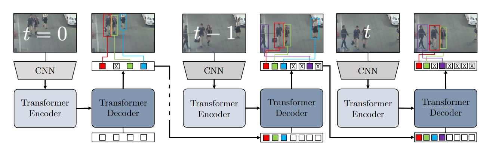
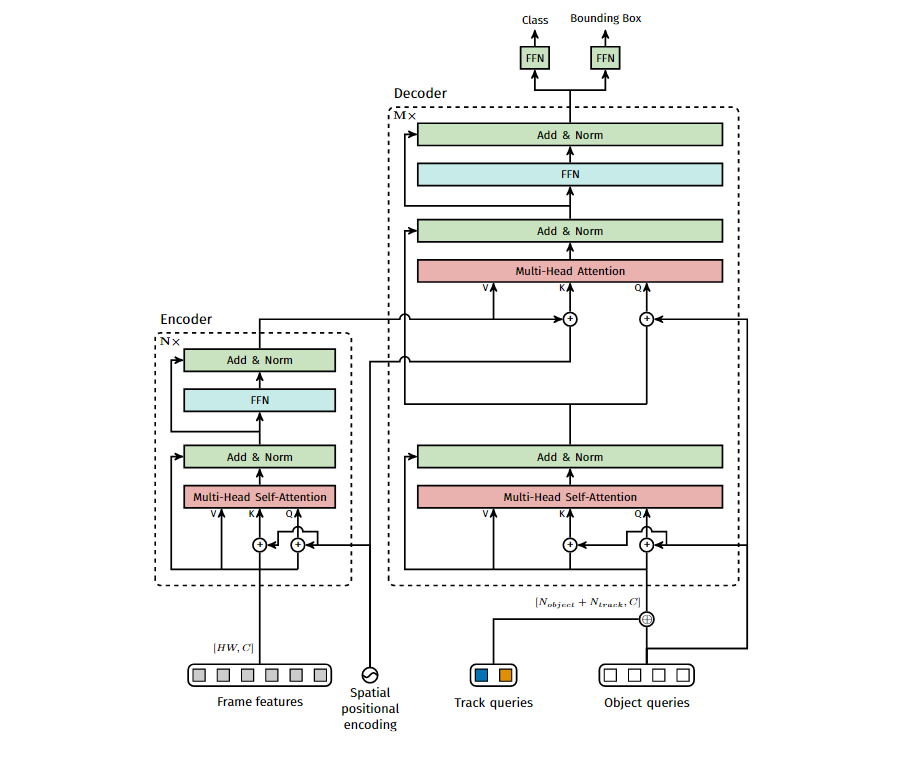

论文链接：http://export.arxiv.org/pdf/2101.02702v3.pdf
开源链接：https://github.com/timmeinhardt/trackformer

## 0. 写在前面

Transformer能应用到多目标跟踪(Multi-object Tracking, MOT)领域很大程度上得益于DETR的成功，TrackFormer就是其中之一。TrackFormer是21年1月挂在arxiv上的文章，其作者团队也包含了DETR的主要作者，只能说是原班人马倾力打造了。

之前也对DETR进行过解读：[论文笔记-End-to-End Object Detection with Transformers](https://emil-jiang.github.io/2023/06/07/%E8%AE%BA%E6%96%87%E7%AC%94%E8%AE%B0-DETR/)

## 1. 摘要

摘要第二句话直接说明将MOT视作一个集合预测问题(set prediction problem)，所谓集合预测问题，就是直接让网络输出最终结果，而不需要任何后处理。DETR也是将目标检测视作集合预测问题，相比于以前的目标检测模型，DETR不需要NMS这一步，极大减少了后处理复杂度。作者也将这个思想带到了TrackFormer当中。紧接着作者提到TrackFormer使用的decoder可以从静态的object queries中初始化新的tracks，然后使用保留身份(identity preserving)的track queries在空间和时间上自动回归地跟踪现有的tracks。这两种query都受益于全局性帧级别特征的self-attention机制，从而可以省去任何图优化(graph optimization)和运动/外观建模(modeling of motion/appearance feature)。

最后说明结果，在当时的MOT17、MOT20和分割数据集MOTS20上取得了SOTA。

## 2. 引言

当前MOT的主流方法仍然是遵循tracking-by-detection的二阶段范式，tracking-by-detection的两个步骤可以概括为：(1) 检测视频中的对象；(2) 对检测到的对象进行帧间的数据关联并创建它们的轨迹（例如DeepSORT中的卡尔曼滤波与级联匹配）。而最近的工作提出了一种新的范式：tracking-by-regression，这种方法让检测器不仅输出检测到的对象，而且将原来的数据关联方法替换为对跟踪轨迹进行连续的回归操作。

以上是作者对于之前MOT工作的大致总结，接下来作者就提出了新的tracking-by-attention的范式。不仅仅是在数据关联的时候使用attention，而是将detection和tracking联合起来，真正做到端到端跟踪。

整个TrackFormer都是建立在DETR的基础之上的，DETR的核心就是给解码器引入object query，让其负责表示检测目标的分类与位置信息。要想将DETR应用到跟踪任务，最直接的想法就是引入新的query来负责跟踪，作者将其命名为track queries。当新的目标进入到画面时，新的object queries就会出现，并将在后续被转化为track queries。最后将object queries和track queries同时输出为bounding boxes，并不需要像tracking-by-detection一样需要做track与detection之间的匹配。

作者将本文的贡献总结为如下三个方面：

1. 提出了一个端到端的目标跟踪范式，这个范式下可以将检测与数据关联联合起来。

2. 提出了一种自回归track queries的概念，这种queries可以保存空间信息和id信息，所以能在时间和空间上追踪目标。

3. 在MOT17,MOT20和分割数据集MOTS20达到了SOTA。

## 2. 相关工作

相关工作中作者主要对当前几大主流的track-by-X(X = detection, regression, segmentation)和ViT做了回顾。这里就不过多介绍了。

## 3. TrackFormer

这一节主要介绍了如何将MOT视作一个集合预测问题以及TrackFormer额核心思想。

### 3.1 MOT as a set prediction problem

作者用以下四步将MOT转换为了集合预测问题，本质上讲就是一个vanllina transformer的思想。

1. 对每帧用CNN进行特征提取

2. 用Transformer encoder对每帧的特征进行self-attention编码
   
3. 用Transformer decoder中的self-attention和cross-attention对queries进行解码

4. 用MLP将box和class信息回归出来。

### 3.2 Tracking-by-attention with queries

这一部分开始进入TrackFormer的核心部分，我们直接从结构图入手

整个Transformer结构有两种queries：静态的object queries(白色框框)，共$N_{object}$个，和可以自回归的track queries(彩色框框)，共$N_{track}$个，分别用于检测和跟踪任务。

首先是初始化部分，从图中可以看出，在$t=0$帧时，TrackFormer将所有检测到有目标的的object queries初始化为track queries，并在后续对进入画面的新目标的object queries也分配为track queries。每一帧的track id都有一个子集$K_{t}\subset K$来保存。当$t>0$时，deocder的输入就包含了每帧初始化用来检测的$N_{object}$个object queries，还有上一帧已经成功检测到目标的$N_{track}$个track queries，$N_{object}$的数量时固定的(跟DETR一样)，而$N_{track}$是不固定的，取决于上一帧有多少track。同时，可以根据一个设置的分类阈值$\sigma_{track}$来判定当前的track和对应的queries是否应该被删除，或者也可以通过IoU阈值为$\sigma_{NMS}$来判断。

总体而言，TrackFormer的前向过程可以分为以下几步

1. 在第一帧直接使用DETR检测，生成第一次的tracks和对应的track queries
2. 后续帧中，decoder的输入为当前帧中新的object queries(用于检测)和上一帧(或几帧)中保留下里的track queries(用于跟踪)
3. 如果由object queries输出的框大于阈值$\sigma_{detection}$则认为新目标进入了画面，如果track queries的置信度小于$\sigma_{track}$则认为跟踪停止。对于严重遮挡的情况可以使用NMS来消除(应该是对track queries的box进行NMS)

### 3.3 训练

训练的loss函数由两个部分组成，一个是检测损失，一个是跟踪损失，与DETR相比，不同的地方在于第二帧的匈牙利匹配这一步。整个系统一次输入为两帧图像，第一帧检测部分完全用DETR的匈牙利匹配方式计算损失，第二帧将track queries和object queries分开处理。

对于track queries，假设有一个匹配关系$j=\pi(i)$可以将GT值$y_i$与track query的预测值$\hat{y_j}$匹配起来，3.2中提到的$K_{t-1}$表示的是第$t-1$帧的track id，这是已经分配好之后的结果。那么对于第$t$帧，$K_{t}$和$K_{t-1}$就存在三种关系

- $K_{t} \bigcap K_{t-1}$：track query部分在前一帧已经分配了对应gt的id，在当前帧看gt中这些id是否依然存在，若存在（t-1和t中都有），则继续将该id的gt分配给该track query

- $K_{t-1}\backslash K_t$: 若不存在（t-1中有而t中没有），说明目标离开了画面，则该track query被认为是背景类

- $K_t\backslash K_{t-1}$: t中有而t-1中没有，说明出现了新的目标，需要使用DETR的思路把未分配的id用匈牙利匹配分配给object queries。

最终的loss函数如下，其中$\hat{p}_i(c_i)$是对与类别$c_i$的预测概率，$b_{\pi=i}$和$\hat{b}_i$指的是第$i$次最优匹配下的真实框和预测框。

$$\mathcal{L}_{\mathrm{Mor}}(y,\hat{y},\pi)=\sum_{i=1}^{N}\mathcal{L}_{\mathrm{query}}(y,\hat{y}_{i},\pi)$$

$$
\mathcal{L}_\mathrm{query}=\begin{cases}-\lambda_\mathrm{cls}\log\hat{p}_i(c_{\pi=i})+\mathcal{L}_\mathrm{box}(b_{\pi=i},\hat{b}_i),&\mathrm{if~}i\in\pi\\-\lambda_\mathrm{cls}\log\hat{p}_i(0),&\mathrm{if~}i\notin\pi.&\end{cases}
$$

### 3.4 内部结构

最后来看一下TrackFormer内部怎么实现的

其实很简单，就是直接把track queries直接concatenate到object queries上，其余操作跟DETR完全一样。所以只用了一个decoder就可以了。

## 总结

TrackFormer这篇文章的方法比TransTrack优雅的多，TransTrack更像是把卡尔曼滤波直接换成一个Transformer decoder，而TrackFormer则是真正意义上的实现了端到端的跟踪。不过个人对这篇文章写作有些不太喜欢，有些地方写的有些晦涩，符号阐述也不清楚，尤其是最后介绍二分匹配和训练的时候，花了很大的功夫才看懂。