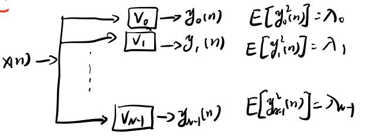
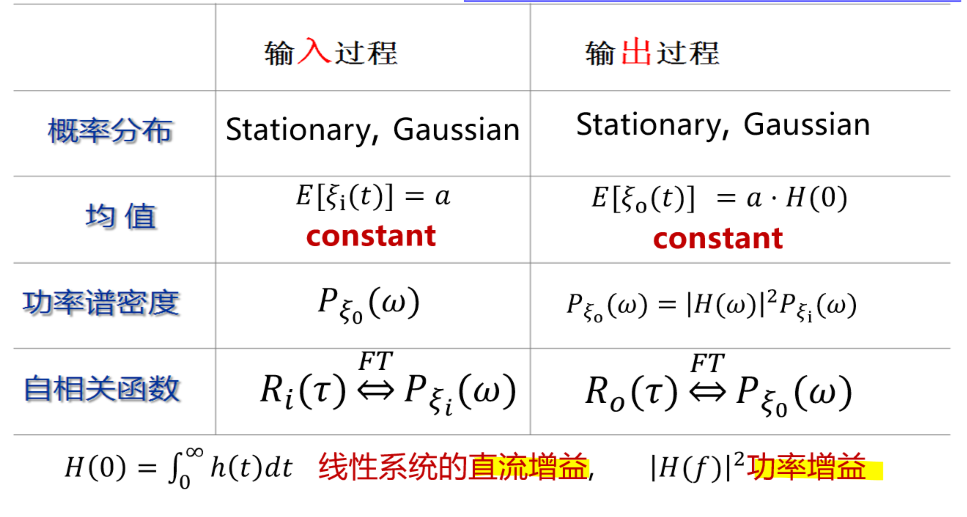

## 1. 平稳随机信号

随机信号$x(n)$满足以下三个条件的为宽平稳随机信号：

- 均值为常数：$E[x(n)] = m_x$，$m_x$为常数，与时间$n$无关
- 自相关只与时间差$m$有关：$R(n_1,n_2) = R_{xx}(m)$
- 平均功率有界：$E[|x(n)|^2]$有界

## 2. 各态历经性

各态历经指随机变量在时间上的统计特性与其对应的随机过程的统计特性相等。
设信号$x(n)$的时间平均为<$x_n$>，时间平均自相关为<$x_n, x_{n+1}$>，

$$
<x_n> = \lim_{N\rightarrow \infty}\frac{1}{2N+1}\sum_{n=-N}^Nx(n)
$$

$$
<x_n, x_{n+m}> = \lim_{N\rightarrow\infty} \frac{1}{2N+1}\sum_{n=-N}^Nx(n)x(n+m)
$$

满足以下两个条件的信号具备各态历经性。

- 时间平均=统计平均：<$x_n$> $ = E[x(n)]$
- 自相关相等：<$x_n, x_{n+m}$> $ = R_{xx}(m)$

**各态历经的信号一定是平稳的，但平稳信号不一定具有各态历经性**



 例题：随机信号$x(n,s) = c$, $c$为一个$\sigma^2 \neq 0$的随机变量，则$x(n,s)$是否平稳和各态历经？
 
 解：
 验证平稳性：
 $E[x(n,s)] = E[c] = m_c$，为常数
 $E[x(n_1,s)x(n_2,s)] = E[c^2]$，与$n$无关
 故$x(n,s)$为平稳随机信号
 
 验证各态历经：
 $$\begin{aligned}<x(n,s) &= \lim_{N\rightarrow\infty}\frac{1}{2N+1} \sum_{n=-N}^Nx(n, s) \\&= \lim_{N\rightarrow\infty}\frac{1}{2N+1} \sum_{n=-N}^Nc\\
 &= c
 \end{aligned}$$
 $c\neq E[c]$，故不是各态历经的，为了验证，再求解自相关
 $$\begin{aligned}<x_n, x_{n+1} &= \lim_{N\rightarrow\infty} \frac{1}{2N+1}\sum_{n=-N}^Nx(n,s)x(n+m,s)\\
    & = \lim_{N\rightarrow\infty} \frac{1}{2N+1}\sum_{n=-N}^Nc^2\\
    &=c^2\end{aligned}$$
 $c^2 \neq E[c^2]$故自相关也不相等



## 3. 平稳随机信号的时域特性

### 3.1 自相关函数

定义：

$$
R_{xx}(m) = E[x(n)x(n+m)]
$$

自相关函数反映了平稳随机序列中相距$m$的两个随机变量的关联程度。
由自相关函数引申出来的有自协方差函数与相关系数
自协方差函数：

$$
\gamma_{xx}(m) = E[(x(n)-m_x)(x(n+m)-m_x))]
$$

及先对随机变量减去均值再求自相关。

相关系数：

$$
\beta(m) = \frac{\gamma_{xx}(m)}{\gamma_{xx}(0)} = \frac{R_{xx}(m)-m_x^2}{\sigma_x^2}
$$

$$
\beta(m)\leq \beta(0) = 1
$$

### 3.2 自相关函数的性质

| 性质       | 描述                                                 |
|------------|------------------------------------------------------|
| 偶函数     | $R(m) = R(-m)$                                       |
| 最大值     | $R(m)\leq R(0) = R_{max}$                            |
| 平移不变性 | 若$y(n) = x(n-n_0)$则有$R_{yy}(m)=R_{xx}(m)$         |
| 直流功率   | $R(\infty) = \lim_{m\rightarrow \infty}R(m) = m_x^2$ |
| 平均功率   | $R(0) = E[x^2(n)]$                                   |
| 交流功率   | $R(0)-R(\infty) = \sigma^2$                          |

判断一个信号能不能成为自相关，则需要判断它是否满足所有自相关函数的性质。

### 3.3 自相关矩阵

有矢量信号 

$$
X(n) = \left[
\begin{array}{c}
 x(n)\\
 x(n-1)\\
 \vdots \\
 x(n-N+1)
\end{array}
\right]
$$

则其自相关矩阵为

$$
R = E[X(n)X^T(n)] = \left[\begin{array}{c}
  R(0)& R(1) &  \cdots & R(N-1)\\
  R(1)& R(0) & \cdots & R(N-2)\\
  \vdots& \vdots & \ddots  & \vdots\\
  R(N-1)& R(N-2) & \cdots &R(0)
\end{array}
\right]_{N\times N}
$$

### 3.4 自相关矩阵的性质

| 性质                    | 描述                                                                                                                                                       |
|-------------------------|------------------------------------------------------------------------------------------------------------------------------------------------------------|
| 对称性                  | $R = R^T$或$R = R^H$                                                                                                                                       |
| 正定性                  | $R$是半正定矩阵，所有特征值$\lambda_i \geq   0 \quad$      推广：      1. 对$R$的任意特征向量$V\neq 0$，有$V^TRV\geq 0$      2. 若$R$为非奇异矩阵，则$R$是正定的 |
| Toeplites矩阵(循环矩阵) | $R$的主、次对角线上的所有元素相同                                                                                                                          |

### 3.5 相关矩阵的特征值

根据矩阵特征值的定义有

$$
RV_i = \lambda_iV_i
$$
左乘一个矩阵相当于对特征向量$V_i$做一次线性变换。
输入矩阵$R$的特征值可理解为随机信号通过以$R$的特征向量为脉冲响应的**单位能量**滤波器的平均输出功率，如图所示

### 3.6 互相关函数

定义

$$
R_{xy}(m) = E[x(n)y(n+m)]
$$

性质

1. $$R_{xy}(m) = R_{yx}(-m)$$

2. 
$$
R_{xy}(m)\leq \sqrt{R_{xx}(0)R_{yy}(0)} \leq \frac{1}{2}[R_{xx}(0)+R_{yy}(0)]
$$

**注意：互相关不对称，最大值也不一定在$R_{xy}(0)$**

## 4. 平稳随机信号的频域与z域特性

平稳随机序列为能量无限信号，不满足绝对可和条件，**因此平稳随机序列不存在DTFT和z变换**。
但平稳随机序列的功率是有限的，存在功率谱(power spectrum density, PSD)。

### 4.1 功率谱密度

功率谱密度的定义为

$$
P_{xx}(w)  = \lim_{N\rightarrow\infty}E[\frac{1}{N}|X_N(e^{jw})|^2]
$$

其中$E[\frac{1}{N}|X_N(e^{jw})|^2]$称为加窗序列的周期图。

**功率谱密度的物理意义：表示随机信号的平均功率沿频率轴的分布情况。**

#### 4.1.1 功率谱密度的性质

| 性质                   | 数学表达/描述                                          |
|------------------------|---------------------------------------------------|
| 与自相关为傅里叶变换对 | $R_{xx}(m) \overset{\mathcal{F}}{\iff} P_{xx}(w)$ |
| 实函数，且值大于0      | $P(w) \geq 0$                                     |
| 周期性，周期为$2\pi$   | $P(w)=P(w+2k\pi)$,$k$为整数                         |
| 偶函数                 | $P(w)=P(-w)$                                      |
|无相位性 |	$P(w)$不包含相位信息 |

注：互相关函数$P_{xy}(w)$是有相位信息的。

#### 4.1.2 功率谱与相关矩阵特征值的关系

相关矩阵$R$的特征值$\lambda_i$满足

$$
P_{min}\leq \lambda_i \leq P_{max}
$$

特殊的，白噪声的相关矩阵为

$$
R_w = \left[\begin{array}{c}
 \sigma_w^2 &  & \\
  &  \sigma_w^2& \\
  &  &\sigma_w^2
\end{array}
\right]
$$

该矩阵的特征值满足$\lambda_i = \sigma_x^2 = P_{max} = P_{min}$

自相关矩阵的条件数定义为其最大与最小特征值的比值

$$
\text{cond}(R) = \frac{\lambda_{max}}{\lambda_{min}}
$$

条件数反映了特征值的动态范围，若$\text{cond}(R)$很大，则在矩阵求逆时会存在很大的数值误差。

#### 4.1.3 z变换形式的功率谱

z变换形式的功率谱定义与普通z变换定义相同：

$$
\Phi_{xx}(z) = \sum_{m=-\infty}^\infty R_{xx}(m)z^{-m}
$$

实际上，4.1.1中的$P_{xx}(w)$就是$\Phi_{xx}(z)$在$z = e^{jw}$，也就是单位圆上的特殊情况。因为$P_{xx}(w) = P_{xx}(-w)$，因此将$e^{jw}$替换为$e^{-jw}$，可以得出以下等式

$$
\Phi_{xx}(z) = \Phi_{xx}(z^{-1})
$$

显然，若$z = z_1$是$\Phi_{xx}(z)$的极点时，$z = \frac{1}{z_1}$也是$\Phi_{xx}(z^{-1})$和$\Phi_{xx}(z)$的极点，这条性质可以简记为共享极点性。



 例： $R(m) = a^{|m|}$，$|a| \leq 1$，求$\Phi(z)$
 
 解：$$\begin{aligned}\Phi(z) &= \sum_{m = -\infty}^\infty a^{|m|}z^{-m}\\
&= \sum_{m = -\infty}^{-1} a^{-m}z^{-m}+\sum_{m = 0}^\infty a^{m}z^{-m}\\
&=\sum_{m = -\infty}^{-1} (az)^{-m}+\sum_{m = 0}^\infty (\frac{a}{z})^{m}\\
&=\sum_{l = 1}^{\infty} (az)^{l}+\sum_{m = 0}^\infty (\frac{a}{z})^{m}\\
&=\frac{1-a^2}{(1-az)(1-az^{-1})}
\end{aligned}$$
 有极点：$z_1 = a, z_2 = \frac{1}{a}$
 
 令$z = e^{jw}$，有
 $$ \Phi(z) = \frac{1-a^2}{1+a^2-2a\cos w}$$



### 4.2 平稳随机信号过LTI

假设有一个LTI系统$h(n)$和输入信号$x(n)$，这里主要考虑输出信号$y(n)$的均值、自相关函数和功率谱密度。

**均值**：$m_y = H(e^{j0})E[x(n)]$

证明

$$
\begin{aligned}
m_y &= E[x(n)*h(n)]\\
&= E[\sum_{m=0}^\infty h(n)x(n-m)]\\
&= \sum_{m=0}^\infty h(n)E[x(n-m)]\\
&= H(e^{j0})E[x(n)]
\end{aligned}
$$

**自相关函数**： 

$$
\begin{aligned}
R_{yy}(n,n+m) &= E[\sum_{k=0}^\infty h(k)x(n-k)\sum_{r=0}^\infty h(r)x(n+m-r)]\\
&= \sum_{k=0}^\infty  h(k) \sum_{r=0}^\infty h(r) E[x(n-k)x(n+m-r)]\\
&= R_{yy}(m)
\end{aligned}
$$

输出信号$y(n)$的均值为常数，自相关只与时间间隔有关，因此输出信号$y(n)$也为平稳随机信号。

一句话概括上述结论：**输入信号是平稳随机序列，则输出信号也为平稳随机序列。**

**功率谱密度**：$P_{yy}(w) = |H(e^{jw})|^2P_{xx}(w)$

**互功率谱密度**：$$\begin{aligned}P_{xy}(w) = H(e^{jw})P_{xx}(w)\\
P_{xx}(w) = H(e^{-jw})P_{xy}(w)\end{aligned}$$

### 4.3 相关卷积定理

相关卷积定理：**卷积的相关=相关的卷积**

数学表达为：

$$
\begin{aligned}
  &R_{yy}(m) = R_{xx}(m)*R_{hh}(m)\\
&R_{xy}(m) = R_{xx}(m)*h(m)
\end{aligned}
$$

$R_{yy}(m)$为$x(n)$与$h(n)$卷积的相关
$R_{xx}(m)*R_{hh}(m)$为输入信号$x(n)$与系统$h(n)$自相关的卷积

**卷积与自相关的关系**：

$$
R_{hh}(m) = h(m)*h(-m)
$$

联立$R_{yy}(m), R_{xy}(m)$和$R_{hh}(m)$有

$$
R_{yy}(m) = R_{xy}(m)*h(-m)
$$

即

$$
卷积的自相关=互相关与系统反转的卷积
$$


 例：输入为白噪声，输出为$y(n)$，求系统响应$h(m)$和$H(e^{jw})$
 
 解：输入白噪声的自相关函数为
 $$R_{xx}(m) = R_w(m) = \sigma_w^2\delta(m)$$
 用相关卷积定理
 $$\begin{aligned}&R_{yy}(m) = \sigma_w^2h(m)*h(-m)\\&R_{xy}(m) = \sigma_w^2h(m)\end{aligned}$$
 则有$$h(m) = \frac{R_{xy}(m)}{\sigma_w^2}$$
 对$h(m)$做DTFT即有$H(e^{jw})$



**例题中的方法也成为白噪声系统辨识，即通过输入一个白噪声，通过测量输入与输出之间的互相关，即可得到系统的脉冲响应。同理，做DTFT后即可得到其频域滤波形式。**

另外在第二章维纳滤波中会有使用相关卷积定理证明的例题。

## 5. 线谱随机信号

定义：功率谱为离散线谱的随机信号成为线谱随机信号，写为$\text{Linespace}(L)$，其中$L$为谱线个数。线谱信号可以看作白噪声的对立面，白噪声的功率谱密度为水平直线，而线谱信号为垂直于$w$轴的直线。

可预测性：若一个矢量信号$X(n)$为$L$维，则设$L+1$维的自相关矩阵$R_{L+1}$是奇异（不满秩）的，此时$X(n),X(n-1),...,X(n-l)$线性相关，即已知前$l$个样本就可以得到全部样本，我们称该信号是可预测的。

特殊的，白噪声的功率谱密度为水平直线，因此完全无法预测

**定理：**：
- 若$X(n)$为线谱信号，则$R_{L+1}$矩阵一定是奇异的
- 若$R_L$矩阵是非奇异的，则$rank(R_{L+1}) = L$

若一个系统是可预测的，则其脉冲的响应$h(i) = v_i$和输出信号$y(n)$应当满足
$R_{yy}(m) = v_0R_{xx}(m)+v_1R_{xx}(m-1)+...+v_LR_{xx}(m-L) = 0$时$v_i$有非零解（线性相关的定义），即有$L+1$个零点。

此时系统响应$V(z)$的阶次为$L+1$，单位元上最多有$L+1$个零点，要使$P_{yy}(w)$在所有$w$上为0，则在$V(z)$的非0值处$P_{xx}(w)=0$。


 例：若$P_{xx}(w)$在$w = \frac{\pi}{2},\pi, \frac{3}{2}\pi$出有值，要使系统可预测，求$V(z)$的系数。

 解：由题意，$V(z)=0$，when $w = \frac{\pi}{2},\pi, \frac{3}{2}\pi$
 因此有
 $$\begin{aligned}V(z) &= (1-jz^{-1})(1+jz^{-1})(1+z^{-1})\\
&=1+z^{-1}+z^{-2}+z^{-3}\end{aligned}$$
 $$V_4 = \left[\begin{array}{c}
 1\\
 1\\
 1\\
1
\end{array}
\right]$$
 说明找得到一组向量$V$，使得$R_{xx}(m)V = 0$

