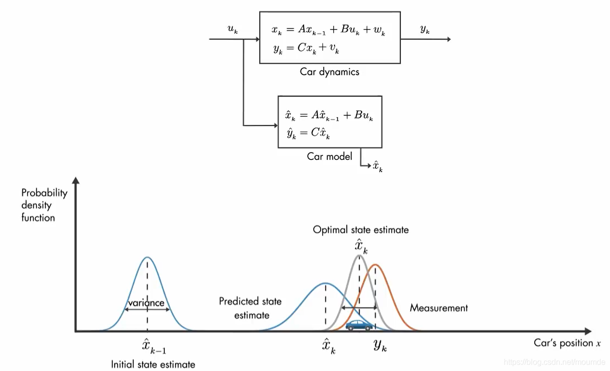

## 1. 公式快捷查询

为了方便查询，这一章开头直接给出卡尔曼的一些通用结论和黄金五公式，考试不要求硬背这五个公式，但实际工程应用中会经常用到，KF的公式推导确实比较多，留到有时间再补充到这一章里面吧。

先做一些符号阐释

| 符号                       | 含义                                     |
|----------------------------|------------------------------------------|
| $\hat{x}_k, \hat{x}_{k-1}$ | $k$时刻和$k-1$时刻的KF更新的状态         |
| $\hat{x}_k^-$                      | 通过$k-1$时刻一步预测的$k$时刻的状态         |
|$y_k$|$k$时刻的观测状态|
|$w_k$|系统噪声|
|$v_k$|测量噪声|
| $P_k$                      | $\hat{x}_k$和$\hat{x}_{k-1}$之间的协方差矩阵 |
| $P_k'$                     | $\hat{x}_k^-$的协方差矩阵                            |
| $H_k$                      | 卡尔曼增益                               |
|$A_k, C_k$|状态转移矩阵|
|$B_k$|输入变换矩阵|
|$R_k$|测量噪声的协方差矩阵|
|$Q_k$|系统噪声的协方差矩阵|

再给出两个系统通用的状态表示的方程

| 含义     | 公式                            |
|----------|---------------------------------|
| 状态方程 | $x_k = A_kx_{k-1}+B_ku_k+w_{k}$ |
| 测量方程 | $y_k = C_kx_k+v_k$              |

最后，给出卡尔曼滤波的黄金五公式

| 含义                                                  | 公式                                                     |
|-------------------------------------------------------|----------------------------------------------------------|
| 一步预测                                         | $\hat{x}_k^- = A_k\hat{x}_{k-1}+B_ku_k$                                |
| 先验协方差矩阵($\hat{x}_k^-$的协方差)                         | $P_k = (I-H_kC_k)P_k'$                                   |
| 增益矩阵                                              | $H_k = P_k'C_k^T(C_kP_k'C_k^T+R_k)^{-1}$                 |
| 递推公式                                            | $\hat{x}_k=\hat{x}_k^-+H_k(y_k-C_k\hat{x}_{k}^-)$ |
| 后验协方差矩阵($\hat{x}_{k-1}$和$\hat{x}_{k}$的协方差) | $P_k'=A_kP_{k-1}A_k^T+Q_{k-1}$                           |

注：$H_k$的选取与两个噪声$w_k,v_k$有关，与$Q_{k-1}$成正比，与$R_k$成反比。

其中，公式1，2为卡尔曼滤波的**预测部分**，公式3，4，5为卡尔曼滤波的**更新部分**。

## 2. 卡尔曼滤波的本质

卡尔曼滤波的本质是对预测值与观测值进行最优融合，这个权值与二者自身的方差有关，方差小的部分权值就大，可以充分利用不确定性得到准确值。用这张图可以很清晰地展现卡尔曼滤波的本质。

## 3. 卡尔曼滤波与维纳滤波

**卡尔曼滤波在稳态下与维纳滤波有相同的效果，因为它们都是以MSE为准则的线性估计器。**

|                      | 卡尔曼滤波                                                                                                   | 维纳滤波                           |
|----------------------|--------------------------------------------------------------------------------------------------------------|------------------------------------|
| 对输入输出信号的要求 | 假设输入信号$x_k$遵循某个已知的线性状态方程，可以处理非平稳过程                                              | 要求输入输出$x_k,y_k$都为平稳信号  |
| 解决最佳滤波的方式   | 用时域与状态变量，理论上是维纳滤波的推广和发展                                                               | 用频域及传递函数的方法             |
| 状态或信号过程的产生 | 卡尔曼滤波将状态和信号过程的产生看作是白噪声激励有限维数系统的输出                                           | -                                  |
| 对观测值的处理       | 卡尔曼滤波在时域上采用线性递推形式对观测值进行处理，能实时给出系统状态的最优估计，并突破了单维输入输出的限制 | -                                  |``

## 4. 一维卡尔曼滤波加权融合的权值计算

> 例：降低方差
>
> 设两个不相关的观测量$x_1,x_2$，它们的方差$D(x_1)=\sigma_1^2, D(x_2) = \sigma_2^2$，若需要融合二者使其方差最小，求融合权值
>
> 解：令$x = wx_1+(1-w)x_2$，则$D(x) = w^2D(x_1)+(1-w)^2D(x_2)$，
> 展开$D(x)$有
> $$D(x) = [D(x_1)+D(x_2)]w^2-2D(x_2)w+D(x_2)$$
> 这是一个关于$w$的二次函数，可求得最小值点为
> $$w = \frac{\sigma_2^2}{\sigma_1^2+\sigma_2^2}$$
> 则最优解$x$
> $$x = \frac{\sigma_2^2}{\sigma_1^2+\sigma_2^2}x_1+\frac{\sigma_1^2}{\sigma_1^2+\sigma_2^2}x_2$$
> 权值系数与对方的方差有关
> 带入$D(x)$可得方差
> $$D(x) = \frac{\sigma_1^2\sigma_2^2}{\sigma_1^2+\sigma_2^2}$$

## 5. 一道例题

设$x_k$与$v_k$为离散随机过程，具有功率谱密度

$$
\Phi_{xx}(z) = \frac{0.36}{(1-0.8z^{-1})(1-0.8z)},
\Phi_{vv}(z) = 1, \Phi_{vx}(z) = 0
$$

并且已知$\hat{x}_{-1} = 0$，$P_0 = 1$，再$k = 0$时开始观测信号$y_k = x_k+v_k$，试用卡尔曼滤波公式求$\hat{x}_k$

解：**核心思路为逐个寻找第一节符号阐释中的每一项数值和表达式。**

与维纳滤波相同，先求$B(z)$

$$\Phi_{xx}(z) = \sigma_w^2B(z)B(z^{-1}) = 0.36\frac{1}{1-0.8z^{-1}}\cdot \frac{1}{1-0.8z}$$

对应系数可得$\sigma_w^2 = 0.36$,

$$
B(z) = \frac{1}{1-0.8z^{-1}}
$$

$$
B(z^{-1}) = \frac{1}{1-0.8z}
$$

因此有

$$
x_k = 0.8x_{k-1}+w_{k-1}
$$

对应状态方程$x_k = A_kx_{k-1}+w_{k-1}$有$A_k = 0.8$。

根据$y_k = x_k+v_k, \sigma_w^2 = 0.36, \Phi_{vv}(z) = 1$，可得$C_k = 1, Q_{k} = 0.36, R_k = 1$。

题目求的是$\hat{x}_k$，先写出$\hat{x}_k$的公式，

$$
\hat{x}_k = A_k\hat{x}_{k-1}+H_k(y_k-C_kA_k\hat{x}_{k-1})
$$

现在有了$A_k = 0.8, C_k = 1$，那么有

$$
\hat{x}_k = 0.8\hat{x}_{k-1}+H_k(y_k-0.8\hat{x}_{k-1})
$$

现在只剩$H_k$未知，接下来求$H_k$。

$$
\begin{aligned}
H_k &= P_k'C_k^T(C_kP_k'C_k^T+R_k)^{-1}\\
&= \frac{P_k'}{P_k'+1}
\end{aligned}
$$

那么现在需要求的就是$P_k'$

$$
\begin{aligned}
    P_k'&=A_kP_{k-1}A_k^T+Q_{k-1}\\
        &= 0.64P_{k-1}+0.36
\end{aligned}
$$

根据$P_k$的公式

$$
\begin{aligned}
    P_k &= (I-H_kC_k)P_k'\\
        &= (1-\frac{P_k'}{P_k'+1})P_k'\\
        &= \frac{P_k'}{P_k'+1}
\end{aligned}
$$

可得$H_k = P_k$，将$P_k'$带入$P_k=H_k$有

$$
P_k = H_k = \frac{0.64P_{k-1}+0.36}{0.64P_{k-1}+1.36}
$$

求稳态解，将上式$P_k$和$P_{k-1}$用$P_{\infty}$带入并化简有

$$
0.64P^2_{\infty}+0.72P_{\infty}-0.36 = 0
$$

解方程可有$P_{\infty} = \frac{3}{8}$，将其带入$P_k'$的表达式有

$$
P_{k}' = 0.64\times \frac{3}{8}+0.36 = 0.6
$$

现在终于可以算$H_k$了

$$
H_k = \frac{P_k'}{P_k'+1} = \frac{3}{8} = P_k
$$

因此，最后的递推方程为

$$
\hat{x}_k = 0.8\hat{x}_{k-1}+\frac{3}{8}(y_k-0.8\hat{x}_{k-1}) = \frac{1}{2}\hat{x}_{k-1}+\frac{3}{8}y_k
$$