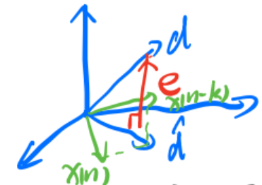
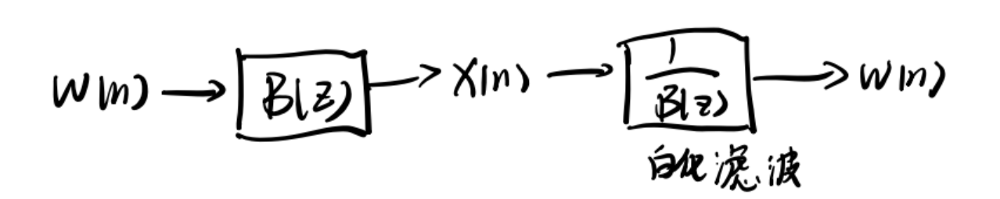
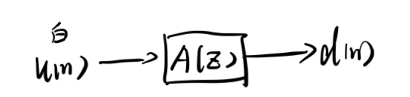
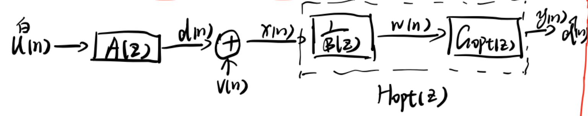
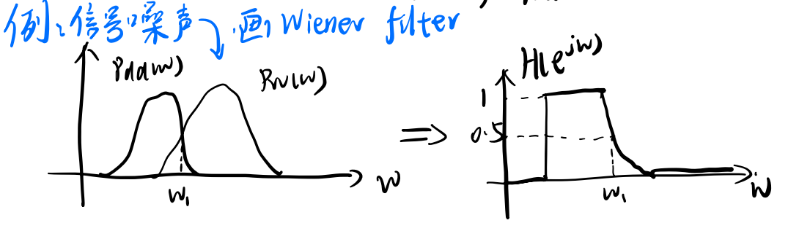

维纳滤波的本质是最小化期望信号与系统输出信号之间的均方误差，是一种线性滤波器，可以与最小二乘线性预测那一套方法相关联。

## 1. 滤波、预测和插值

通过目标信号与当前信号的时间关系确定属于滤波、预测或者插值

已知$x(n), x(n-1), ..., x(0)$，期望输出$d(n) = \left\{ \begin{aligned}
    &s(n)\quad &\text{滤波}\\
    &s(n+N) \quad N\geq 1\quad &\text{预测}\\
    &s(n-N)\quad &\text{插值/平滑}\\
\end{aligned}\right.$

## 2. 维纳滤波的时域解

### 2.1 最小均方误差

最小均方误差(Minimum Squared Error)定义为期望信号与输出信号差值的平方

$$
E[e(n)^2] = E\{[d(n)-\sum_{m=0}^\infty h(m)x(n-m)]^2\}
$$

要求MSE最小，可以用上式对$h(\cdot)$求偏导，对每一个取值$k$，有

$$
\frac{\partial E[e^2(n)]}{\partial h(k)} = 2E\{\underbrace{[d(n)-\sum_{m=0}^\infty h(m)x(n-m)]}_{e(n)}[-x(n-k)]\}
$$

令上式等于0，即可得到最优$h(\cdot)$，也就是2.2中的维纳霍夫方程，这里不再做推导。

### 2.2 时域维纳滤波

#### 2.2.1 维纳霍夫方程
维纳霍夫方程(Wiener-Hopf Equation)表示的是输入的自相关和输入输出之间的互相关之间的联系

$$
R_{xd}(m) = \sum_{m=0}^\infty h_{opt}(m)R_{xx}(k-m)
$$

其中$h_{opt}(m)$为最佳维纳滤波器。用矩阵表示，即可得到**维纳霍夫方程**

$$
Rw = P
$$

其中$R$为输入的自相关，$P$为输入与输出的互相关，$w$为滤波器，即$h_{opt}(m)$。

#### 2.2.2 非因果IIR维纳滤波

求解$h_{opt}(m)$时很容易想到将等式两边同时做$z$变换，可得到

$$
\Phi_{xx}(z)H_{opt}(z) = \Phi_{xd}(z) \iff H_{opt}(z) = \frac{\Phi_{xd}(z)}{\Phi_{xx}(z)}
$$

**注意：**$z$变换存在的条件是该信号是双边序列。也就是说，用这个式子表示的$H_{opt}(z)$在时域上的$k\in (-\infty, +\infty)$，即不存在约束条件。实际上，直接通过$z$变换得到的$H_{opt}(z)$称为逆滤波，逆滤波是维纳滤波的一种特殊情况（详见数字图像处理笔记第四章维纳滤波部分）。但无论是否有约束，时域上的维纳霍夫方程始终成立。

**因果IIR维纳滤波将在第3节与白化滤波器一起介绍**

#### 2.2.3 FIR维纳滤波

回顾代价函数MSE，若把有限长输入信号与滤波器都写为向量的形式

$$
X(n) = \left[ 
\begin{array}{c}
    x(n) \\
    x(n-1) \\
    \vdots\\
    x(n-N+1)
\end{array} 
\right]\quad W = \left[ 
\begin{array}{c}
    w_0 \\
    w_1\\
    \vdots\\
    w_N
\end{array} 
\right]
$$

则2.2.1中的代价函数可写为

$$
E[e^2(n)] = \underbrace{E[d^2(n)]}_{\sigma_d^2}-\underbrace{E[d(n)X^T(n)W]}_{P^TW}-\underbrace{E[d(n)W^TX(n)]}_{W^TP}+\underbrace{W^TE[X(n)X^T(n)]W}_{W^TRW}
$$

因为$P^TW$和$W^TP$都是标量，$P\in \mathbb{R}^{N\times 1}, W\in \mathbb{R}^{N\times 1}$，所以有$P^TW=W^TP$。

因此，关于滤波器$W$的代价函数$J(w)$用矩阵可以表示为

$$
J(w) = \sigma_d^2-2W^TP+W^TRW
$$

**注意：式中所有项都是标量，因此$J(w)$也是一个标量**

$J(w)$对$w$求偏导可得

$$
\frac{\partial J(w)}{\partial w} = -2P+2RW
$$

令上式等于0，可得出FIR维纳滤波的时域解

$$
W_{opt} = R^{-1}P
$$

上述方式是通过求导来得到维纳滤波器的最优解。实际上，观察$J(w)$的表达式，它是关于$W$的一个二次函数，可以通过矩阵配方的形式将其转化为顶点式，由于矩阵配方的过程非常复杂，这里直接给出结果

$$
J(w) = \sigma_d^2-P^TR^{-1}P + (W-R^{-1}P)^TR(W-R^{-1}P)
$$

可以直观看出当$W = R^{-1}P$时，符号为正的第三项等于0，此时有最小均方误差

$$
\begin{aligned}
J_{min} &= \sigma_d^2-P^TR^{-1}P\\
        &= \sigma_d^2-P^TW_{opt}
\end{aligned}
$$

#### 2.2.4 正交性原理

2.2.1中，为了求得最佳滤波器，令误差对滤波器的偏导数等于0，等价于下式

$$
E[e(n)x(n-k)] = 0 \quad k\geq 0
$$

这是正交性原理的第一个核心表达式。从该式可以得知，MSE最小时$e(n)$与$x(n-k)$正交。

令输出信号为$\hat{d}(n)$，根据离散时间滤波器的定义，$\hat{d}(n)$是$x(n),x(n-1),...,x(n-k)$的线性组合，因此$\hat{d}(n)$也应当与误差$e(n)$正交

$$
E[e(n)\hat{d}(n)] = 0
$$

这是正交性原理的第二个核心公式。

正交性原理可以总结为：

- 误差$e(n)$与观测数据$x(n-k)$正交
- 误差$e(n)$与估计信号$\hat{d}(n)$正交

**正交性原理与MSE之间互为充要条件，即**33

$$
\text{MSE最小} \iff \text{正交性原理}
$$

从图中也可以直观理解，只有当误差$e$同时垂直于$x(n-k)$和$\hat{d}(n)$时最小。

## 3. 维纳滤波的频域解

### 3.1 因果IIR维纳滤波

本节主要考虑输入信号为白噪声$w(n)$时的情况。

白噪声的特点是自相关矩阵$R$的对角线元素$R(0)=\sigma_w^2$，其逆矩阵$R^{-1}$的对角线元素为$R^{-1}(0) = \frac{1}{\sigma_w^2}$

$$
R = \left[\begin{array}{c}
 \sigma_w^2 &  & \\
  &  \sigma_w^2& \\
  &  &\ddots& \\
  & & & \sigma_w^2
\end{array}
\right] \quad R^{-1} = \left[\begin{array}{c}
 \frac{1}{\sigma_w^2} &  & \\
  &  \frac{1}{\sigma_w^2}& \\
  &  &\ddots& \\
  & & & \frac{1}{\sigma_w^2}
\end{array}
\right]
$$

将白噪声的自相关矩阵带入维纳滤波的时域解有最佳滤波器（用$g$表示）。

$$
g_{opt}(n) = \frac{1}{\sigma_w^2}R_{wd}(n)u(n)
$$

$u(n)$为单位阶跃函数。

对其进行$z$变换有

$$
G_{opt}(z) = \frac{1}{\sigma_w^2}[\Phi_{wd}(z)]_+
$$



$G_{opt}(z)$就是因果IIR维纳滤波的频域解形式，一般情况下因果IIR维纳滤波的求解比较困难。



将$g_{opt}(n)$带入最小均方误差$J_{min}$中有

$$
J_{min} = \sigma_w^2-\frac{1}{\sigma_w^2}\sum_{k=0}^\infty R^2_{wd}(k)
$$

### 3.2 白化滤波

3.1中假设了输入$x(n)$为白噪声$w(n)$，若$x(n)$不是白噪声，则可以先将$x(n)$白化为白噪声，再进行维纳滤波操作。若$x(n)$的功率谱时有理分式，则$x(n)$可以看作是一个滤波器对白噪声的响应。如图所示

这里$\frac{1}{B(z)}$才是白化滤波器，$B(z)$表示白噪声经由一个滤波器变为信号$x(n)$的过程。

根据相关卷积定理和自相关与卷积的关系可得

$$
\Phi_{xx}(z) = \sigma_w^2B(z)B(z^{-1})
$$


  证明：
 
  根据相关卷积定理：$$R_{xx}(m) = \sigma_w^2R_{bb}(m)$$
  根据卷积与自相关的关系：$$R_{bb}(m) = b(m)*b(-m)$$
  则$R_{xx}(m) = \sigma_w^2*b(m)*b(-m)$
  两边同时做$z$变换有
  $$\Phi_{xx}(z) = \sigma_w^2B(z)B(z^{-1})$$



$B(z)$是一个**最小相位滤波器**，也就是说它的零极点都在单位圆内。根据第一章4.1.3的结论，还可以知道$B(z^{-1})$存在一对实部与$B(z)$互为倒数的共轭极点。

现在，我们可以采用相同的方式用白噪声得到期望信号$d(n)$，假设白噪声通过一个系统$A(z)$得到期望信号，如图所示

那么就可以得到基于白化滤波器的维纳滤波器，整个系统如图所示(画的有点潦草但应该还看的清orz)

这个系统的意思是，假设用$A(z)$将白噪声转换为期望信号$d(n)$，而$d(n)$被其它噪声$v(n)$污染得到了我们现实生活中实际到手的信号$x(n)$，$x(n)$通过一个白化滤波器$\frac{1}{B(z)}$，得到白噪声$w(n)$，这样就可以使用2.3.1中得到的维纳滤波器来还原信号，$\frac{1}{B(z)}$和$G_{opt}(z)$联合起来形成了我们拿到的输入$x(n)$需要经过的系统$H_{opt}(z)$，而通过$H_{opt}(z)$得到的信号是估计信号$\hat{d}(n)$，我们希望通过$H_{opt}(z)$去还原出原始信号使得$\hat{d}(n)$与$d(n)$的MSE最小。

显然有

$$
H_{opt}(z) = \frac{G_{opt}(z)}{B(z)} = \frac{1}{\sigma_w^2B(z)}[\Phi_{wd}(z)]_+
$$

可以证明$\Phi_{xd}(z) = \Phi_{wd}(z)B(z^{-1})$，将其带入$H_{opt}(z)$有

$$
H_{opt}(z) = \frac{1}{\sigma_w^2B(z)}\left[\frac{\Phi_{xd}(z)}{B(z^{-1})}\right]_+
$$



 例：证明$\Phi_{xd}(z) = \Phi_{wd}(z)B(z^{-1})$
 
 证：
 命题等价于证明：$R_{xd}(m) = R_{wd}(m)*b(-m)$
 根据互相关函数的性质有：$R_{xd}(m) = R_{dx}(-m), R_{wd}(m) = R_{dw}(-m)$
 $$R_{dx}(m) =E[d(n)x(n+m)]$$
 又有$$x(n+m) = w(n+m)*b(m)$$
 带入$R_{dx}(m)$有
 $$
\begin{equation}
    \begin{aligned}
    R_{dx}(m)&=E[d(n)(w(n+m)*b(m))]\\
    &=E[d(n)\sum_{k=0}^\infty b(k)w(n+m-k)]\\
    &=\sum_{k=0}^\infty b(k)\underbrace{E[d(n) w(n+m-k)]}_{R_{dw}(m-k)}\\
    &= b(m)*R_{dw}(m) 
    \end{aligned}
\end{equation}
$$

 将$m$替换为$-m$有
$$
R_{dx}(-m) = R_{xd}(m) = R_{wd}(m)*b(-m)$$

 两边同时做$z$变换，命题得证
 （上课时老师说这道题也可以用相关卷积定理证明，但我这里没有证出来，如果有会用相关卷积定理证明的同学非常欢迎联系我！！）



### 3.3 非因果维纳滤波器的简单分析

2.2.2节介绍了非因果IIR形式的维纳滤波，这里主要从画图的角度分析一下非因果滤波器的形式。

首先需要知道非因果滤波器$h(m)$的一般形式，假设$x(n)=d(n)+v(n)$，$v(n)$为噪声，这里对应白化滤波器图中间的位置。

因为噪声与期望信号是无关（$R_{dv}=0$）的，因此容易证明

$$
R_{xd}(m) = R_{dd}(m) \iff \Phi_{xd}(z) = \Phi_{dd}(z)
$$

同理可得

$$
R_{xx}(m) = R_{dd}(m)+R_{vv}(m) \iff \Phi_{xx}(z) = \Phi_{dd}(z)+\Phi_{vv}(z)
$$

第二个公式可以简记为**和的自相关=自相关的和**。

根据相关卷积定理$R_{xd}(m) = R_{xx}(m)*h(m)$，可得

$$
H_{opt}(z) = \frac{\Phi_{xd}(z)}{\Phi_{xx}(z)} = \frac{\Phi_{dd}(z)}{\Phi_{dd}(z)+\Phi_{vv}(z)}
$$

用$e^{jw}$替换$z$就可以得到滤波器的功率谱形式

$$
H(e^{jw}) = \frac{P_{xd}(w)}{P_{xx}(w)} = \frac{P_{w}(w)}{P_{dd}(w)+P_{vv}(w)} = \left\{\begin{aligned}
&0, &P_{dd} = 0, P_{vv} \neq 0, &无信号，关闭\\
&1, &P_{dd} \neq 0, P_{vv} = 0, &无噪声，全通\\
&\leq 1,& P_{dd} \neq 0, P_{vv} \neq 0, &信号噪声都存在，部分通过
\end{aligned}\right.
$$


例：



简而言之，就是有信号就开，没信号就关，没噪声就全通，有噪声就降幅度

### 3.4 一道例题

设计白化滤波器，使其具有功率谱为$P_{xx}(w)=\frac{1.04+0.4\cos w}{1.25+\cos w}$的信号白化

思路：凑形式，待定系数求$B(z)$

解：

回顾$x(n)$与白化滤波器的关系

$$
\Phi_{xx}(z) = \sigma_w^2B(z)B(z^{-1})
$$

$P_{xx}(w)$是$\Phi_{xx}(z)$在$z = e^{jw}$处的特殊形式，因此需要将$P_{xx}(w)$凑出$e^{jw}$的形式。根据欧拉公式

$$
P_{xx}(w) = \frac{1.04+0.4\times \frac{e^{jw}+e^{-jw}}{2}}{1.25+\frac{e^{jw}+e^{-jw}}{2}}
$$

替换$e^{jw}$为$z$

$$
\Phi_{xx}(z) = \frac{1.04+0.2(z+z^{-1})}{1.25+0.5(z+z^{-1})} = \frac{0.2z+1.04+0.2z^{-1}}{0.5z+1.25+0.5z^{-1}}
$$

我们知道白化滤波器的倒数一定具有$B(z) = \frac{z-a}{z-b}$的分式形式，因此可以根据待定系数法求$a$和$b$。

$$
\frac{0.2z+1.04+0.2z^{-1}}{0.5z+1.25+0.5z^{-1}} = \sigma_w^2\frac{z-a}{z-b}\frac{z^{-1}-a}{z^{-1}-b}  = \sigma_w^2 \frac{-az+(1+a^2)-az^{-1}}{-bz+(1+b^2)-bz^{-1}}
$$

直接令$\sigma_w^2=1$，有

$$
\left\{\begin{aligned}
a &= -0.2\\
b&=-0.5
\end{aligned}\right.
$$

因此

$$
B(z) = \frac{z+0.2}{z-0.5} = \frac{1+0.2z^{-1}}{1+0.5z^{-1}}
$$

最后记得倒一下

$$
\frac{1}{B(z)}=\frac{1+0.5z^{-1}}{1+0.2z^{-1}}
$$

## 4. 维纳滤波器小结

| 含义 | 公式 |
|---|---|
| 最佳因果FIR维纳滤波 | $W_{opt} = R^{-1}P$，$0\leq k\leq N-1$ |
| 最佳非因果IIR维纳滤波 | $h_{opt}(n) = \mathcal{Z}^{-1}[\frac{\Phi_{xd}(z)}{\Phi_{xx}(z)}]$ |
|最佳因果IIR维纳滤波|$H_{opt}(z) = \frac{1}{\sigma_w^2B(z)}\left[\Phi_{wd}(z)\right]_+=\frac{1}{\sigma_w^2B(z)}\left[\frac{\Phi_{xd}(z)}{B(z^{-1})}\right]_+$|
| 均方误差表达式 | $J(w) = \sigma_d^2-2W^TP+W^TRW$ |
| 最小均方误差 | $J_{min} =\sigma_d^2-P^TW_{opt}$ |
|正交性原理| $E[e(n)x(n-k)=0], E[e(n)\hat{d}(n)]=0, \quad 1\leq k\leq n$ |

## 5. 维纳预测器

概念：已知$x(n),x(n-1),...$，求信号未来的估计值$\hat{s}(n+N)$。

一般的$x(n)=s(n)+v(n)$，$v(n)$为噪声，若$v(n)=0$，即没有噪声时称为纯预测。

### 5.1 N步因果纯预测器

令预测器期望输出为$d(n)=s(n+N)$，则此时$x(n)$与$d(n),s(n)$的互相关存在如下关系

$$
R_{xd}(k) = E[x(n)d(n+k)] = E[x(n)s(n+k+N)] = R_{xs}(k+N)
$$

做$z$变换则有

$$
\Phi_{xd}(z) = z^{-N}\Phi_{xs}(z)
$$

将其带入3.2节中带白化滤波的因果IIR滤波器

$$
\begin{aligned}
H_{opt}(z) &= \frac{1}{\sigma_w^2B(z)}\left[\frac{\Phi_{xd}(z)}{B(z^{-1})} \right]_+ \\ 
&= \frac{1}{\sigma_w^2B(z)}\left[\frac{z^{-N}\Phi_{xs}(z)}{B(z^{-1})} \right]_+
\end{aligned}
$$

由于$v(n)=0$，可以得到下列一长串等式

$$
\Phi_{xs}(z) = \Phi_{ss}(z) = \Phi_{xx}(z) = \sigma_w^2B(z)B(z^{-1})
$$

将$\Phi_{xs}=\Phi_{xx}$的关系带入$H_{opt}$，就得到了**N步因果纯预测器的公式**

$$
H_{opt}(z) = \frac{1}{\sigma_w^2B(z)}\left[B(z)z^{-N}\right]_+
$$

注意这里$B(z)$不能消掉，因为中括号里的$B(z)$只代表右边序列的$z$变换。

解题的过程中，要灵活运用$\Phi_{xs}, \Phi_{xx}, \Phi_{ss}, \Phi_{vv}$的关系。

N步纯预测器的最小均方误差为

$$
J_{min} = \sigma_w^2\sum_{k=0}^{N-1}b^2(k)
$$

这里就不做详细推导了。

### 5.2 一步线性预测

转换一下N步线性预测的概念，令$s(n) = x(n)$，已知$x(n-1), x(n-2),...,x(n-p)$，预测$x(n)$

预测值$\hat{x}(n)$是前面$p$个已知值的线性组合

$$
\hat{x}(n) = \sum_{k=0}^{p-1}h(k)x(n-1-k)
$$

为了后续表示方便，我们改变一下滤波器系数的表示方式，令

$$
a_{pk} = -h(k-1)
$$

为了使MSE最小，同样采取对系数求偏导的方法，经过一系列运算最终可以得到如下矩阵方程

$$\begin{bmatrix}R_{xx}(0)&R_{xx}(1)&\cdots&R_{xx}(p)\\R_{xx}(1)&R_{xx}(0)&\cdots&R_{xx}(p-1)\\\vdots&\vdots&\ddots&\vdots\\R_{xx}(p)&R_{xx}(p-1)&\cdots&R_{xx}(0)\end{bmatrix}\begin{bmatrix}1\\a_{p1}\\a_{p2}\\\vdots\\a_{pn}\end{bmatrix}=\begin{bmatrix}E[e^2]\\0\\0\\\vdots\\0\end{bmatrix}$$

该方程称为**Yule-Walker方程**，其中$E[e^2]=\sigma_w^2$。这个矩阵方程就是是求解一步预测器的方法，求解$p$阶一步线性预测器时直接列出对应方程即可求解。

## 6. 新息

定义：实际观测值与预测值的差值定义为新息，用数学表达实际上就是不带绝对值的L1距离。

$$
e(n) = x(n)-\hat{x}(n)
$$

若从起点$n=1$开始预测，新息有以下三条性质：

性质1：$E[e(n)x(k)] = 0, \quad 1\leq k\leq n-1$，即新息与之前的观测值$x(k)$都没有关系，这条性质实际上就是正交性原理

性质2：$E[e(n)e(k)]=0, \quad 1\leq k\leq n-1$ 

性质3：$\{x(1), x(2),...,x(n)\} \iff \{e(1), e(2),...,e(n)\}$，即观测值与新息存在一一对应的关系，知道观测值就可以求新息，反之亦然 

