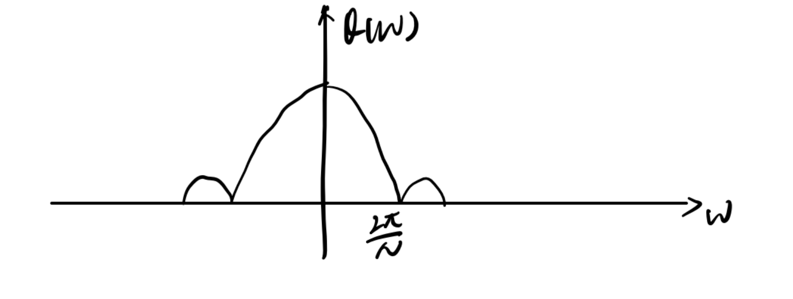
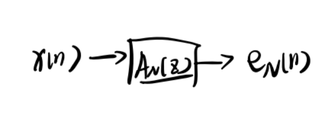
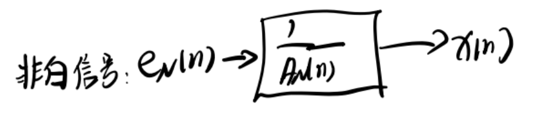
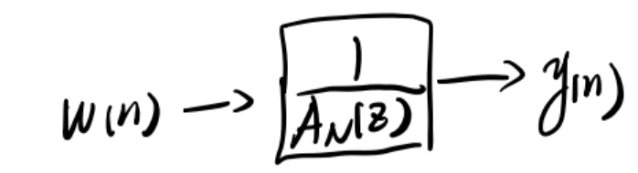

## 1. 谱估计的定义

谱估计的定义：确定信号在特定频率（或频带）处的功率含量

另外回顾一下第一章的内容，随机信号过线性系统输入与输出的功率谱关系为

$$
P_{yy}(w) = P_{xx}(w)|H(e^{jw})|^2
$$

## 2. 无偏估计、最小方差估计和一致估计

假设$\hat{\theta}$是对真实值$\theta$的估计，下表列出了三种估计的定义，满足对应定义就可被认定为对应的估计

| 估计 | 定义 |
|---|---|
| 无偏估计 | $E[\hat{\theta}]=\theta, Bias=B=\theta-E[\hat{\theta}]$,$Bias$为偏差 |
| 最小方差估计 | $\hat{\theta}=\mathop{\arg\min}\limits_{\hat{\theta}}\underbrace{E[(\hat{\theta}-E(\hat{\theta})^2]}_{\sigma_{\hat{\theta}}^2}$，意思就是要让估计的参数有最小的方差 |
| 一致估计 | 当数据量$N\rightarrow\infty$时，$B\rightarrow 0, \sigma_{\hat{\theta}}^2\rightarrow   0$ |

无偏估计的作用是让估计数据分布在目标数据中心的周围，最小方差估计的作用是让估计数据尽可能近的分布在同一区域。**一致估计则是让估计数据与尽可能以一个小的范围（最小方差）分布在目标数据中心（无偏）附近。**

## 3. 经典谱估计方法

谱估计方法很多，这里暂时只记录老师提到的重点内容周期图法

### 3.1 周期图法

#### 3.1.1 周期图法的步骤

设一个长度为$N$离散信号的DTFT为

$$
X_N(e^{jw}) = \sum_{n=0}^{N-1}x(n)e^{-jwn}
$$

则该信号的**周期图定义**为：

$$
I_N(w)=\frac{1}{N}|X_N(e^{jw})|^2
$$

**周期图法就是让估计的功率谱等于周期图**

$$
\hat{P}_{xx}(w)=I_N(w)
$$

放在一起对比一下原来的功率谱

$$
\hat{P}_{xx}(w)=\frac{1}{N}|X_N(e^{jw})|^2\quad P_{xx}(w)=\lim_{N\rightarrow\infty}E[\frac{1}{N}|X_N(e^{jw})|^2]
$$

可以看出周期图法其实就是用一部分有限长功率谱替代无限长的信号的功率谱

#### 3.1.2 验证周期图法的无偏性

接下来验证一下周期图法的无偏性

$$
\begin{aligned}
  E[I_N(w)] &=E[\frac{1}{N}|X_N(e^{jw})|^2]\\
            &=E[\frac{1}{N}X_N(e^{jw})X^*_N(e^{jw})] \quad \text{写为共轭式方便分析}\\
            &=\frac{1}{N}E[\sum_{n=0}^{N-1}x(n)e^{-jwn}\sum_{k=0}^{N-1}x(k)e^{jwk}] \\
            &=\frac{1}{N}E[\sum_{n=-\infty}^{\infty}d(n)x(n)e^{-jwn}\sum_{k=-\infty}^{\infty}d(k)x(k)e^{jwk}]\quad d(\cdot)\text{为一个矩形窗}\\
            &=\frac{1}{N}E[\sum_n\sum_kd(n)d(k)x(n)x(k)e^{-jw(n-k)}]
\end{aligned}
$$

$$
d(n)=\left\{\begin{aligned}
    &1, \quad &0\leq n\leq N-1\\
    &0, \quad &else
\end{aligned}\right.
$$

令$m=n-k$，则上式可变为

$$
E[I_N(w)]=\sum_m\frac{1}{N}R_{dd}(m)R_{xx}(m)e^{-jwm}
$$

我们知道$x(n)$的功率谱是对$R_{xx}(m)$做傅里叶变换

$$
P_{xx}(w)=\sum_mR_{xx}(m)e^{-jwm}
$$

很显然$E[I_N(w)]$多了一项$\frac{1}{N}R_{dd}(m)$，且这一项不为1，所以

$$
\hat{P}_{xx}(w)=E[I_N(w)]\neq P_{xx}(w)
$$

**周期图法不满足无偏性**

实际上这个$\frac{1}{N}R_{dd}(m)$也是有物理意义的，不妨令$q_N(m)=\frac{1}{N}R_{dd}(m)$，则

$$
\begin{aligned}
    q_N(m)  &= \frac{1}{N}R_{dd}(m)\\
            &= \frac{1}{N}[d(m)*d(-m)]\quad \text{门函数的卷积}\\
            &=\left\{\begin{aligned}
                &1-\frac{|m|}{N},\quad &|m|\leq N-1\\
                &0, \quad &else
            \end{aligned}
            \right.
\end{aligned}
$$

$q_N(m)$实际上是一个三角窗，也就是说，**用周期图法估计功率谱相当于在时域上给自相关函数加上了一个三角窗后再做傅里叶变换得到估计的功率谱**。

#### 3.1.3 周期图法的频域特性

接下来把$E[I_N(w)]$写为频域的表达式，观察频域上的情况

把3.1.2中最终得到的$E[I_N(w)]$中的$q_N(m)R_{xx}(m)$视作一个整体，则这个式子就是对这个整体做傅里叶变换，时域上相乘等于频域上卷积，因此有

$$
E[I_N(w)]=Q(w)*P_{xx}(w)
$$

$Q(w)$是两个门函数$d(m),d(-m)$傅里叶变换的乘积

$$
Q(w)=\frac{1}{N}D(e^{jw})D(e^{-jw})
$$

两个门函数的分别在$[-N+1,0]$和$[0,N-1]$上有值，相当于在时域上做了移位，所以频域上也要乘上对应的相位移位

$$
D(e^{jw}) = \frac{\sin\frac{w}{2}N}{\sin\frac{w}{2}}e^{-jw\frac{w-1}{2}},\quad D(e^{-jw}) = \frac{\sin\frac{w}{2}N}{\sin\frac{w}{2}}e^{jw\frac{w-1}{2}}
$$

带入$Q(w)$，相位项可以抵消掉，于是有

$$
Q(w)=\frac{1}{N}(\frac{\sin\frac{w}{2}N}{\sin\frac{w}{2}})^2
$$

这就是一个辛格函数的形式

也就是说，**周期图法相当于在频域上用辛格函数与原信号的功率谱做卷积**。

#### 3.1.4 验证周期图法的方差

周期图法验证方差比较复杂，但周期图与原来的方差存在以下关系

$$
\lim_{N\rightarrow \infty}D[I_N(w)]=P^2_{xx}(w)
$$

显然$N\rightarrow\infty$时，$D[I_N(w)]=\sigma_{\theta}^2\neq 0$。



结合3.1.2中的结论，周期图法不是一致估计。



### 3.2 谱分辨率

3.1.2和3.1.3节中说明了周期图法实际上就是相当于时域上对自相关函数加窗，频域上用辛格函数与原功率谱卷积。但是直接加窗很显然会带来影响，比如频谱泄露、混叠等等，这里主要分析混叠的影响。

例如，当$P_{xx}(w)=\sum_i\delta (w-w_i)$，即一系列冲激函数的时候，若两个冲激函数之间的距离小于主瓣宽度，就会产生混叠现象。

**因此，主瓣宽度就决定了谱分辨率的大小，而同等采样速率条件下，主瓣宽度又取决于信号长度$N$，$N$越大，主瓣宽度越小，谱分辨率越高。**



频域分辨率取决于观测时间$N$

时域分辨率取决于信号带宽$w$



**结合周期图法本身的特点，可以总结出周期图法存在的两个问题**

1. 小信号的主瓣可能被大信号的旁瓣淹没
2. 数据短($N$较小)的时候频率谱分辨率较低

### 3.3 降低谱估计方差的方法

降低方差最直接的方式就是求平均。

例如，假设有$L$个随机变量$x_1,x_2,...,x_L$，它们均值都为$c$，方差都为$\sigma^2$，将它们送入一个均值滤波器之后可得输出信号$y$的$E[y]=c, \sigma_y^2=\frac{\sigma^2}{L}$。

**周期图法降低方差的思想则是将序列分为若干段，每一段分别用周期图法估计，最后将每一段的谱估计求平均**。例如，将长度为$N$的序列分为$L$段，每段长度为$M$，则$N=L\times M$。第$i$段中的第$n$数据可以表示为

$$
x^i(n) = x(iM+n),\quad 0\leq n\leq M-1, 0\leq i\leq L-1
$$

那么第$i$段的周期图就可以写出来了，其实就是将原来周期图的表达式$N$换成$M$。

$$
\hat{P}_{xx}^i(w)=I_M^i(w)=\frac{1}{M}|\sum_{n=0}^{M-1}x^i(n)e^{-jwn}|^2
$$


需要注意的是，在选择$M$的大小时，应使得间隔$m>M$时，$R_{xx}(m)$很小，也就是说分隔的两段数据之间应该不相关。


最后，将这$L$段的谱估计求一个均值，就可以得到用平均法求估计的周期图

$$
\hat{P}_{xx}(w)=\frac{1}{L}\sum_{i=0}^{L-1}I_M^i(w)
$$

如果满足各段数据不想关的条件，则最后估计的方差只有原来的$\frac{1}{L}$，即$\sigma^2=\frac{1}{L}P_{xx}^2(w)$。

**但是，当$L$变大时，每一段中的长度$M$变小，根据3.3中的结论，会导致每一段的谱分辨率降低。**

## 4. 参数化模型谱估计方法

参数化模型谱估计是指通过参数估计的形式直接将滤波器系数估计出来。用第二章维纳滤波的白化滤波器作为例子，假设一个信号$x(n)$是由输入为白噪声$w(n)$经过逆白化滤波器$H(z)$得到，而$H(z)$一定为两个多项式的分数形式，其中分子为$q$阶多项式，分子为$p$阶多项式。

$$
H(z) = \frac{B(z)}{A(z)} =\frac{\sum_{k=0}^qb_kz^{-k}}{\sum_{k=0}^pa_kz^{-k}}
$$

回忆本章第一节中提到输出功率谱与输入功率谱之间的关系，这里输入为白噪声：

$$P_{xx}(w)=\sigma_w^2|H(e^{jw})|^2=\sigma_w^2|\frac{B(e^{jw})}{A(e^{jw})}|^2$$

现在的任务就是通过一些方法对$H(z)$这个滤波器建模，求出分子或者分母的系数。常用的方法有MA模型、AR模型和ARMA模型


实际上这些都是时间序列分析中常用的模型，还有一个ARIMA模型，是对ARMA模型的改进。


这门课重点是AR模型，MA，ARMA等可以自行了解下，这部分与数学建模有交叉，还是很有趣的。

### 4.1 AR模型

#### 4.1.1 AR模型求解方法

AR(Auto regressive)模型在信号处理中的一大特点就是$H(z)$只有分母有$p$阶系数，分子没有系数，**这也是辨别AR模型的重要判据**。相比之下，MA(Move average)模型只有分子有$q$阶系数，分母没有系数，而ARMA模型则是分子分母都有系数。

既然没有分子项，那么AR模型的滤波器以及输出信号功率谱应当具备以下形式(**考试要会辨认**)

$$
\begin{aligned}
    &H(z) = \frac{1}{1+a_1z^{-1}+a_2z^{-2}+...+a_pz^{-p}}\\
    &P_{xx}(w) = \frac{\sigma_w^2}{|1+\sum_{k=1}^pa_ke^{-jwk}|^2}
\end{aligned}
$$

根据信号与系统的知识，由滤波器$H(z)$，输入信号$w(n)$和输出信号$x(n)$构建的差分方程应具有FIR的差分方程的形式，$k=0$时系数为$1$。

$$
x(n)+\sum_{k=1}^pa_kx(n-k)=w(n) \iff x(n) = -\sum_{k=1}^pa_kx(n-k)+w(n)
$$

这个式子是$x(n)$的**递推式**，也就是说$x(n)$是前$k$个输出的值和当前输入$w(n)$的线性组合，这就是一个自回归(auto regressive)的操作。

另外不要忘了，根据滤波器的形式$x(n)$也可以由输入$w(n)$的线性组合得出

$$
x(n) = h(0)w(n)+h(1)w(n-1)+...+h(p-1)w(n-p+1) = \sum_{k=0}^{p-1}h(k)w(n-k)
$$

为了防止混淆，这里列一个表方便对比

| 形式 | 表达式 |
|---|---|
| 递推式 | $x(n) = -\sum_{k=1}^pa_kx(n-k)+w(n)$ |
| 滤波器式 | $x(n) = \sum_{k=0}^{p-1}h(k)w(n-k)$ |

同样，可以写出$x(n)$的自相关，直接把上面的$x(n)$和$x(n+m)$带进去就可以了

$$
R_{xx}(m)=-\sum_{k=1}^pa_kR_{xx}(m-k)+E[x(n)w(n+m)]
$$

等式右边第二项，当只考虑$m\geq 0$时的情况如下

$$
E[x(n)w(n+m)]=\left\{\begin{aligned}
    &0, \quad &m\geq 1\\
    &h(0)\sigma_w^2, \quad& m=0
\end{aligned}\right.
$$

特别的，当$N\rightarrow\infty$时，$h(0)=1$（初值定理）。

理解起来也很简单，就是输出与输入互相关函数。由于系统是因果的，未来的输入肯定与当前输出没关系。而输出$x(n)$是输入$w(n)$的线性组合，因此，当$m=0$时，

$$
E[x(n)w(n)] = E[w(n)(h(0)w(n)+h(1)w(n-1)+...h(p-1)w(n-p+1))]
$$

由于$w(n)$为白噪声，白噪声除了与自己时刻相关，与其他时刻都不相关，所以只有$E[h(0)w^2(n)]=h(0)\sigma_w^2$不为0。

将$E[x(n)w(n)]$带回到自相关$R_{xx}(m)$就有

$$
R_{xx}(m) = \left\{\begin{aligned}
    &-\sum_{k=1}^pa_kR_{xx}(m-k), \quad &m\geq 1\\
    &-\sum_{k=1}^pa_kR_{xx}(m-k)+\sigma_w^2, \quad& m=0
\end{aligned}\right.
$$

写为矩阵的形式就有

$$
\left[\begin{matrix}
    R(0)&R(1)&\cdots&R(-(p-1))\\
    R(1)&R(0)&\cdots&R(-(p-2))\\
    \vdots&\vdots&\ddots&\vdots\\
    R(p-1)&R(p-2)&\cdots&R(0)\\
\end{matrix}\right]\left[\begin{matrix}
    1\\
    a_1\\
    a_2\\
    \vdots\\
    a_p
\end{matrix}\right]=\left[\begin{matrix}
    \sigma_w^2\\
    0\\
    0\\
    \vdots\\
    0
\end{matrix}\right]
$$

**这个矩阵方程就是第二章中一步预测的Yule-Walker方程，因此求解系数$a_k$的步骤也与一步预测相同，考试请务必牢记这个矩阵方程。**

最后简单看一下**AR模型的误差**，这里仅需记住两个结论：

1. 预测阶数在AR模型阶数范围内时，误差随预测阶数的增加而减少，但低阶AR模型做高阶预测时，误差将不再减小。比如一个二阶AR模型，做一阶预测（即只使用$x(n-1)$做预测）的误差比使用二阶预测的误差大，但如果三阶预测的时候，误差就不会再减小了。
2. AR模型的阶次越大，使用的预测阶数越多，误差越小，预测的越准，但误差是有下限的，这个下限与输出功率谱有关。

#### 4.1.2 AR模型的逼近

对一般的随机信号$x(n)$，可能未必满足AR模型（比如不是由白噪声输入产生的），则可以对其做AR模型逼近。

首先对$x(n)$做N阶AR最优线性预测：

$$
\hat{x}(n)=-a_{N,1}x(n-1)-a_{N,2}x(n-2)-...-a_{N,N}x(n-N)
$$

则它与$x(n)$的误差为$e_N(n)$

$$
e_N(n) =x(n)-\hat{x}(n)=x(n)+a_{N,1}x(n-1)+\cdots+a_{N,N}x(n-N)
$$

现在假设有一个滤波器$A_N(z)$，滤波器系数为$1,a_{N,1},...,a_{N,N}$，且$A_N(z)$所有零点都在单位圆内，那么$\frac{1}{A_N(z)}$就是稳定的。

反过来将$e_N(n)$经过$\frac{1}{A_N(z)}$，得到的就是输出信号$x(n)$。

用AR模型逼近时，用方差为$\epsilon_N$的白噪声$w(n)$替代$e_N(n)$，则滤波器的输出$y(n)$就满足N阶AR模型了。

该逼近隐含了一个条件：**$y(n),x(n)$只有前N个自相关函数相等。**

$$
R_{yy}(k) = R_{xx}(k), \quad 0\leq k\leq N
$$

#### 4.1.3 AR模型的应用：线性预测编码器

用N阶AR模型可以仅用N+1个参数（N个滤波器系数和1个白噪声$w(n),\sigma_w^2=\epsilon_N^2$）即可近似一个随机信号$x(n)$。

例如：将一段语音信号$x(n)$每20ms分割一次（采样频率$f_s = 10kHz$），则每段采集200个样本。若取N=10（10阶预测），则可以只用10个$x(n)$做线性预测得到$\hat{x}(n)$和$e_N(n)$，再用1个方差与$e_N(n)$相等的白噪声$w(n)$替代$e_N(n)$。那么现在只需要发送10个滤波器参数$a_{N,1},...,a_{N,10}$外加$\epsilon_N$，再在接收端本地用白噪声经过滤波器的输出替代$x(n)$即可得到原信号。

#### 4.1.4 Levison-During递推算法

简称LD算法。AR模型的计算量为$O(n^3)$，**这个算法可以将计算量减少到$O(n^2)$**。

LD算法中引入进了一个额外的参数$k_p$，称为反射系数，$p$阶的误差与$p-1$阶的误差与这个反射系数有关

$$
\epsilon_m=(1-|k_m|^2)\epsilon_{m-1}, \quad \text{where }0\leq |k_m|<1
$$

#### 4.1.5 AR模型的三组独立参数

对于一个$p$阶AR(p)过程$x(n)$，可以用下列3组参数表示，且可以相互导出(信息量相等)。**也就是说，知道这3组参数中的任意一组，整个AR模型都可以求解出来。**

1. 相关函数$R_{xx}(0)$到$R_{xx}(p)$
2. 滤波器系数$a_k$和白噪声方差$\sigma_w^2$
3. 反射系数$k_p$和自相关函数$R_{xx}(0)$

#### 4.1.6 AR模型的阶次选择

AR模型很重要的一步就是选择滤波器阶次$p$

- 若阶次过**小**，得到的**功率谱**会很**平滑**，**谱分辨率差**
- 若阶次过**大**，得到的功率谱可能有**虚假谱峰**，还可能产生**谱峰分裂现象**

#### 4.1.7 AR模型的优缺点

| 优点 | 缺点 |
|---|---|
| 1.   **功率谱平滑**：AR模型是一个有理分式，使用AR模型得到的功率谱比传统方法更加平滑（毛刺现象更少）             | 1.   **噪声影响大**：分辨率受SNR影响，SNR低时，分辨率明显下降，而传统方法对噪声不敏感            2 |
| 2. **分辨率高**：AR模型隐含饿了数据与自相关的预测（也称外推） | 2. **阶次难确定**：谱估计质量受阶次影响，阶次难以确定 |

### 4.2 最大熵谱估计

最大熵谱估计的基本思想是：已知N+1个自相关函数，对$|m|\geq N+1$的自相关进行外推，外推后的自相关函数所对应的序列应具有最大熵（即最难以预测）。

特别的，若均值，方差都固定，则使得熵最大的分布为**高斯分布**。

需要注意的是，对信号本身的任何处理都不会增加熵。

**最大熵谱估计与AR模型的关系：对于高斯随机序列，最大熵谱估计和AR模型等价。**

### 4.3 Capon最小方差法

Capon最小方差法的核心思想是用滤波器$w_{opt}$的输出功率$E[|y(n)|^2]$作为$x(n)$在$w_0$处的功率谱估计

Capon方法估计出来的功率谱与原功率谱的关系仅限于**峰值处的频率相同**，但**不能保证峰值幅度相同**。

Capon方法与AR模型的关系为：

$$
\frac{1}{P_{capon}(w)} = \sum_{m=0}^p\frac{1}{(P_{AR}(w))^m}
$$

显然，阶次越高的时候，AR谱估计的分辨率越高，**同阶次的Capon估计方法分辨率不如AR模型**