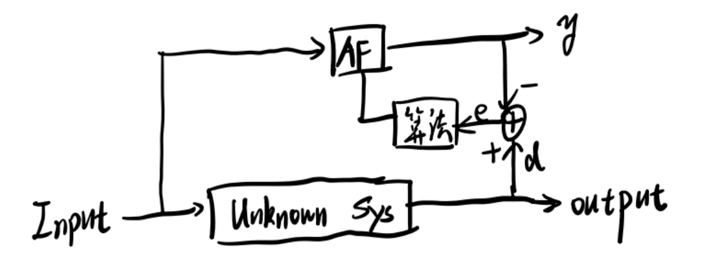
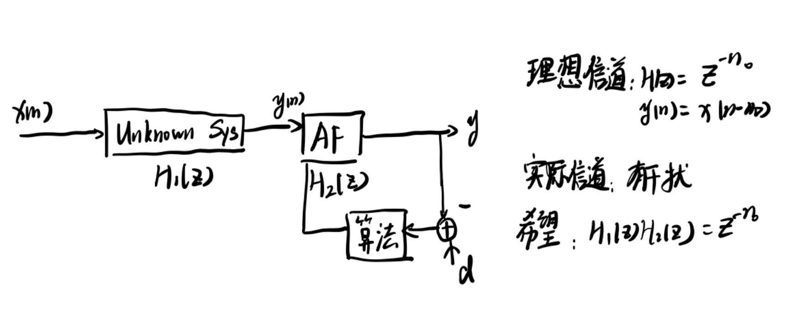
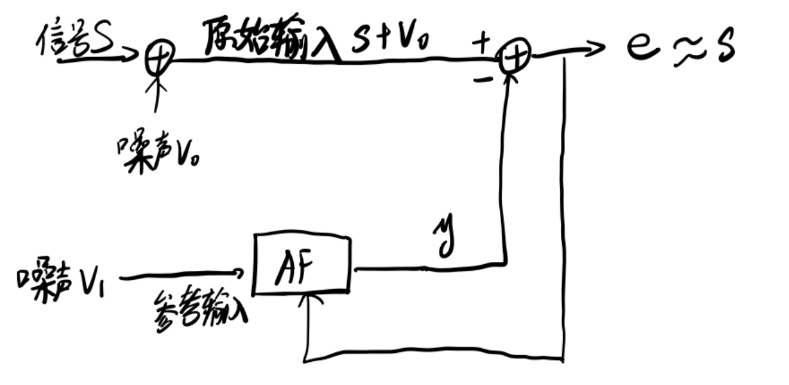

自适应滤波（Adaptive filter, AF）是指根据信号环境特性用递推算法（自适应算法）自动调整滤波器中的脉冲响应，使自适应滤波器的输出尽可能接近期望输出。在平稳环境中，迭代次数充分大时，自适应算法的结果在某种统计意义上收敛于最优的维纳解。在非平稳环境中，自适应算法具有一定的跟踪输入数据统计特性变换的能力。

**自适应滤波器的特点为权值是时变的。**

## 1. 自适应滤波器的应用

考试要求能画图

### 1.1 系统辨识

自适应滤波用于系统辨识的原理是给未知系统和AF同一个输入，使AF的输出$y$与未知系统的输出$d$尽可能接近，并通过误差$e$和自适应算法优化AF。

### 1.2 逆滤波

逆滤波也称均衡器，可以用来抵消信道干扰。这里期望信号为$d$，输出信号为$y$，信道干扰相当于一个未知系统$H_1(z)$，而我们希望信号输出只是输入的时延，因此理想信道的脉冲响应是$H(z)=z^{-n_0}$。设计的自适应滤波器$H_2(z)$应该尽可能满足$H_1(z)H_2(z)=z^{-n_0}$。

## 2. 最速下降(SDA)

如果接触过机器学习中的梯度下降算法应该对这一节比较熟悉。

最速下降的原理是通过朝负梯度方向迭代使得滤波器$w(n)$能最佳逼近最优滤波器$w_{opt}(n)$。用公式表示为

$$
w(n+1) = w(n)-\mu \nabla J(w)
$$

其中$\mu$为更新步长，$J(w)$为代价函数，与第二章维纳滤波的定义相同，$\nabla J(w)$为代价函数的梯度。回顾[第二章维纳滤波](https://emil-jiang.github.io/2023/11/06/%E9%9A%8F%E6%9C%BA%E4%BF%A1%E5%8F%B7%E5%A4%84%E7%90%86-%E7%AC%AC%E4%BA%8C%E7%AB%A0/) $J(w)$的表达式，对权重$W$求偏导很容易得到

$$
\nabla J(w) = 2(RW-P)
$$

$R$是输入自相关矩阵，$P$是输入输出互相关矩阵。

### 2.1 步长与收敛速度

**为了保证滤波器收敛，步长$\mu$应满足**

$$
0\leq \mu \leq \frac{1}{\lambda_{max}}
$$

其中$\lambda_{max}$是输入自相关矩阵$R$的最大特征值。根据线性代数的知识，一定有$\lambda_{max}\leq tr(R)$，因此步长也可以保守取为

$$
0\leq \mu \leq \frac{1}{tr(R)}
$$

**条件数$cond(R)=\frac{\lambda_{max}}{\lambda_{min}}$越小，收敛速度越快。而白噪声具备$\lambda_{max}=\lambda_{min}$的特性，所以白噪声收敛最快。根据这条特性，滤波器不收敛时可以考虑对数据先进行白化处理。**

### 2.2 最速降下降与维纳滤波

现在，若已知$R,P$矩阵，求$w_{opt}$有两种方法

1. 维纳滤波：$w_{opt}=R^{-1}P$，这种方法存在解析解，但需要对矩阵求逆
2. 最速下降：$w(n+1) = w(n)-\mu \nabla J(w)$，不用对矩阵求逆，但需要迭代

## 3. LMS自适应滤波

### 3.1 LMS滤波原理

Least-Mean-Square，LMS自适应滤波是对最速下降法的改进。最速下降需要提前知道整个输入数据的自相关$R$与输入输出的互相关$P$，但实际上很多时候是不知道的，**因此LMS自适应滤波用瞬时值代替平均值计算瞬时梯度**。实质上类似于随机梯度下降(Stochastic Gradient Decent, SGD)的思想.

所谓的瞬时值，就是去掉了期望计算

$$
\hat{R} = x(n)x^T(n) \quad \hat{P} = x(n)d^T(n)
$$

**LMS核心三大公式**如下

| 含义 | 公式 |
|---|---|
| 滤波输出 | $y(n) = \hat{w}^T(n)x(n)$ |
| 误差 | $e(n) = d(n)-y(n)$ |
| 权值更新 | $\hat{w}(n+1)=\hat{w}(n)+2\mu e(n)x(n)$ |

也就是说，在LMS中，瞬时梯度为

$$
\hat{\nabla} J(w) = -2e(n)x(n)
$$

滤波器输出有$N$次乘法，$N-1$次加法，计算误差有$1$次加法，权值更新有$N+1$次乘法，$N$次加法，总共是$2N+1$次乘法，$2N$次加法，因此计算复杂度为$O(n)$

### 3.2 LMS的MSE

LMS的MSE由三个部分组成

$$
J(n) = J_{min}+\underbrace{J_{tr}(n)}_{瞬态MSE}+\underbrace{J_{ex}(n)}_{稳态MSE}
$$

这里我们关心的的是时间步$n$而不是滤波器系数$w$。瞬态MSE在$n\rightarrow\infty$的时候为0。但稳态MSE（也叫超量误差）是由梯度噪声引起的，因为LMS去掉了求期望的步骤，相当于引入了噪声。也就是说在稳态时，MSE为

$$
J(\infty) = J_{min}+J_{ex}(\infty) > J_{min}
$$

显然性能下降了。

引入的超量误差$J_{ex}(\infty)$与步长有如下关系

$$
J_{ex}(\infty) \approx J_{min}tr(R),\quad \text{when }\mu \text{ is small}
$$

也就是说步长越小，超量MSE就会越小，但相应的收敛速度也会越慢

我们定义失调量$M$来度量这个误差

$$
M = \frac{J_{ex}(\infty)}{J_{min}} \approx \mu \times tr(R), \quad \text{when } \mu \text{ is small}
$$

### 3.4 LMS与最速下降的联系与区别

LMS是基于最速下降的改进算法，它不需要提前知道所有输入数据的统计特征，而是根据每一次单个的数据调整权重，**因此LMS的梯度是随机的**。

### 3.5 LMS的改进

LMS有三种基本的改进思想

| 方法 | 描述 |
|---|---|
| 归一化 | 将步长$\mu$也变成时变的，$\mu(n)=\frac{\mu}{\|x(n)\|^2}$ |
| 去相关(白化) | 将输入信号$x(n)$变为白噪声，缩小特征值动态范围，减小条件数，加快收敛速度 |
| 子带域适应 | $P_{min}\leq \lambda_i\leq P_{max}$，简而言之就是将功率谱分为若干段，每一段的动态范围就小了 |

## 4. 递推最小二乘(RLS)

### 4.1 RLS原理

Recursive Least Squares，RLS递推最小二乘是在最小二乘的基础上加入遗忘因子，使算法具有跟踪新数据的能力。

遗忘因子的作用是对误差进行指数加权

$$
\epsilon(n) = \sum_{i=1}^n\beta(n,i)|e(i)|^2, \quad 0< \beta(n,i)\leq 1
$$

其中$\beta(n,i)$就是遗忘因子，本质上是一个指数函数$\beta(n,i) = \lambda^{n-i}$，$(1-\lambda)^{-1}$称为记忆长短度量。注意这里$\lambda$并不是某个矩阵特征值，只是一个参数而已。

同样对MSE求偏导令其等于0，简单移项整理可得

$$
\sum_{i=1}^n \lambda^{n-i}x(i)x^T(i)\hat{w}(n) = \sum_{i=1}^n\lambda^{n-i}d(i)x(i)
$$

等式左边除去滤波器$\hat{w}(n)$，剩余的项为**加权时间平均自相关**，称为$\Phi(n)$

$$
\Phi(n) = \sum_{i=1}^n \lambda^{n-i}x(i)x^T(i)
$$

等式右边为**加权时间平均互相关**，称为$Z(n)$

$$
Z(n) = \sum_{i=1}^n\lambda^{n-i}d(i)x(i)
$$

可以得到滤波器表达式为

$$
\hat{w}(n) = \Phi^{-1}(n)Z(n)
$$

显然，这个式子和维纳滤波的时域解是一致的，不过所有的参数都是时变的。既然滤波器是时变的，与上一次滤波器系数相关，那么$\Phi(n), Z(n)$也必须有递推公式。

$$
\begin{aligned}
    \Phi(n) &= \lambda\Phi(n-1)+x(n)x^T(n)\\
    Z(n) &= \lambda Z(n-1)+x(n)d^T(n)
\end{aligned}
$$

### 4.2 RLS的优缺点

优点：

1. 收敛快
2. 收敛速度对输入自相关$R$的特征值分布不敏感

缺点：

1. 计算量大，RLS计算复杂度为$O(n^2)$

## 5. 自适应滤波器的应用

自适应滤波器的应用场合很多，这里以自适应噪声抵消器(Adaptive Noise Canceller)为例。

自适应噪声抵消器的原理是使用一个自适应滤波器去学习噪声的输入模式。在这幅图中体现为用一个AF和参考输入$v_1$拟合噪声$v_0$，如果$v_1$经由AF生成的$y$足够逼近$v_0$，那么只需要在原始输入中减去$y$即可。

实际上噪声$v_0$本身难以得到，可以采用$d = s+v_0$作为AF的期望信号，证明也很简单，直接计算当$d = s+v_0$和$d = v_0$的自相关就可以了，注意这里$x(n)$为噪声$v_1(n)$，因为考虑的是AF的输入输出。

$d = s+v_0$时

$$
R_{xd}(m) = E[x(n)d(n+m)] = E[\underbrace{v_1(n)s(n+m)}_{=0}+v_1v_0(n+m)] = E[v_1(n)v_0(n+m)]
$$

第一项等于0的原因是正交性原理

$d=v_0$时

$$
R_{xd}(m) = E[v_1(n)v_0(n+m)]
$$

所以二者等价

**自适应噪声抵消器起作用需要有两个条件：**

1. $v_0$与$v_1$相关
2. 参考输入没有或者只有少量信号

条件2很好理解，主要看一下条件1。

针对条件1可以进一步提出一个问题：**若$v_0$和$v_1$不相关，整个系统(包含AF与其他部分)的SNR会减小吗？**

首先很显然有这样一个结论：信号$s$的平均功率$E[s^2]$与AF的权向量无关，而$y$的平均功率$E[y^2]$是有关的。

接下来看一下误差的组成

$$
E[e^2] = E[(s+v_0-y)^2] = \underbrace{E[(s+v_0)^2]}_{\text{常数}}+\underbrace{E[y^2]}_{\geq 0}
$$

因此，最小化AF误差就相当于最小化$E[y^2]$，而$\min E[y^2]=0$，AF权向量也为0，相当于把AF关了。因此不会减少整个系统的SNR。

从频率响应的角度，如果$v_1$与$s,v_0$都不相关时，$\Phi_{xd}(z)=0, H_{opt}(z)=0$